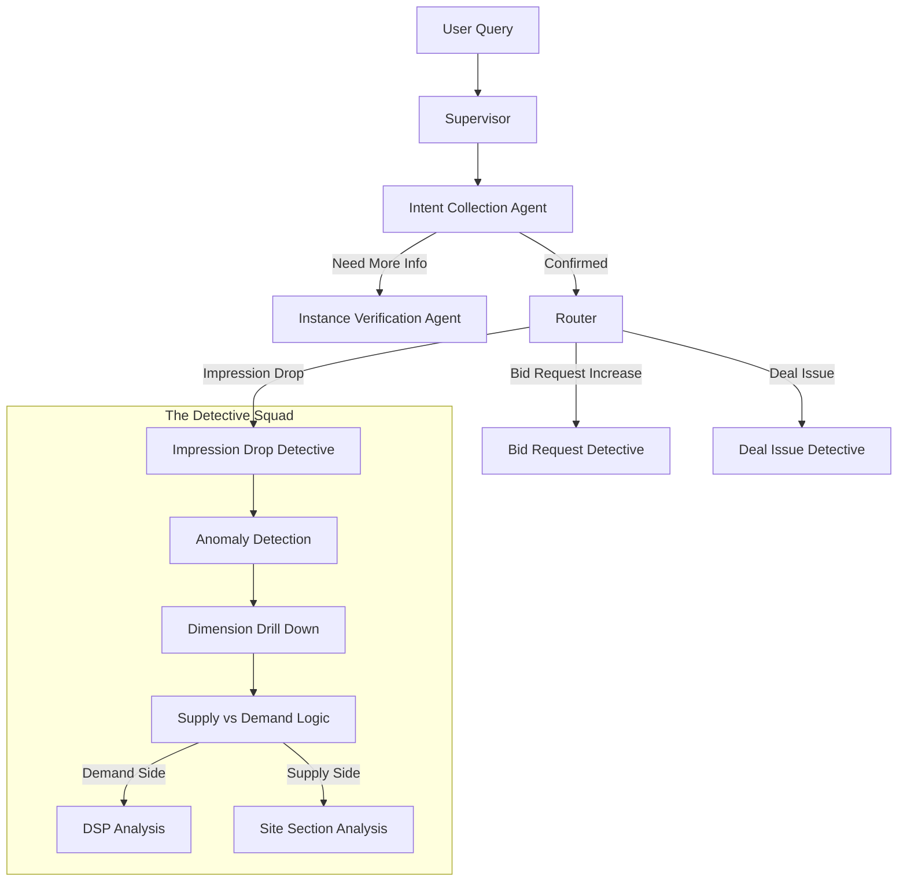

> "Traffic dropped 30% last night?"
> 
> This is a blurry Slack message that starts the nightmare for every AdTech Tier 2 Support engineer. The message usually comes from an anxious NBCU Account Manager, followed by hours of "investigation": checking Presto, checking Grafana, checking Change Logs, searching for that "culprit" across countless permutations of dimensions.
> 
> In my final project at FreeWheel, I decided to end this nightmare. I built an AI agent squad using **LangGraph** that simulates the troubleshooting mindset of a senior engineer. It not only understands the Account Manager's complaints but also drills down like a detective, inferring the truth from limited data, and even finding the misconfigured line through "time travel."


## The AdTech Troubleshooting Dilemma: "Blind Men and the Elephant" in a Data Tsunami

In the AdTech field, the hardest part of troubleshooting isn't the lack of tools, but the **excess of dimensions**.

A simple "traffic drop" could be:
*   **Supply Side**: Did a page get redesigned? Was an ad slot tag pasted incorrectly?
*   **Demand Side**: Did a DSP run out of budget? Did a Deal expire?
*   **Tech Side**: Did a change in machine learning model parameters cause traffic to be "cut" by the algorithm?

Worse yet, due to performance and cost considerations, we often can't query "all dimensions" in a single SQL statement. This requires engineers to possess strong **inference capabilities**—piecing together the complete truth from limited clues.

Doesn't that sound exactly like what AI is best at?

## My AI Squad: The AIOps Squad

I didn't write a massive `if-else` script. Instead, I designed a Multi-Agent System based on **LangGraph**. You can imagine them as different roles in a police station:



### 1. The Operator & Triage (Supervisor & Intent Collection)

The system's entry point (`index.js`) is a **Supervisor**. Its task is simple: understand human language.

When a user asks: "Why there was an impression drop on NBCU since yesterday?"

It precisely extracts the intent via Zod Schema:
*   **Intent**: `root cause analysis`
*   **Metric**: `impression`
*   **Issue Type**: `drop`
*   **Entity**: `NBCU` (Network)

The most interesting part here is the **Instance Verification** phase. AI often hallucinates, inventing non-existent IDs. So, I designed a "Verifier" node in `rca.js` that checks the real database (ToolNode) first to confirm that the ID for "NBCU" is `12345`. If it can't find it, or finds multiple, it asks the user back: "Do you mean NBCU News or NBCU Entertainment?"

### 2. The Core Detective: Drill-down & Inference

Once the case is confirmed, the Supervisor hands it over to the task force. Taking the classic **Impression Drop** (`impDrop.js`) as an example, here's how AI simulates human logic.

#### Step 1: Confirming the Crime Scene (Anomaly Detection)

The AI doesn't just take your word for it. It first runs a `PrestoQueryBuilder` to construct SQL and query baseline data from the past few days.

```javascript
// Pseudocode: Dynamic SQL construction for anomaly detection
const sql = QueryBuilder
    .select('impression', 'request')
    .from('traffic_table')
    .where('network_id', networkId)
    .where('time', 'last_7_days')
    .build();

const data = executeQuery(sql);
```

Only when the data drop exceeds the threshold (`detectAnomalies`) will it actually open a case.

#### Step 2: The Pincer Movement (Side Logic Decision)

This is the most brilliant part of the system. Because of data source limitations, we often can't directly query "which Deal from which DSP dropped on which page."

The AI adopts a "Side Logic" approach:
1.  It calculates the **Loss Share** for the **Supply Side** (Site Section) and **Demand Side** (Sales Channel) separately.
2.  If the Supply Side drop contributes 90% of the total drop, while every channel on the Demand Side is stable, the conclusion is: **Supply issue**.
3.  Conversely, if a specific Sales Channel (e.g., Programmatic) plummets, the conclusion is: **Demand issue**.

```javascript
// Pseudocode: Side Decision Node
function analyzeSide(supplyLoss, demandLoss) {
    if (demandLoss.share > 0.9) {
        // Case is on Demand Side, continue checking DSP and Deal
        return nextStep('analyze_demand_side');
    } else if (supplyLoss.share > 0.9) {
         // Case is on Supply Side, check Pages and Ad Slots
        return nextStep('analyze_supply_side');
    }
}
```

This is truly the intuition of a senior SRE codified.

### 3. Time Machine: Finding the Motive (Change History)

*(Note: This feature is a separate module in the actual project, but logically it is the final piece of the AIOps loop)*

When we have located the "suspect"—for example, a Deal with ID `54321`—we need to find the "motive."

The AI activates the **Change History Analysis** node. It takes `Entity ID: 54321` and `Anomaly Time: Yesterday` to retrieve configuration change logs.

*   "Ah-ha! Yesterday at 3:00 PM, someone raised the Floor Price of this Deal from \$2.0 to \$20.0."
*   "Or, yesterday at 10:00 AM, someone changed the Creative audit status of this Deal to Blocked."

At this point, what the AI gives is no longer a cold "it dropped," but a complete story:

> **Conclusion**: Traffic drop on Deal `54321` caused overall market damage.
> **Reason**: A configuration change was detected yesterday at 15:00, raising the floor price by 10x, resulting in a sudden drop in Bid Rate.
> **Suggestion**: Please confirm if this floor price change is intended; rolling back is recommended.

## Conclusion: From Automation to Agentic

Traditional Automation is "I tell you what to check, and you check it."
**Agentic AIOps** is "I tell you where it hurts, and you find the cause."

Through LangGraph, we solidified complex Chains of Thought into a Graph. It not only preserves the experience of human experts (like the judgment logic in Side Logic) but also leverages the flexibility of LLMs to solve intent recognition and result explanation.

This is also the final "gift" I left at FreeWheel. I hope this AI detective that never sleeps can let my former colleagues work a little less overtime and get a good night's sleep.
