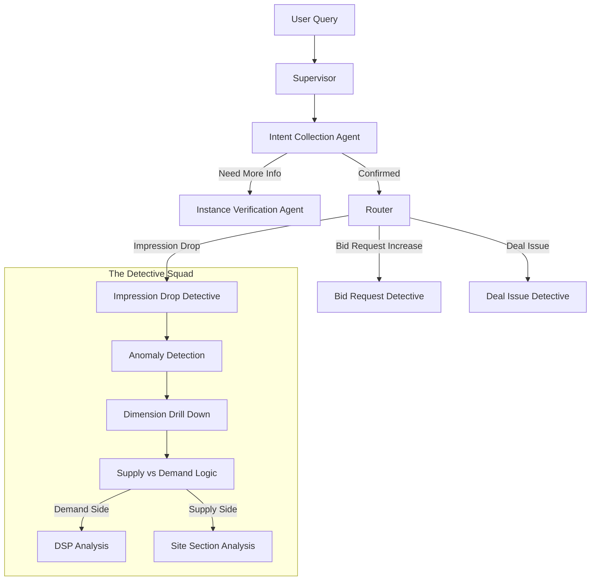

> "昨晚流量又掉了 30%？"
> 
> 每一个 AdTech Tier 2 Support 的噩梦，往往是从这样一个模糊的 Slack 消息开始的。发消息的通常是焦虑的 NBCU Account Manager，而接下来就是长达数小时的"查案"：查 Presto，查 Grafana，查 Change Log，在无数个维度的排列组合中寻找那个"罪魁祸首"。
> 
> 在离开 FreeWheel 的最后一个项目里，我决定终结这个噩梦。我用 LangGraph 构建了一个模拟高级工程师排查思路的 AI 探员组。它不仅能听懂 Account Manager 的抱怨，还能像侦探一样层层下钻，利用有限的数据推断真相，甚至通过"时空回溯"找到那行被改错的配置。


## AdTech 的排查困境：数据海啸中的"盲人摸象"

在广告技术领域，排查问题最难的不是工具不够多，而是**维度太多（Dimensions）**。

一个简单的"流量下降"，可能是：
*   **Supply Side（供给侧）**：某个页面改版了？某个广告位代码贴错了？
*   **Demand Side（需求侧）**：某个 DSP 没钱了？某个 Deal 到期了？
*   **Tech Side（技术侧）**：机器学习模型的参数变动导致了流量被算法"砍掉"了？

更要命的是，基于性能和成本的考量，我们往往无法在一个 SQL 里查到"所有维度"。这就要求工程师必须具备极强的**推断能力（Inference）**——用有限的线索，去拼凑完整的真相。

这听起来，不就是 AI 最擅长的事情吗？

## 我的 AI 探员组：The AIOps Squad

我没有写一个巨大的 `if-else` 脚本，而是基于 **LangGraph** 设计了一套多探员协作系统（Multi-Agent System）。你可以把它们想象成警察局里的不同角色：



### 1. 接线员与分诊台 (Supervisor & Intent Collection)

系统的入口 (`index.js`) 是一个 **Supervisor**。它的任务很简单：听懂人话。

当用户问："为什么昨天 NBCU 的流量跌了？" (Why there was an impression drop on NBCU since yesterday?)

它通过 Zod Schema 精准提取意图：
*   **Intent**: `root cause analysis`
*   **Metric**: `impression`
*   **Issue Type**: `drop`
*   **Entity**: `NBCU` (Network)

这里最有趣的是 **Instance Verification（实例校验）** 环节。AI 经常会产生幻觉，编造一个不存在的 ID。所以我在 `rca.js` 里设计了一个"校验者"节点，它会先去查真实的数据库（ToolNode），确认 "NBCU" 对应的 ID 是 `12345`。如果查不到，或者查到多个，它会反问用户："你指的是 NBCU News 还是 NBCU Entertainment？"

### 2. 核心侦探：下钻与推断 (The Art of Drill-down)

一旦确认了案情，Supervisor 就会把案子移交给专案组。以最经典的 **Impression Drop** (`impDrop.js`) 为例，这里展示了 AI 如何模拟人类的逻辑。

#### 第一步：确认案发现场 (Anomaly Detection)

AI 不会听风就是雨。它首先会运行一个 `PrestoQueryBuilder` 构造 SQL，查询过去几天的基线数据。

```javascript
// 伪代码：动态构建 SQL 进行异常检测
const sql = QueryBuilder
    .select('impression', 'request')
    .from('traffic_table')
    .where('network_id', networkId)
    .where('time', 'last_7_days')
    .build();

const data = executeQuery(sql);
```

只有当数据跌幅超过阈值（`detectAnomalies`），它才会真正立案。

#### 第二步：左右互搏 (Side Logic Decision)

这是整个系统最精彩的部分。因为数据源限制，我们往往不能直接查到"是哪个 DSP 的哪个 Deal 在哪个页面上跌了"。

AI 采取了"夹逼法"（Side Logic）：
1.  它分别计算 **Supply Side**（Site Section）和 **Demand Side**（Sales Channel）的 **Loss Share**（跌幅贡献度）。
2.  如果 Supply Side 的跌幅贡献了 90% 的总跌幅，而 Demand Side 每个渠道都很平稳，那结论就是：**供给出问题了**。
3.  反之，如果某个特定 Sales Channel（比如 Programmatic）暴跌，那结论就是：**需求出问题了**。

```javascript
// 伪代码：Side Decision Node
function analyzeSide(supplyLoss, demandLoss) {
    // 模糊推断：当没有足够的数据支持精细化判断时，使用更宽泛的表（置信区间）
    if (demandLoss.share > 0.9) {
        if (isBeeswax(demandLoss.dspId)) {
             // 端到端排查：如果怀疑是 Beeswax (FreeWheel DSP)，直接调用 Beeswax Agent 查数
            return nextStep('analyze_beeswax_end_to_end');
        }
        return nextStep('analyze_demand_side');
    } 
    
    // 置信度判断
    if (supplyLoss.share > 0.9) {
        const confidence = calculateConfidence(supplyLoss);
        // 如果 Bid Request 也随之减少，说明必须是上游问题 -> High Confidence
        if (confidence === 'high') {
             return report('High Confidence Supply Issue');
        }
        // 否则可能是填充率问题 -> Medium Confidence
        return nextStep('analyze_supply_side_further');
    }
}
```

### 3. 名侦探的直觉：模糊推断与置信度 (Fuzzy Inference & Confidence)

在现实世界中，线索往往是断断续续的。有时候我们查不到 "Deal A 在 URL B 上的表现"，因为数据太稀疏了。

这时候，AI 会采用**模糊推断（Fuzzy Inference）**：
*   **宽泛数据源**：如果 Deal 维度的数据不够，它会退而求其次，查看 "DSP + URL" 甚至 "DSP 全局" 的数据。
*   **置信度分级（Confidence Level）**：
    *   **High Confidence**：如果 Bid Request（请求量）和 Impression（展示量）同时暴跌，这几乎肯定是上游没发请求，或者是被某个过滤器拦住了。AI 会直接结案。
    *   **Medium Confidence**：如果只有 Impression 跌了，但请求量正常。这可能是竞价逻辑变了，也可能是素材加载慢了。AI 会标记为 "中置信度"，并建议人类介入复核。

### 4. 端到端全链路：Beeswax 联动

广告系统最怕"踢皮球"。Supply 说没量，Demand 说没收到请求。

因为 FreeWheel 同时拥有 Beeswax (DSP)，我的 Agent 拥有了**端到端（End-to-End）**的视野。当 Side Logic 怀疑是 Beeswax 的问题时，它不会只报一个 "Demand Issue"，而是直接切入 Beeswax 的数据库：
*   "查一下这个 Line Item 在 Beeswax 侧是不是投不动了？"
*   "是不是 Beeswax 的 Targeting 设置把流量过滤了？"

这直接打通了广告投放的"任督二脉"。

这完全就是资深 SRE 的直觉代码化。

### 5. 时间机器：寻找作案动机 (Change History)

*（注：这部分功能在实际项目中是一个独立的模块，但在逻辑上它是整个 AIOps 闭环的最后一块拼图）*

当我们定位到了"嫌疑人"——比如 ID 为 `54321` 的 Deal ——我们就需要寻找"作案动机"。

AI 会启动 **Change History Analysis** 节点。它会拿着 `Entity ID: 54321` 和 `Anomaly Time: Yesterday`，去检索配置变更日志。

*   "Ah-ha! 昨天下午 3 点，有人把这个 Deal 的 Floor Price 从 \$2.0 提到了 \$20.0。"
*   "或者，昨天上午 10 点，有人把这个 Deal 的 Creative 审核状态改成了 Blocked。"

这时候，AI 给出的就不再是一个冷冰冰的"跌了"，而是一个完整的故事：

> **结论**：Deal `54321` 流量下跌导致整体大盘受损。
> **原因**：检测到昨天 15:00 有一次配置变更，底价被抬高了 10 倍，导致 Bid Rate 骤降。
> **建议**：请确认该底价变更是否符合预期，建议回滚。

## 结语：从 Automation 到 Agentic

传统的 Automation 是"我让你查什么，你查什么"。
而 **Agentic AIOps** 是"我告诉你哪里疼，你自己去找病因"。

通过 LangGraph，我们将复杂的思维链（Chain of Thought）固化成了图（Graph）。它不仅保留了人类专家的经验（比如 Side Logic 的判断逻辑），又利用 LLM 的灵活性解决了意图识别和结果解释的问题。

这也正是我在 FreeWheel 留下的最后一份"礼物"。希望这个 24 小时不睡觉的 AI 侦探，能让我的前同事们少加点班，多睡个好觉。