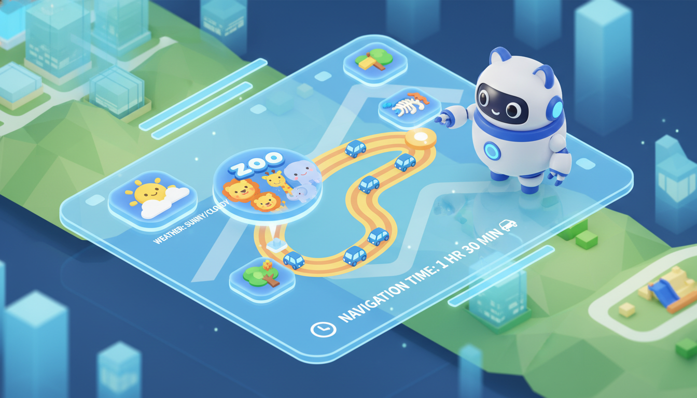

> "Dad, are we leaving now? Where are we going?"
>
> Every Saturday morning, hearing this question makes my scalp tingle. For a "tech dad" with a bit of "choice paralysis," planning the perfect weekend outing for the kid is harder than fixing a bug. You have to consider the weather (will it be too sunny?), traffic (will it be jammed?), the kid's interest (is he into Ultraman again?), and also avoid crushing crowds.
>
> Finally, after being roasted by my wife one too many times about this, I decided to solve the problem the way I know best—writing code. I used the free tier of Cloudflare Workers and the orchestration capabilities of LangGraph to build myself an "AI Parenting Travel Planner."



## Why Reinvent the Wheel?

AI chatbots on the market (ChatGPT, Doubao, Kimi) are all smart, but they share a common flaw: **"Armchair General"**.

When you ask it: "Recommend a place suitable for a 5-year-old," it will eloquently list "Forbidden City, Great Wall, Summer Palace."
Please, Forbidden City on a Saturday morning at 10 AM? Tickets are long gone, and with the crowds, the experience is likely just "people watching."

I don't need a "Wikipedia," but an Agent that can think like a **real assistant**:
1.  **Filter First**: Don't check traffic immediately; pick a few candidates based on historical preferences first.
2.  **Confirm Later**: After I select what I'm interested in, then check specific weather and traffic.
3.  **Have Memory**: Remember my son hates hiking but loves zoos.

## Tech Stack: The Joy of Being Frugal (Cloudflare + LangGraph)

As a hobby project, the primary principles are **Cheap** (or even free) and **Easy to Maintain**.

*   **Compute Platform**: [Cloudflare Workers](https://workers.cloudflare.com/). 100,000 free requests per day, which is practically "unlimited" for personal use. Plus, global edge deployment makes it extremely fast.
*   **Orchestration Framework**: [LangGraph.js](https://langchain-ai.github.io/langgraphjs/). Its "State Graph" concept fits perfectly with complex decision-making processes.
*   **Memory Storage**: [Cloudflare Vectorize](https://developers.cloudflare.com/vectorize/). A free vector database to store the kid's preferences.
*   **Model**: Models compatible with OpenAI interface (I used Doubao from ByteDance, cheap and sufficient).

## Core Logic: Planning Like a Human

I wrote a very detailed System Prompt in the `Planner Node`, forcing the AI to see the principle of **"Phased Planning"**.

### Phase 1: Broad Search & Initial Screening

The AI first calls `memory_retriever` to dig through the vector database:
*   *"Last time we went to the botanical garden, the kid seemed bored."*
*   *"User marked that they dislike drives longer than 2 hours."*

Combining these "memories," it uses `baidu_search` to broadly search for "natural scenic spots suitable for 5-year-olds around Beijing."

**AI's Inner Monologue**:
> "User wants natural scenery and dislikes long drives. Based on search results, I excluded Gubei Water Town (too far) and kept Yeyahu Wetland and Wenyu River Park in the initial list."

### Phase 2: Targeted Inquiry

Only after I express interest in "Yeyahu" does the AI enter the second phase. At this point, it calls those "expensive" APIs:
*   **Gaode Maps (`gaode_maps`)**: Not just checking distance, but **real-time traffic** and **tolls**. "Departing now via Jingzang Expressway, estimated 1 hour 20 minutes, smooth traffic."
*   **QWeather (`qweather`)**: Checking **hourly precision**. "Chance of showers at 3 PM, recommend bringing an umbrella or switching to indoor activities."

This is the charm of LangGraph: **It's not just chatting; it's executing a rigorous workflow.**

### A Glimpse at the Code

Here is the core state flow I defined in the Graph:

```javascript
const workflow = new StateGraph(ParentState)
    .addNode('agent', entry)
    .addNode('memoryRetriever', memoryRetrieverNode)
    .addNode('planner', plannerNode) // Core Brain
    .addNode('toolExecutor', toolExecutorNode) // Tool Executor
    .addNode('summarizer', summarizerNode) // Conversation Summarizer
    .addNode('memoryRecorder', memoryRecorderNode ) // Preference Extractor
    
    // Logic Edges
    .addEdge(START, 'agent')
    .addEdge('agent', 'memoryRetriever')
    .addEdge('memoryRetriever', 'planner')
    .addEdge('toolExecutor', 'planner') // Loop back to Planner after tool execution
```

## The Secret to "Getting Smarter"

The part of this Agent that satisfies me the most is its **Memory Recorder** node.

After each conversation ends, a background task running on `lightLlm` (a cheaper model for cost-saving) analyzes the dialogue to extract **"User Preference"**.

For example, after returning from Yeyahu, I complained to the Agent: "Too many mosquitoes, let's not go near water next time."

Next time I ask: "Where to go this weekend?"
The AI immediately retrieves this memory and notes in its thought process:
> *"Retrieved user feedback disliking water (fear of mosquitoes), excluding wetland parks for this plan."*

This feeling of "being remembered" is truly more touching than any advanced algorithm.

## Conclusion

Now, this little tool deployed on Cloudflare has become my family's "Weekend Chief of Staff." Of course, technology is just an aid; the most important thing is putting down the phone and wholeheartedly exploring the world with your child.

If you are also a programmer dad/mom who loves to tinker, why not try building one for yourself? After all, nothing is more fulfilling than solving life's "trivialities" with code.



---

*Project code is built on Cloudflare Workers template, frontend connected via OpenAI-compatible clients like NextChat.*
