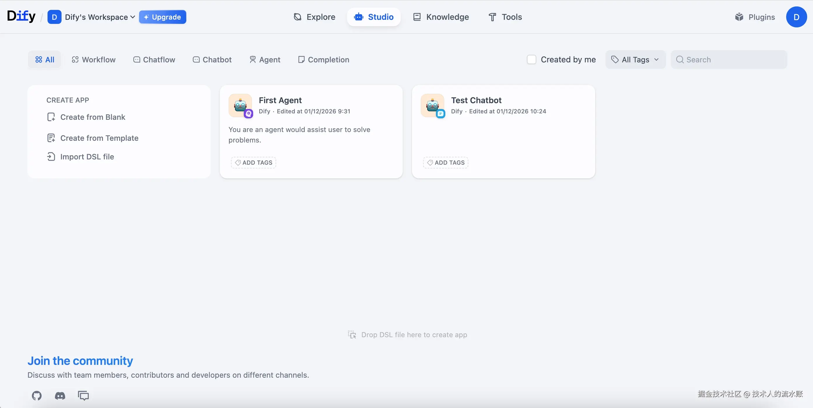
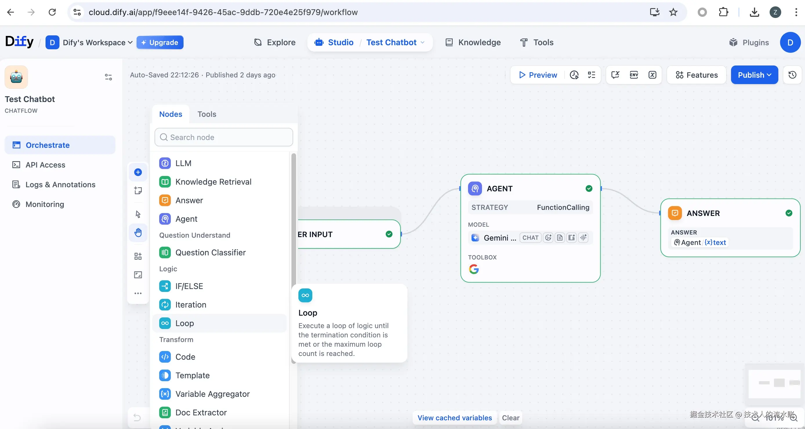
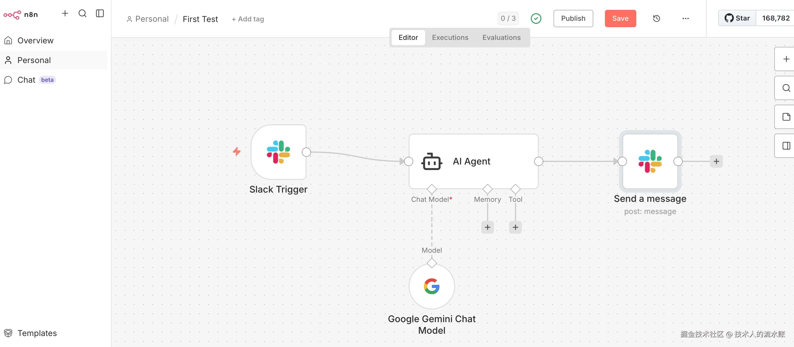
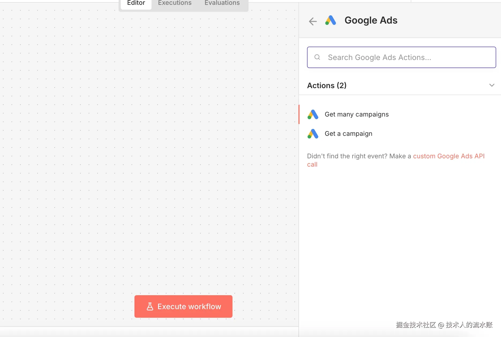

> 在低代码的世界里，不仅有拖拽，还有深夜里的源码重构。如果要挑战一个成熟体系中的限制，一定要三思后行。

## 如何开始的n8n

n8n在很久前就有耳闻，那时在用扣子平台(Coze国内版)开发集成豆包的小应用，就经常看到与Coze并列的低代码平台还有Dify和n8n。

最近决定要试一试，还是因为来到了掘金，看到了诸多大佬使用n8n成功构建自动化流程和变现的经历，就像是十多年前的前端开发者，对于框架的痴迷，改不了吃着碗里的，看着锅里的习惯。

刚好想要试试AI和Google Ads的集成，就不如用一个不熟悉的低代码平台来练练手。

### n8n和dify的对比

然而在开始尝试之前，我尝试着和Gemini聊了聊Dify和n8n的定位区别，Gemini给的答案是:

| **维度**    | **n8n**                                                     | **Dify**                                                 |
| --------- | ----------------------------------------------------------- | -------------------------------------------------------- |
| **本质**    | **工作流自动化引擎 (Workflow Engine)**                              | **LLM 应用开发平台 (LLMOps)**                                  |
| **核心优势**  | 极强的 **API 搬运能力**。连接 400+ 外部系统，处理非 AI 逻辑（如：循环、分支、数据库操作）非常稳健。 | 极强的 **RAG（知识库）能力**。管理 Prompt、上下文、分段清洗、嵌入（Embedding）非常专业。 |
| **交互形态**  | **后端导向**。它擅长在后台默默工作，或者连接到 Slack/Discord。                    | **前端导向**。它能一键生成一个类似 ChatGPT 的 Web 页面供非技术人员使用。            |
| **AI 逻辑** | 相对较新。它通过集成 LangChain 实现了 AI 节点，但不如 Dify 丝滑。                 | 生而为 AI。所有的设计都是围绕着如何让大模型更好用展开的。                           |

让我本来想以聊天为入口，用n8n去构建这个集成的时候，还是犹豫了一下，看看要不要去看看Dify。

当然在开始之前还是有必要对比一下成本的。先看一看两个产品的云端产品的计划对比：

| **维度**      | **n8n Cloud (云端)**        | **Dify Cloud (云端)**                   |
| ----------- | ------------------------- | ------------------------------------- |
| **永久免费层级**  | **无**（仅提供 14 天试用）         | **有 (Sandbox)**                       |
| **起步价格**    | 约 **\$20/月** (Starter 计划) | 约 **\$59/月** (Professional 计划)        |
| **计费核心指标**  | **Executions** (工作流执行次数)  | **Messages** (消息数) + **Storage** (存储) |
| **入门方案配额**  | 2,500 次执行 / 月             | 5,000 条消息 / 月                         |
| **AI 功能限制** | 消耗 AI 额度 (50 Credits)     | 限制文档上传数和向量存储空间                        |
| **并发限制**    | 5 个并发执行                   | 限制 API 请求速率                           |

可以看出针对测试和低用量的几个关键点:

1.  n8n没有长期免费的计划，所以如果测试持续时间长的话，会导致不交钱就不能继续。
2.  dify有免费计划，API触发限制倒是还可以，但是上面没提到的一个dify的关键配额是，如果直接使用内部的OpenAI，有总使用次数200次的限制（注意总计，不是每月）。
3.  关于协作，因为n8n里提到的是收费计划的体验，所以是可以和其他人共享工作流，而dify的免费计划仅限1个人使用。

那么如果想试试自己Host呢？对比大概是这样:

| **维度**         | **n8n (自托管社区版)**                | **Dify (自托管社区版)**                    |
| -------------- | ------------------------------- | ------------------------------------ |
| **应用定位**       | **通用自动化/iPaaS** (连接 SaaS 应用)    | **LLMOps/AI 应用开发** (RAG+Agent)       |
| **核心架构**       | 单容器 (Node.js) + 可选 Postgres     | 微服务架构 (10+ 容器，含向量库)                  |
| **推荐最小硬件**     | 1 vCPU / 2GB RAM / 20GB SSD     | **2 vCPU / 8GB RAM** (建议) / 50GB SSD |
| **云端月耗 (估算)**  | **$5 - $10** (如 Hetzner/轻量云)    | **$20 - $40** (资源开销大)                |
| **部署复杂度**      | **低**：一行 Docker 命令即可启动          | **中高**：多组件协作，环境变量多                   |
| **免费版执行上限**    | **无限制** (受限于硬件性能)               | **无限制** (自托管版本无对话数限制)                |
| **多用户支持**      | 社区版仅支持单人使用 (2026 策略)            | 支持创建团队空间，但功能受限                       |
| **2026 版核心限制** | 缺乏 Git 同步、SSO、高级角色权限            | 缺乏高级分析报表、复杂 OAuth 配置繁琐               |
| **授权协议**       | Sustainable Use License (非商用重售) | Apache-2.0 based (商业更友好)             |

可以看出针对测试和低用量的几个关键点:

1.  n8n的部署更加简单，成本低，而dify涉及多个容器，成本高
2.  n8n额社区免费版仍然不支持协作，而dify的社区免费版可以

**结论**
考虑到上面的这些点，考虑测试或低用量，有下面的结论:

1.  如果用Dify，不考虑协作，可以使用Dify云平台的免费版+个人LLM API Key。
2.  如果用n8n，不考虑协作，可以使用n8n社区版自己部署
3.  如果有协作的需求，可以考虑n8n云的Starter计划(\$24/月)，dify云的Professional计划(\$59/月)或自己部署dify社区版
4.  如果自建n8n，因为只有n8n容器+数据库，可以考虑Serverless+外部数据的方案，最小化成本。如果自建Dify，考虑到10+容器的复杂性，建议开VM并用官方的docker compose方案部署。

**💡 一句话总结：** 重 AI 交互与 RAG 选 Dify 云端版；重 API 搬运与极致私有化部署选 n8n 社区版。

### dify的尝试

上面的对比之后，考虑AI给出的dify更擅长聊天，作为入口，且dify有可以长期运行的云免费计划，遂计划先试试Dify。

网上注册了一个账号，进去看到第一眼，这个UI还是有点...比较...务实，就是少了点现代感，再加上我的老Mac，总感觉操作起来卡卡的。整个页面的感觉大概是这样：

工作流的编辑页面大概是这样

尝试构建了一个与Slack的集成，整体在Dify内的集成流程大概是

1.  安装Slack插件
2.  插件里配置Endpoint，贴Bot Token, 关联Dify App，最后生成Callback URL
3.  把Callback URL贴回Slack的事件订阅即可

然后关于单AGENT节点，配置起来跟扣子非常像，在一个节点里配置使用的模型，调用的工具，系统提示词，用户提示词即可。变量应用也相对比较友好。

此外Dify的云平台版，也提前做了很多国内大模型的插件，如果要调用直接安装并放入API Key即可。

测试了一两个小时Dify，总是感觉接受不了这个UI，那么接下来就试试n8n吧。

## n8n的尝试

之前没有上来就尝试n8n主要还是考虑部署的问题，因为我当前有一些想法想和别人合作（我来开发别人用），所以还是需要一个大家都能访问的环境，而n8n的云平台计划显然不符合我的既免费又不受太多限制的要求，虽然种草挺久，但是一直没有开始尝试。

直到我看到有大佬分享了一个 [n8n在GCP上部署的完整terraform](https://github.com/datawranglerai/self-host-n8n-on-gcr)，考虑到我在GCP还有很多Credits没有用完，就决定动手试试。

### n8n的安装

实测这个Terraform模板整体质量还是很高的，除了简单调整一下部署区域之外，基本不用做什么改动，应用terraform，打开n8n的首页就可以进行初始化配置了。

### 关于成本的问题

但是在运行了两天之后，就会发现一点成本问题，这个模板内默认设置了

    limits = {
      cpu    = "1"
      memory = "2Gi"
    }
    cpu_idle = false

> ⚠️ **避坑指南：Cloud Run 部署的“既要又要”陷阱**
>
> 实测发现，如果将 `cpu_idle` 设置为 `true`，虽然费用直线下降，但由于 n8n 后端会维护 Postgres 连接池，瞬间将 CPU 降到 0 会导致严重的 **CPU 争用（CPU Contention）** ，系统会变得极度不稳定。
>
> **结论**：在 Cloud Run 上跑 n8n，只能依赖自动缩容到 0 来省钱，实例运行时建议保持 `cpu_idle = false`。

事后再次发现，如果将上面的cpu\_idle改成false确实会更便宜，但是由于n8n的后端会维护Postgres连接池等，瞬间将CPU降到0会导致严重的CPU争用，最终整个系统都会不太稳定。所以不得不把它又调回来了，只能依赖自动缩为0来省钱了。

### n8n初体验

n8n进来之后整体的感觉就是还是很技术+现代风的，大图标和流畅的交互，对于我这个不那么专业的Node.js FullStack开发者来说甚是亲切。

再一次尝试构建了一个Slack的集成，整体在Dify内的集成流程大概是：

1.  先在全局的Credentials里建立一个Slack的认证，将Slack Bot的token复制进来并保存。
2.  在工作流里建立一个Slack Bot的输入节点，选择刚才的Slack credential。
3.  这里要注意的一点是,n8n的Slack的Callback URL会有Test和Production两个，而Slack里必须要测试URL通过才能填进去，那么就需要，测试阶段使用Test URL，发布后再去Slack里替换成生产的URL。

工作流的配置还是挺有特色的，节点引用的其他工具，都会用连线清晰的标注，以我的Slack+基础LLM集成的方案为例。

基本流程跑通了，就要开始尝试要做的事情了，那么就先试试与Google Ads的集成，结果在这里就踩了坑。

## Node开发踩坑

n8n里每一个节点叫node，node可以是很多不同的类型，AI给出的分类大概是这样

| **节点类型**            | **主要功能**                      | **典型示例**                                                   | **核心价值**               |
| ------------------- | ----------------------------- | ---------------------------------------------------------- | ---------------------- |
| **触发节点 (Triggers)** | 整个工作流的起点，监听特定事件或定时运行。         | **Webhook**, **Cron (Schedule)** , Gmail Trigger           | 定义工作流“何时”开始运行。         |
| **逻辑节点 (Logic)**    | 控制数据流向，进行判断、合并或等待。            | **If**, **Switch**, **Merge**, Wait, Stop                  | 工作流的“大脑”，处理条件分支。       |
| **数据节点 (Data)**     | 对 JSON 或二进制数据进行清洗、转换或格式化。     | **Edit Fields (Set)** , **Code**, **Split Out**, Aggregate | 处理 API 返回的原始数据，适配下游需求。 |
| **集成节点 (Action)**   | 与外部 SaaS 或数据库进行 CRUD（增删改查）交互。 | **Postgres**, **Supabase**, HTTP Request, Slack            | 实现跨平台的数据交换。            |
| **AI 节点 (Cluster)** | 专门用于构建 LLM Agent 和 RAG 流程的生态。 | **AI Agent**, **Vector Store**, **Memory**, Tool           | 构建具有推理能力和知识库的智能体。      |
| **系统/脚本节点**         | 执行底层系统命令或自定义代码。               | **Execute Command**, **Code (JS/Python)**                  | 解决标准节点无法实现的特殊工程需求。     |

我们这里要开发的Google Ads集成节点，就是一个Action节点，主要任务是对接Google Ads的API，进行对应的CRUD操作。

### 官方Node的支持

其实官方是有Google Ads的节点的支持的，我在工作流里做了测试，也可以联通，但是官方的这个节点明显就是做了一个框，因为它只实现了最基本的认证和对广告活动的Get操作，这个对于常规Google Ads的使用，基本就是没法用。

官方的节点的功能大概是这样:

于是在看了Google Ads的API文档之后，我决定至少先把自定义的Search先做进去。

Google Ads最新的API针对查询提供很高的灵活性，它提供了一个类似SQL的GAQL语句，以类SQL的方式可以实现跨表的业务查询，而之前提到的广告活动(Campaign)的查询，其实也是基于这个句法，所以如果我把这个自定义查询的接口暴露出来，实际上至少可以在n8n里再去拼SQL去获取业务数据，然后之后再考虑为不同的特定业务单独加Action。

### 开始Node开发

n8n的Node开发有官方的starter可以参考，大部分社区的Node都是基于这个starter开始的。此外这个starter里也包含了n8n的CLI，里面有基于官方要求的build和lint方法，经过这个方法的包，基本可以保证在框架上是符合运行要求的。

[官方starter的链接在这里](https://github.com/n8n-io/n8n-nodes-starter/)

[官方的构建说明文档](https://docs.n8n.io/integrations/creating-nodes/build/)

那么如果想要测试自己构建的Node，在使用官方CLI进行Build和Lint之后，只能使用自己的本地或其他地方部署的测试实例，先部署，后进行测试。

[部署的官方说明](https://docs.n8n.io/integrations/creating-nodes/deploy/install-private-nodes/)

简单来说，针对已经发布到npm的部署，可以在UI里找到Settings -> Community Nodes使用npm上包的名字直接部署。而如果是私有部署，需要复制到特定的目录(上面的文档里有提)下，并重启实例，实例在加载的过程中会加载这个Node。

这两种部署方式实测在UI里的表现有点不太一样：

*   通过复制到特定目录的方式，部署进去的Node和原生的Node就长得基本是一样的，需要靠名字区分。
*   通过UI安装的Node，部署进去有一个小的符号标记为社区Node。

此外我发现，在n8n里，即使内置的节点也不都是直接能使用，我测试使用Firecrawl时发现，它在n8n里其实是一个社区节点，需要先点击安装才能时候，而安装之后，它也会出现在社区节点的列表里。而这个社区节点的安装，之后就成为了一个大坑。

### Node开发的踩坑 —— 社区节点加载

社区节点的安装的基本原理，其实是在特定目录下运行了一个`npm install`。而考虑到我们是使用Cloud Run这样基于容器的环境做的部署，一旦没有收到新的请求，默认超过15分钟，就会缩容到0。等到有请求来再次拉起时，又是从镜像里建立了一个新的容器，对于需要持久化的数据来说，绝大部分都存在了相连的Postgres里，而对于社区节点，就只能放在文件系统里。这样如何保持它在文件系统里就成为了一个问题。

简单来说解决这问题有两个思路:

1.  手动加载社区节点后，不关机。理论上可以让它一直存在，就是Cloud Run最小实例数设置为1。我也这样尝试过，贵不说，即使设置最小实例数为1，基于容器化的特性，宿主环境偶尔也会出现重新拉起一个容器，关掉了你之前容器的情况，这个时候这个方法就失效了。
2.  让文件在启动时就出现在文件系统里，而实操这又分为了两种情况，一种是官方提供的，因为外部依赖比较多，但n8n没有内置的社区节点，如之前提到的Firecrawl。另一种是自己构建的社区节点。对于这两种不同的节点有不同的建议安装方式。
    *   因为外部依赖比较多，但n8n没有内置的社区节点: 可以考虑将它直接打到启动的镜像里，这可能需要一套CI/CD的流程，但核心操作是在n8n依赖包的目录，运行一个`npm install`安装社区节点包
    *   自己构建的社区节点: 自己构建的社区节点，如果是基于n8n自带的方法去构建的用来对接API的节点，通常不会有太多的文件依赖，这种情况也可以使用打到容器的方法，只是个人认为有点重。考虑到我的使用场景现在还不依赖Firecrawl，我就选择了另一种比较灵活的方式——挂载Cloud Storage。

挂载Cloud Storage本质上就是把对象存储挂载在私有节点的那个目录上，也就是`~/.n8n/custom/`，这样在需要更新自己新做的Node时，只要把这个节点上传到Cloud Storage对应的目录，然后让Cloud Run重启一下就可以了。这样就少了Build和Deploy的完整流程。但是前提依旧是，这个包的依赖不能多，因为Cloud Storage上如果存一堆小文件，那么从Cloud Run去获取时，速度是非常慢的，一堆小文件会严重影响性能。而自建的节点只是通过Restful API做一些CRUD有必要引入很多依赖吗？只能说理论上没必要，但总有自作聪明的人，于是乎就有了下一个坑。

### Node开发的踩坑 —— 节点包的依赖

官方的Google Ads节点的代码是我看的第一个节点的源码。

[代码的链接在此](https://github.com/n8n-io/n8n/tree/master/packages/nodes-base/nodes/Google/Ads)

最基本的条件是要有这三个文件:

*   GoogleAds.node.json
*   GoogleAds.node.ts
*   googleAds.svg

这些文件的命名也是有要求的，我的建议是，最好保证所有文件的前缀都采用同样的命名，且ts和json文件里声明的任何class和name等，都采用相同的名字，不然测试的时候一定会遇到各种问题，且这些问题在本地build和lint过程中也检测不出来。（别问我怎么知道的）

关于官方这个节点的内容，我做了仔细研究，他们整体是声明式的编码方式，里面包括一些关键点:

*   需要的认证方式，以及通过认证方式导出的关键字段。
*   节点和UI上Action关联的输入定义
*   把节点的Action，关联到API的请求，利用认证导出字段和输入字段作为参数

官方关于声明式和程序化方法构建节点的文档如下

*   [声明式方法](https://docs.n8n.io/integrations/creating-nodes/build/declarative-style-node/)
*   [程序化方法](https://docs.n8n.io/integrations/creating-nodes/build/programmatic-style-node/)

而我被坑到的点在于，在我看到官方Google Ads的功能如此之弱之后，想要自己去扩展时，第一个行动是找了个Google Ads的Node.js的API，然后我开启了 **Vibe Coding** 模式，让 AI 帮我处理复杂的程序化逻辑（Programmatic style）进行重构。虽然 AI 帮我写代码飞快，但也让我撞上了社区节点不支持外部依赖包的“隐形墙”，这正是我要分享的硬核价值。Antigravity在这个过程中也放弃了声明式方法，转而选择了程序化方法。当我到了lint步骤时，官方的CLI就给出了报错，说社区节点如果想用于云上，不支持包含外部依赖。这个时候其实已经觉察到一点不对了，但是考虑到我只是部署到自己的私有节点，加上eslint的ingore之后，也是可以正常release到npm。

之后通过社区节点的UI界面部署到我的n8n实例里，测试什么都一些正常。

但是当我开始考虑持久化方案的时候问题就来了，上面提到了，对于自己构建的节点，我想使用放在Cloud Storage上的方法，那么这就会要求不能有很多小文件。对于构建本身产生的文件并不多，也就是一些js和sourcemap之类的，但是当我把构建出来的文件复制到Cloud Storage并重启n8n容器后，报出了 **`Cannot find module 'google-ads-api'`** 的错。我这才意识到，虽然我成功把构建后的文件传到了 Cloud Storage，但包依赖（node\_modules）并没有随之迁移。。我这才意识到，我复制过去的只是我的代码build出来的文件，我的包依赖还完全没有解决。当我在本地dist目录里再去npm install之后，这个文件大小就迅速膨胀，直接导致Cloud Storage这条路就走不通了。

这个节点我只好又回到原点，在Vibe Coding的帮助下，基于官方的节点代码，没有外部包的依赖，只是增加自定义查询的方法，这个时候在构建，就就只是那十几个文件，再去使用Cloud Storage方法就可以顺畅进行了。最后，悄悄地删掉了我放在eslint配置里的那个ignore...

这里分享我基于大佬的原Terraform进行更改的，[加上了Cloud Storage挂载的terraform的代码仓库](https://github.com/zhibinyang/self-host-n8n-on-gcr/)。

## 总结

n8n的开发总体还是很有趣的，尤其是可以通过自己编码扩展n8n的节点能力。这次只是node开发探索的开始，相信之后还有更多有趣的尝试，必然也有更多的坑要一个一个去踩。
