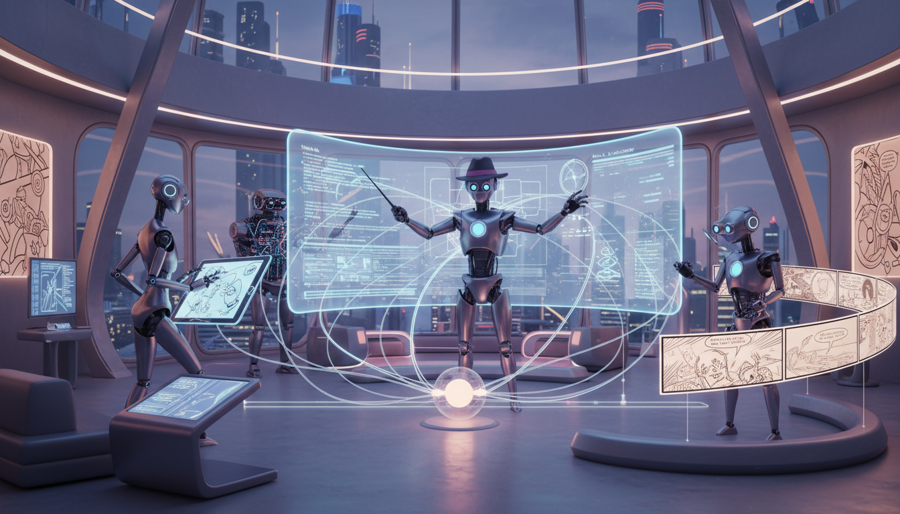

> 你是否遇到过这种情况：让 AI 画四格漫画，主角却在每一格里“变身”，或者关键道具凭空消失？AI 空有才华却毫无逻辑，就像个只有七秒记忆的天才。为了解决这个痛点，我放弃了单打独斗，而是利用 n8n 组建了一个由编剧、视觉总监和逻辑审查员组成的“AI 导演组”。本文将分享我是如何通过 Multi-Agent 工作流，让 AI 真正学会“带脑子”画画，实现角色一致性和叙事连贯性的质的飞跃。

之前我在掘金社区看到有大佬分享了一个用来生成四格漫画的 AI 工作流。那个想法很棒，但实际跑起来我发现一个老生常谈的问题：AI 这种东西，才华横溢但毫无逻辑。

上一格主角手里还端着咖啡，下一格咖啡就不翼而飞了；或者明明是向左跑，到了下一格却变成了从右边入镜。对于单张插画来说这没问题，但对于需要连续叙事的漫画来说，这种“灵异事件”简直是灾难。

为了解决这个问题，我没有去训练更复杂的模型，而是转换了思路：既然一个 AI 搞不定，那就组建一个“剧组”。

我基于 n8n 搭建了一个 Multi-Agent 的工作流，把原本 chaotic 的生成过程，拆解成了一个严谨的流水线。

## 为什么单打独斗不行

大多数人玩 AI 漫画的流程是这样的：给一段 prompt -> AI 直接生成四格图。

这种简单粗暴的方式最大的问题在于，AI 的模型（无论是 Stable Diffusion 还是 DALL-E 3）并没有长时记忆和物理常识的强约束。它在画第四格的时候，可能已经忘记了第一格里主角穿的是什么颜色的袜子。

所以，我们需要引入“职能分工”。在我的这个工作流里，我不再指望一个模型包办所有事情，而是设立了几个明确的角色。

## 我的 AI 导演组

这个工作流的核心，就是利用 n8n 的 LangChain 节点，串联起了几个性格迥异的 AI Agent。

### 1. 爆笑梗漫编剧 (The Director)

这是整个流程的大脑。它的职责非常纯粹：**只负责故事，不负责画面。**

我给它设定了非常详细的 System Prompt，要求它模仿吉卜力的写实风格，创作职场题材的冷幽默四格漫画。它不需要操心画面怎么画，它只需要输出剧本：

- Panel 1（起）：铺垫场景
- Panel 2（承）：冲突升级
- Panel 3（转）：逻辑反转
- Panel 4（合）：爆梗绝杀

它甚至还有一套完整的人物小传，比如那个32岁、穿深蓝色 Polo 衫、眼神清澈又带着疲惫的程序员男主，还有一个油腻的直线老板作为反派。这样每次生成的故事，角色性格都是立得住的。

### 2. 视觉形象架构师 (Visual Architect)

拿到了剧本，不能直接画。因为文字剧本到视觉画面之间，存在巨大的鸿沟。

这个 Agent 的作用就是"**翻译**"。它会把编剧写的“男主感到无奈”，转化成具体的视觉指令：“男主坐在工位前，双手抱头，背景是堆满文件的办公桌，色调偏冷灰”。

重要的是，它被强制要求遵守“视觉约束”。它手里有一份死板的“角色定妆照”文档。不管剧本怎么飞，它必须保证男主的 Polo 衫永远是深蓝色的，老板的发际线永远是那么高。

### 3. 逻辑与物理审查员 (Logic Referee)

这是我最得意的一个设计。这个 Agent 不负责创意，它是一个"**找茬的**"。

它的 System Prompt 里写满了物理定律和空间逻辑。它的工作是审查视觉架构师的输出：

- **矢量一致性**：如果上一格男主向左看，这一格的视线是不是接得上？
- **物体持久性**：第一格桌子上的那个水杯，如果没有被拿走或打碎，第二格、第三格必须还在那里，不能凭空消失。

如果发现逻辑漏洞，它会直接打回修改，直到逻辑闭环为止。这极大地降低了“穿帮”镜头的出现率。

### 4. 跨维度视觉审计 (The Auditor)

最后，当图生成出来之后，还有一个 Agent 负责“验收”。它会像在一堆大家来找茬的游戏里一样，对比最初的剧本和最终生成的图片。

如果剧本里写的是“白天”，生成的图却是“黑夜”；或者剧本里主角拿的是手机，图里拿的是香蕉，它会立刻发出警报。虽然目前我把它设计成输出报告，但在未来，这一步可以直接触发“重绘”。

## 效果展示

通过这套“编剧 -> 视觉翻译 -> 逻辑审查 -> 最终生成”的流水线，产出的四格漫画稳定性有了质的飞跃。

比如最近生成的一个关于“无效汇报”的漫画：

- **第一格**：深夜空荡的办公室，只有男主工位亮灯，那是孤独的加班狗。
- **第二格**：对比镜头，老板在高尔夫球场谈笑风生。
- **第三格**：天亮了，代码跑通，男主那一刻的成就感。
- **第四格**：汇报会上，老板拿着激光笔侃侃而谈，那是他的功劳。男主在角落冷笑。

虽然是 AI 生成的，但因为每一格的情绪和逻辑都被 Agent 严格把控，读起来竟然真的有一种这就发生在我身边的讽刺感。

## 结语

其实 AI Agent 的本质，就是把人类的工作流（Workflow）标准化。

以前我们画漫画，脑子里也是这么想的：先想梗，再画分镜，再扣细节。现在我们只是把这个思考过程外化成了 Prompt，交给了不同的 Agent 去执行。

如果你也想做类似的 AI 应用，不妨也试试这种“导演组”的思路。与其费尽心思调教一个全能的超级模型，不如组建一支各司其职的专业团队。毕竟，三个臭皮匠，顶个诸葛亮嘛。

如果你也对如何用 n8n 驱动这种复杂的多 Agent 协作感兴趣，欢迎在评论区交流。