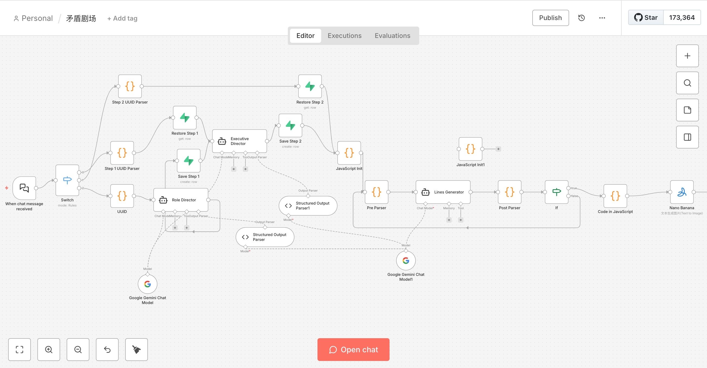

> Why are we obsessed with deep interviews and debate shows?
>
> Not to hear the conclusions, but to see the **conflict**. To see how people with distinct standpoints clash to defend their bottom lines, to see logic jumping back and forth on the edge of emotion, to see how an elite is stripped of their hypocritical coat.
>
> Recently, in my "Node Autopsy Room", I built an automated workflow called **"Paradox Theatre"** using n8n. My instructions to it were simple: input a social hot topic, and it automatically casts roles, orchestrates scripts, and drives multiple AI Agents to complete a 12-minute, high-tension deep conversation.
>
> This is not a gentle seminar, but a carefully designed "Digital Shura Field" (battlefield).

## Act I: The Casting Director's "Scent of Humanity"

Half the credit for a good show goes to casting.

At the beginning of the workflow, I configured a node called `Role Director`. It doesn't look for those commentators who follow the crowd; it only looks for these three types of people:

1.  **The Stakeholder**: At the center of the storm, views based on survival and emotion.
2.  **The Moral Critic**: Defender of rules and traditions, views based on order and right/wrong.
3.  **The Deconstructor**: A cold academic machine, disassembling everything with sociology or psychology.

The most interesting point is: I asked the director to design a **"Human Flaw"** for each guest. For example, an arrogant HRD who craves recognition, or a deconstructionist who privately suffers from severe anxiety. This is the foreshadowing for the subsequent "breakdown" climax.

## Act II: The Screenwriter's "Interruption Protocol"

If AIs just take turns speaking, that's called "making a report". Real conflict is full of **interruptions, talking over each other, and logical crushing**.

The core node `Executive Director` is responsible for generating a "script list" of up to 40+ units. It divides the show into three stages:

*   **Round 1:** Collision of values, maintaining basic decency.
*   **Round 2:** Deep game, introducing sensitive details, starting **violent interruptions**.
*   **Round 3:** Psychological offense and defense, concentrating fire on someone's "Human Flaw" to create a breakdown.

Here I designed an **Interruption Protocol**. If the script is marked as `being_interrupted`, the current Agent's speech will be forcibly cut off halfway (ending with "——"), and the next `interrupting` Agent will cut in instantly, giving the opponent no chance to breathe.

## Act III: Production and Circulation of Logic

To support this long conversation, I used a series of JavaScript nodes in n8n to manage **"State"**.

It's like the circulatory system of a brain:

1.  **Pre Parser**: Extracts who should speak now, who the opponent is, and what the future plot direction is.
2.  **Lines Generator**: Calls Gemini 3 Pro to inject soul. It will bring in the persona, refer to historical dialogue, and decide whether to mock with pity or counterattack with anger based on "acting prompts".
3.  **Post Parser**: Cleans the lines, updates the dialogue history, and pushes the index to the next line.

To ensure the show's memory isn't lost, I connected **Supabase** as a persistent database. Even if the workflow breaks halfway, I can recover the "actor memory" of this session at any time via UUID.

## Final Act: The "Golden Sentence" of Parting on Bad Terms

The show won't end with muddling through. At the end of the workflow, I let the head writer give a description of leaving "on bad terms" and generate a Golden Sentence that highlights the theme.

Finally, I called `Nano Banana`'s image generation node to generate a visually striking cover image for my official account based on the core conflict of the entire interview.

## Final Thoughts

In the process of tossing this workflow around, what excited me most was not how "smart" the AI behaved, but that under specific rule constraints (such as the interruption protocol, flaw design), they demonstrated a kind of **"Digital Humanity"**.

Previously, doing technical support was Troubleshooting; now doing AI orchestration is Designing Conflict. This shift from "Logic Maintainer" to "Drama Architect" might be the most interesting crossover for us in the Cloud Native and AI era.

If you are also interested in how to use n8n to drive this kind of complex multi-Agent collaboration, feel free to communicate in the comments section. See you at the next "node".

Attached overall flowchart:

