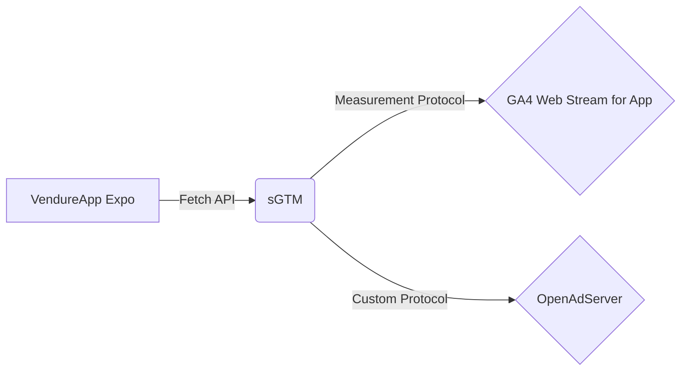

> The focus of AdTech is shifting towards App and CTV. Although I have never been involved in App development and do not have an Apple Developer account, to complete my AdTech Sandbox landscape, I decided to challenge myself: without native development experience and without wanting to pay, I used Expo and React Native to "hand-roll" an e-commerce App Storefront that can run through full-link telemetry. This is not only a technical experiment but also an exploration of pragmatic decision-making and rapid prototyping.

## Why build an App suddenly?

My [AdTech Sandbox Plan]() already has a Web end, but in the current advertising technology circle, everyone talks about App and CTV (Connected TV). Missing one end feels like missing a leg.

Although I have never written a single line of Obj-C or Swift code in my life, I know that current cross-platform technologies are very mature. Since I am familiar with the TS/JS tech stack, React Native naturally became the first choice. More importantly, I learned about the **Expo** tool — it allows me to run code directly on my phone through the Expo Go container, completely bypassing the XCode compilation process and the payment threshold of the Apple Developer account.

For a Sandbox that just wants to quickly verify the AdTech process, this is the perfect "free ride" solution.

## Resurrection of VendureApp

Since it is a Sandbox, writing UI from scratch is obviously not cost-effective. I searched through Github and pleasantly found an open-source project called `VendureApp`. Its tech stack (Expo + React Native + Apollo Client) perfectly matches my backend Vendure.

But there is no free lunch in the world. The last update of this project was two years ago, when it was still Expo SDK v51, and now the world is already at v54.

The moment I pulled the code down, the screen full of red errors seemed to mock my naivety. Dependency conflicts were disastrous, especially those bindings for native modules. After repeated `yarn install` and `yarn why`, and with the help of LLMs, I finally sorted out a dependency graph that could work.

When the product list finally rendered in the simulator, I realized: **As long as dependencies are sorted out, the tech stack gap is not a problem.**

## Alternative Telemetry Solution

The App is running, but the real challenge has just begun: **Telemetry**.

According to the traditional approach, App telemetry must choose Firebase SDK. But awkwardly, the Expo Go "container" itself does not support loading custom native code, so many Firebase native modules simply cannot run.

At this time, there were two paths in front of me:
1. **Eject to Bare Workflow**: Set up a complete XCode environment, pay, compile. -> **Too heavy, give up.**
2. **Web Simulation Scheme**: Forcefully use Web SDK. -> **Environment difference is large, many pitfalls.**
3. **Direct Fetch Scheme**: constructing requests entirely by myself.

After weighing the pros and cons, I chose a more "AdTech" path: **Fetch + sGTM**.

Since Expo Go is also a JS environment, I can totally use `fetch` to send HTTP requests directly. I send the data to my **sGTM (Server-side Google Tag Manager)**, then clean and forward it in sGTM, and finally distribute it to the GA4 Web Data Stream and my OpenAdServer.

The first wave of telemetry mainly covered the core e-commerce process:
- `view_item`
- `add_to_cart`
- `purchase` (This is the lifeline of conversion)

In order to get accurate pre-tax prices and currency units, I acted as a detective again, rummaging through the GraphQL return structure, and finally replaced the Hard Coded Euro symbol with dynamic data.

## The "Ghost" in GA4 DebugView

Everything seemed to go smoothly until I tried to verify the data in GA4's DebugView.

No matter how I pieced together the Fetch request, or even tried simulating the `debug_mode` parameter, DebugView remained blank. The frustration of "I clearly sent the request, why do you ignore me" made me question life late at night.

Until I helplessly clicked on **Realtime** — there was data!
I checked the export of **BigQuery** again — the data was also there!

It turned out that GA4 did not block my request, but simply didn't want to talk to me in DebugView. At that moment, I was relieved. Since the data can enter the report and the data warehouse, does it matter if I can see that blue icon in DebugView?

## The Last Mile of Deep Link

The closed loop of AdTech cannot be separated from attribution, and attribution cannot be separated from **Deep Link**. I hope that after users click on the ad (`exp://...`), they can jump directly to the product details page.

Here I encountered another pitfall: Vendure's Shop API has complex logic when searching for products. I wanted to use SKU as a Deep Link parameter, but the existing API does not support exact lookup and jump directly through SKU, only search, then select.

As a pragmatic developer, I decisively chose **Internal ID**. The parameter might be ugly, but making it work is the hard truth.

In order to implement Conversion API, I also need to pass down the `click_id` of the ad click. Here, React Native's `AsyncStorage` is used to temporarily store the `click_id` in the Deep Link when the app starts, and then take it out from Storage and stuff it into the telemetry event when the user generates a purchase behavior.

## Summary

At this point, my AdTech Sandbox has finally completed the App link.

It's like playing with Lego. Although some blocks are not original (Expo Go replaces native), and some connections are a bit forced (Fetch replaces SDK), the castle built in the end can still fully demonstrate the full process of **Ad Click -> App Launch -> Browse & Add to Cart -> Conversion Postback**.

For developers who want to quickly verify ideas, **Done is better than perfect**.

---

For the full background of AdTech Sandbox, please see another blog post:
[AdTech Sandbox 2026]()


