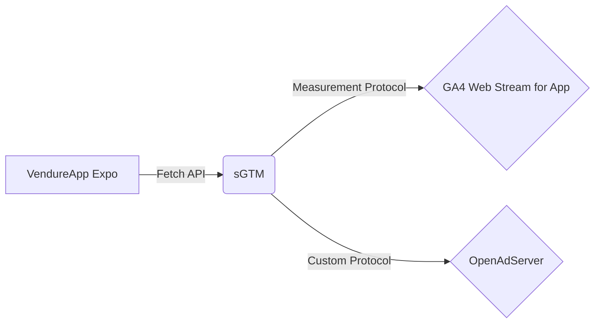

> AdTech 的重心正在向 App 和 CTV 转移。虽然我从未涉足 App 开发，也没有 Apple 开发者账号，但为了完善我的 AdTech Sandbox 版图，我决定挑战自己：在没有原生开发经验、不想付费的情况下，用 Expo 和 React Native “手搓”出一个能跑通全链路埋点的电商 App Storefront。这不仅是一次技术的尝鲜，更是一场关于务实决策与快速原型的探险。

## 为什么突然要做 App？

我的 [AdTech Sandbox 计划]() 已经有了 Web 端，但现在的广告技术圈子，言必称 App 和 CTV（Connected TV）。少了一端，总觉得像缺了一条腿。

虽然我这辈子没写过一行 Obj-C 或 Swift 代码，但我知道现在的跨平台技术已经非常成熟。既然我熟悉 TS/JS 技术栈，React Native 自然成了首选。更重要的是，我了解到 **Expo** 这个神器 —— 它可以让我直接在手机上通过 Expo Go 容器运行代码，完全绕过 XCode 的编译流程和苹果开发者账号的付费门槛。

对于一个只想快速验证 AdTech 流程的 Sandbox 来说，这是最完美的“白嫖”方案。

## 捡漏与填坑：VendureApp 的复活

既然是 Sandbox，从零写 UI 显然不划算。我翻遍了 Github，惊喜地发现了一个叫 `VendureApp` 的开源项目，它的技术栈（Expo + React Native + Apollo Client）完美契合我的后端 Vendure。

但天下没有免费的午餐。这个项目最后一次更新是在两年前，当时还是 Expo SDK v51，而现在的世界已经是 v54 了。

把代码拉下来的那一刻，满屏的红色报错仿佛在嘲笑我的天真。依赖包的冲突简直是灾难级的，尤其是那些原生模块的绑定。经过反复的 `yarn install` 和 `yarn why`，在大模型外援的帮助下，我终于梳理出一份能跑通的依赖关系图。

当模拟器里终于渲染出商品列表的那一刻，我意识到：**只要依赖理得清，技术栈跨度都不是事儿。**

## 另辟蹊径的埋点方案

App 跑通了，真正的挑战才刚刚开始：**埋点（Telemetry）**。

按照传统的套路，App 埋点必选 Firebase SDK。但尴尬的是，Expo Go 这个“容器”本身不支持加载自定义的原生代码（Native Code），很多 Firebase 的原生模块根本跑不起来。

这时候，摆在我面前有两条路：
1.  **Eject 到 Bare Workflow**：搭建完整的 XCode 环境，付费，编译。 -> **太重，放弃。**
2.  **Web 模拟方案**：强行用 Web SDK。 -> **环境差异大，坑多。**
3.  **Fetch 直发方案**：完全自己构造请求。

经过权衡，我选择了一条更“AdTech”的路：**Fetch + sGTM**。

既然 Expo Go 也是 JS 环境，我完全可以直接用 `fetch` 发送 HTTP 请求。我把数据发送给我的 **sGTM (Server-side Google Tag Manager)**，然后在 sGTM 里进行清洗和转发，最终分发给 GA4 的 Web Data Stream 和我的 OpenAdServer。

第一波埋点主要覆盖了电商核心流程：
- `view_item` (浏览商品)
- `add_to_cart` (加购)
- `purchase` (这可是转化的命门)

为了拿到准确的税前价格和货币单位，我又当了一回侦探，在 GraphQL 的返回结构里翻箱倒柜，终于把 Hard Code 的欧元符号换成了动态数据。

## GA4 DebugView 的“幽灵”

一切看似顺利，直到我试图在 GA4 的 DebugView 里验证数据。

无论我怎么拼凑 Fetch 请求，甚至尝试模拟 `debug_mode` 参数，DebugView 里始终是一片空白。那种“我明明发了请求，你为什么不理我”的挫败感，让我在深夜里怀疑人生。

直到我无奈点开 **Realtime (实时报表)** —— 竟然有数据！
我又去查了 **BigQuery** 的导出 —— 数据也在！

原来，GA4 并没有 Block 我的请求，只是单纯不想在 DebugView 里理我。那一刻，我释怀了。既然数据能进报表，能进数仓，能不能在 DebugView 里看到那个蓝色的小图标，又有什么关系呢？

## Deep Link 的最后一公里

AdTech 的闭环离不开归因，而归因离不开 **Deep Link**。我希望用户点击广告 (`exp://...`) 后能直接跳转到商品详情页。

这里又遇到一个坑：Vendure 的 Shop API 在搜索商品时，逻辑比较复杂。我想用 SKU 做 Deep Link 参数，但现有 API 不支持直接通过 SKU 精确查找并跳转，只能先搜索、再选择。

作为一名务实的开发者，我果断选择了 **Internal ID**。参数丑点就丑点吧，能跑通才是硬道理。

为了实现转化回传（Conversion API），我还需要把广告点击的 `click_id` 透传下去。这里用到了 React Native 的 `AsyncStorage`，在应用启动时暂存 Deep Link 里的 `click_id`，等到用户产生购买行为时，再从 Storage 里取出来塞进埋点事件里。

## 总结

至此，我的 AdTech Sandbox 终于补齐了 App 这一环。

这就好比玩乐高，虽然有些积木块不是原装的（Expo Go 代替原生），有些卡扣接得稍微有点勉强（Fetch 代替 SDK），但最终搭建起来的城堡，依然能完整演示从 **广告点击 -> App 唤起 -> 浏览加购 -> 转化回传** 的全流程。

对于想要快速验证想法的开发者来说，**Done is better than perfect**。

---

AdTech Sandbox 的完整背景，可参见另一篇博客：
[AdTech Sandbox 2026]()


