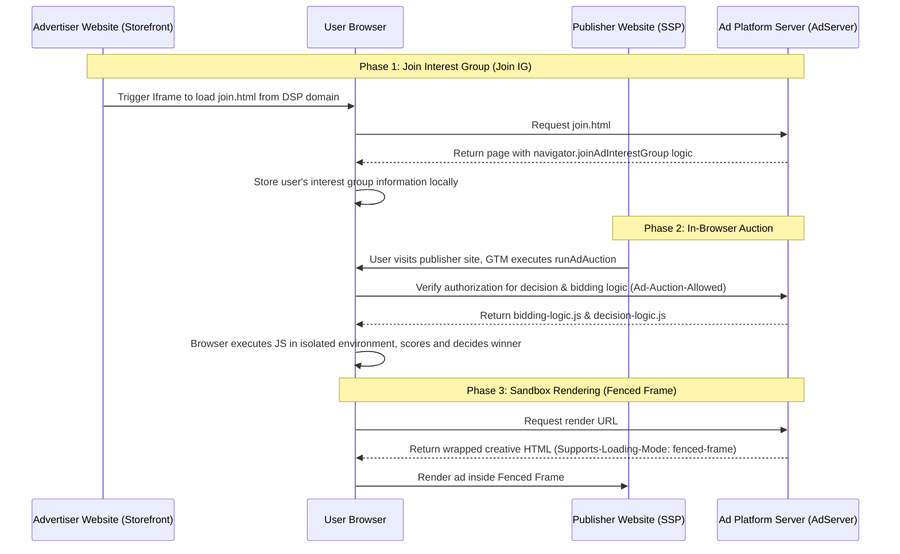

> A few days ago, while discussing the next research direction in the AdTech space with AI, the Privacy Sandbox naturally became a primary focus. In an era where we are gradually moving away from third-party cookies, figuring out how to achieve precise ad targeting while protecting user privacy has become an industry-wide headache. Within this complex ecosystem, the Topics API is relatively straightforward, but the Protected Audience API (PAAPI) reveals fascinating technical depth. Driven by curiosity about its underlying mechanics, I decided to implement a basic PAAPI serving pipeline from scratch on my open-source ad server. This was destined to be a hardcore debugging journey. However, what I didn't expect was that exactly at the moment when I overcame countless hurdles to successfully render the ad, I read some astonishing news—this "technological crown jewel" I had just thoroughly figured out is about to be deprecated.


<!--more-->

## What was PAAPI trying to save?

In the early days of AdTech, third-party cookies were the bedrock for building user profiles and executing retargeting campaigns. However, with the rise of privacy awareness and the enforcement of data compliance laws globally, the traditional cross-site tracking model became unsustainable. The Privacy Sandbox, led by Google, emerged to strike a balance between "protecting user privacy" and "sustaining the advertising business model."

The Protected Audience API (formerly known as FLEDGE) was designed specifically to address the core need of **retargeting**. Its core philosophy is quite radical: **if sending user data to the server is unsafe, then push the bidding logic down to the browser.** 
By letting the browser take over the storage of interest groups and the computation of the bidding process, PAAPI attempts to sever the circulation of User IDs between buyers and sellers, returning data control to the user's local device.

## Breaking through with a Static Implementation

To thoroughly understand this black box, I decided to build a minimal PAAPI static ad delivery system on my OpenAdServer. 
I initially thought it would just be copying a few API calls, but it turned into a bumpy "troubleshooting history."

### Architecture Flow Verification

After successfully making the pipeline work, the overall PAAPI interaction sequence looks roughly like this:



### Full Troubleshooting Record

From APIs returning `undefined` to CDN caching mischief, countless details made me deeply appreciate the strictness of this system:

| Error / Symptom | Core Cause | Final Solution |
| --- | --- | --- |
| `NotAllowedError` | Browser privacy settings or Flags not enabled | Enable `adPrivacy` settings and configure `enrollment-overrides` |
| `TypeError: same origin required` | GTM domain mismatch with IG Owner | Use an **Iframe** from the Ads domain for delegated writing |
| `Syntax Error` (GTM) | Lack of ES6+ syntax support | Refactored into **ES5 + Promise** style code |
| `Lack of Ad-Auction-Allowed` | Backend response missing authorization Header | Inject Header via Nest.js or Cloudflare Transform Rules |
| `Fenced-frame header required` | Creative HTML missing rendering header | Add `Supports-Loading-Mode: fenced-frame` to the `renderUrl` response |
| `No winner found` (and Storage is empty) | IG not written or Owner configuration error | Check Iframe loading status and ensure exact `owner` string match |

### Core Code Refactoring and Validation

To get this verification process running, I independently refactored the backend server, the publisher side, and the advertiser side.

**1. Backend Injection and Isolation Gateway (Nest.js)**

All logic JS must be explicitly authorized by the server. I created a `PaapiController` to distribute the scripts and creative pages:

```typescript
import { Controller, Get, Header } from '@nestjs/common';

@Controller('paapi')
export class PaapiController {
    @Get('decision-logic.js')
    @Header('Content-Type', 'application/javascript')
    @Header('Ad-Auction-Allowed', 'true')
    getDecisionLogic() {
        return `function scoreAd(adMetadata, bid, auctionConfig, trustedScoringSignals, browserSignals) {
  return bid;
}

function reportResult(auctionConfig, browserSignals) {
  return { "success": true };
}`;
    }

    @Get('bidding-logic.js')
    @Header('Content-Type', 'application/javascript')
    @Header('Ad-Auction-Allowed', 'true')
    getBiddingLogic() {
        return `function generateBid(interestGroup, auctionSignals, perBuyerSignals, trustedBiddingSignals, browserSignals) {
  return {
    bid: 15,
    render: interestGroup.ads[0].renderUrl,
    ad: { id: 'test-ad-001' }
  };
}

function reportWin(auctionSignals, perBuyerSignals, sellerSignals, browserSignals) {
  console.log("I won the auction!");
}`;
    }

    @Get('ad-creative.html')
    @Header('Content-Type', 'text/html')
    @Header('Supports-Loading-Mode', 'fenced-frame')
    getAdCreative() {
        // To prevent privacy leaks, Fenced Frames strictly require the rendering content to be an independent HTML document
        return `<!DOCTYPE html>
<html>
  <body style="margin:0; padding:0; overflow:hidden;">
    
  </body>
</html>`;
    }

    @Get('join.html')
    @Header('Content-Type', 'text/html')
    getJoinHtml() {
        return `<!DOCTYPE html>
<html>
<body>
  <script>
    // This code runs under the ads.example.com domain
    var myGroup = {
      owner: 'https://ads.example.com',
      name: 'test-sneakers',
      biddingLogicUrl: 'https://ads.example.com/paapi/bidding-logic.js',
      ads: [{
        renderUrl: 'https://ads.example.com/paapi/ad-creative.html',
        metadata: { type: 'sneaker', baseBid: 10 }
      }]
    };

    if (navigator.joinAdInterestGroup) {
      navigator.joinAdInterestGroup(myGroup, 30 * 24 * 60 * 60)
        .then(function() { console.log("Iframe: Joined IG"); })
        .catch(function(e) { console.error("Iframe error:", e); });
    }
  </script>
</body>
</html>`;
    }
}
```

**2. Advertiser Side Configuration (Custom HTML in GTM)**

Since GTM runs on the Storefront domain, it cannot unauthorizedly write to the ad platform's interest groups. It must be delegated via an invisible Iframe:

```html
<script>
(function() {
  var ifrm = document.createElement("iframe");
  ifrm.src = "https://ads.example.com/paapi/join.html"; 
  ifrm.style.width = "0";
  ifrm.style.height = "0";
  ifrm.style.border = "0";
  ifrm.style.display = "none";
  document.body.appendChild(ifrm);
})();
</script>
```

**3. Publisher Side Triggering Auction (Custom HTML in GTM)**

Utilize the browser's `runAdAuction` to initiate a local auction and assign the winning rendering config to a `fencedframe`. Because GTM's sandbox environment is archaic, the code had to be rolled back to ES5:

```html
<script>
(function() {
  if (!navigator.runAdAuction) { return; }

  var auctionConfig = {
    seller: 'https://ads.example.com',
    decisionLogicUrl: 'https://ads.example.com/paapi/decision-logic.js',
    interestGroupBuyers: ['https://ads.example.com'],
    resolveToConfig: true 
  };

  navigator.runAdAuction(auctionConfig)
    .then(function(config) {
      if (config) {
        var frame = document.createElement('fencedframe');
        frame.config = config;
        frame.style.width = '728px';
        frame.style.height = '90px';
        frame.style.border = '1px solid #eee';
        
        var slot = document.getElementById('global-footer-paapi-ad');
        if (slot) { slot.appendChild(frame); }
      }
    })
    .catch(function(err) { console.error("Auction error:", err); });
})();
</script>
```

Crossing these hurdles one by one, witnessing the asset successfully render inside the Fenced Frame delivered an unparalleled sense of accomplishment in conquering the black box.

## The Missed Dynamic Implementation

Having completed the purely static approach based on hardcoded bids, my blueprint for the next phase was already laid out: making the ads "come alive" without User IDs.

In the original plan, we were to utilize the `trustedBiddingSignalsUrl` interface to inject dynamism. Although this interface only receives very limited and desensitized parameters (like `hostname`, interest group name, etc.), we could achieve real-time on-device bid intervention through granular naming of interest groups (e.g., `sneakers-high-value`) while fusing macro-level weights and inventory information on the server. By dissecting `reportWin` and the ARA (Attribution Reporting API) in the attribution pipeline, I was also calculating how to recover conversion features by doing offline data joins using `auction_id` without accurate IDs.

However, the "original plan" will forever remain just a plan.

## A Dramatic Turn: Abruptly Halted

Just as I prepared to dig deep into TEE (Trusted Execution Environment) following the dynamic pipeline, an official announcement poured cold water over me: **Chrome version 144 will officially remove the PAAPI.**

Google announced a pivot to a so-called "User-choice mode." After years of delays and back-and-forths with the UK's CMA, Google finally compromised. PAAPI is no longer a mandatory standard for the entire industry. Due to its extremely high integration complexity, performance controversies, and even suspicions of disguised monopoly, this technical experiment—which carried the heavy hopes of advertising privacy—met its end.

## Technical Insights with Honor in Defeat

I have to admit, this is quite an ironic outcome: a cutting-edge architecture that was just thoroughly researched is about to become historical dust. But calmly reviewing it, the process remains a valuable asset.

Even if specific APIs are being deprecated, the core technical concepts embodied in PAAPI will continue to shine in other forms of architecture:

1. **On-Device Computing Mindset:** The design of pushing edge computing logic down to the browser provides us with a deeper understanding of client-side performance ceilings and isolation scheduling.
2. **Trust and Verification Mechanisms:** From `Ad-Auction-Allowed` to the `Fenced Frame`, we understand how modern browsers meticulously guard cross-domain communication and rendering isolation boundaries.
3. **The Essence of Obfuscated Attribution:** Learning how to recover ROI signals to the greatest extent possible through cohort aggregation and fuzzy key joins when 1:1 plaintext mapping is unavailable.

Compared to purely brutal, cliff-edge bans (like some platforms that just cleanly cut things off), PAAPI at least demonstrated technical backbone in finding solutions under "extreme limitations." Tech stacks will eventually cycle out, and APIs will die, but as long as the engineering mindset of "extracting value from uncertainty" persists, our journey of exploration in AdTech will never cease.
