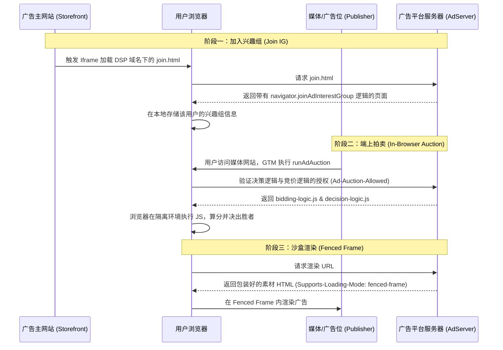

> 前几天和AI探讨AdTech领域的下一步研究方向时，Privacy Sandbox（隐私沙盒）成为了重点关注对象。在这个逐渐告别第三方Cookie的时代，如何在保护隐私的前提下实现精准投放，是整个行业的心病。在这套复杂的体系中，Topics API相对直白，而Protected Audience API (PAAPI) 则展现出了令人着迷的技术深度。带着对底层运转机制的好奇，我决定在自己的开源广告服务器上亲手实现一套最基础的PAAPI投放链路。这注定是一场硬核的调试之旅，但我没想到的是，在跨越重重障碍终于让广告成功渲染的那一刻，我却读到了一个令人错愕的消息——这个我刚刚摸透的“技术明珠”，马上就要被废弃了。


<!--more-->

## PAAPI的缘起想拯救什么？

在广告技术的早期，第三方Cookie是构建用户画像、实施重定向（Retargeting）广告的基石。然而，随着隐私保护意识的觉醒以及各国数据合规法案的落地，传统的跨站追踪模式无以为继。Google主导的Privacy Sandbox应运而生，试图在“保护用户隐私”与“维持广告商业模式”之间寻找平衡。

Protected Audience API（早期被称为FLEDGE）正是为了解决**重定向广告**这一核心诉求而设计的。它的核心理念非常激进：**既然把用户数据发给服务器不安全，那就把竞价逻辑发给浏览器。** 
通过让浏览器接管兴趣组的存储和竞价的计算环节，PAAPI试图切断User ID在买卖双方之间的流通，将数据的控制权交还给用户所在的终端。

## 静态方案的破壁之旅

为了彻底理解这个黑盒，我决定在我的OpenAdServer上实现一个最基本的PAAPI静态广告投放。
原本以为只是照抄几段API调用，没想到却是一部跌宕起伏的“踩坑史”。

### 架构流转验证

在成功跑通链路后，整个PAAPI的交互时序大致如下：



### 踩坑全记录

从API返回 `undefined` 到CDN缓存作祟，无数个细节让我深刻体会到了这套体系的严苛：

| 报错信息 / 现象 | 核心原因 | 最终解决方案 |
| --- | --- | --- |
| `NotAllowedError` | 浏览器隐私设置或 Flags 未覆盖 | 开启 `adPrivacy` 设置并配置 `enrollment-overrides` |
| `TypeError: same origin required` | GTM 域名与 IG Owner 不符 | 使用 Ads 域名的 **Iframe** 进行委托写入 |
| `Syntax Error` (GTM) | 不支持 ES6+ 语法 | 重构为 **ES5 + Promise** 风格代码 |
| `Lack of Ad-Auction-Allowed` | 后端响应缺少准入 Header | 在 Nest.js 或 Cloudflare Transform Rules 注入 Header |
| `Fenced-frame header required` | 素材 HTML 缺少渲染头 | 为 `renderUrl` 响应添加 `Supports-Loading-Mode: fenced-frame` |
| `No winner found` (且 Storage 为空) | IG 未写入或 Owner 配置错误 | 检查 Iframe 加载状态及 `owner` 字符串是否完全匹配 |

### 核心代码重构与验证

为了跑通这一套验证流程，我分别在后端服务端、媒体侧以及广告主侧进行了重构。

**1. 后端注入与隔离网关 (Nest.js)**

所有的逻辑 JS 都必须经过服务器的显式授权。我创建了一个 `PaapiController` 来分发脚本和素材页面：

```typescript
import { Controller, Get, Header } from '@nestjs/common';

@Controller('paapi')
export class PaapiController {
    @Get('decision-logic.js')
    @Header('Content-Type', 'application/javascript')
    @Header('Ad-Auction-Allowed', 'true')
    getDecisionLogic() {
        return `function scoreAd(adMetadata, bid, auctionConfig, trustedScoringSignals, browserSignals) {
  return bid;
}

function reportResult(auctionConfig, browserSignals) {
  return { "success": true };
}`;
    }

    @Get('bidding-logic.js')
    @Header('Content-Type', 'application/javascript')
    @Header('Ad-Auction-Allowed', 'true')
    getBiddingLogic() {
        return `function generateBid(interestGroup, auctionSignals, perBuyerSignals, trustedBiddingSignals, browserSignals) {
  return {
    bid: 15,
    render: interestGroup.ads[0].renderUrl,
    ad: { id: 'test-ad-001' }
  };
}

function reportWin(auctionSignals, perBuyerSignals, sellerSignals, browserSignals) {
  console.log("I won the auction!");
}`;
    }

    @Get('ad-creative.html')
    @Header('Content-Type', 'text/html')
    @Header('Supports-Loading-Mode', 'fenced-frame')
    getAdCreative() {
        // 为了隐私防泄露，Fenced Frame 强制要求渲染内容必须是一个独立的 HTML 文档
        return `<!DOCTYPE html>
<html>
  <body style="margin:0; padding:0; overflow:hidden;">
    
  </body>
</html>`;
    }

    @Get('join.html')
    @Header('Content-Type', 'text/html')
    getJoinHtml() {
        return `<!DOCTYPE html>
<html>
<body>
  <script>
    // 这里的代码运行在 ads.example.com 域名下
    var myGroup = {
      owner: 'https://ads.example.com',
      name: 'test-sneakers',
      biddingLogicUrl: 'https://ads.example.com/paapi/bidding-logic.js',
      ads: [{
        renderUrl: 'https://ads.example.com/paapi/ad-creative.html',
        metadata: { type: 'sneaker', baseBid: 10 }
      }]
    };

    if (navigator.joinAdInterestGroup) {
      navigator.joinAdInterestGroup(myGroup, 30 * 24 * 60 * 60)
        .then(function() { console.log("Iframe: Joined IG"); })
        .catch(function(e) { console.error("Iframe error:", e); });
    }
  </script>
</body>
</html>`;
    }
}
```

**2. 广告主侧配置 (Custom HTML in GTM)**

由于 GTM 运行在 Storefront 域名，无法越权写广告平台的兴趣组，所以必须通过不可见 Iframe 进行委托写入：

```html
<script>
(function() {
  var ifrm = document.createElement("iframe");
  ifrm.src = "https://ads.example.com/paapi/join.html"; 
  ifrm.style.width = "0";
  ifrm.style.height = "0";
  ifrm.style.border = "0";
  ifrm.style.display = "none";
  document.body.appendChild(ifrm);
})();
</script>
```

**3. 媒体侧发起竞拍 (Custom HTML in GTM)**

利用浏览器的 `runAdAuction` 发起本地拍卖，并将获胜的渲染配置赋予 `fencedframe`。因为 GTM 的沙盒环境古板，代码必须回退退到 ES5：

```html
<script>
(function() {
  if (!navigator.runAdAuction) { return; }

  var auctionConfig = {
    seller: 'https://ads.example.com',
    decisionLogicUrl: 'https://ads.example.com/paapi/decision-logic.js',
    interestGroupBuyers: ['https://ads.example.com'],
    resolveToConfig: true 
  };

  navigator.runAdAuction(auctionConfig)
    .then(function(config) {
      if (config) {
        var frame = document.createElement('fencedframe');
        frame.config = config;
        frame.style.width = '728px';
        frame.style.height = '90px';
        frame.style.border = '1px solid #eee';
        
        var slot = document.getElementById('global-footer-paapi-ad');
        if (slot) { slot.appendChild(frame); }
      }
    })
    .catch(function(err) { console.error("Auction error:", err); });
})();
</script>
```

跨过这一道道坎，看到 Fenced Frame 里成功刷出素材的那一瞬，那种征服黑盒的成就感是无与伦比的。

## 擦肩而过的动态方案

完成了基于写死出价的纯静态方案后，我的下一阶段蓝图已经铺开：让广告在没有 User ID 的情况“活”起来。

在原本的计划中，我们会利用 `trustedBiddingSignalsUrl` 接口来注入动态性。虽然这个接口只能收到非常有限且脱敏的参数（如 `hostname`，兴趣组名字等），但我们可以通过兴趣组的精细化命名（如 `sneakers-high-value`）并在服务端融合大盘权重和库存信息，来实现实时的端上出价干预。通过拆解归因链路里的 `reportWin` 以及 ARA (Attribution Reporting API)，我还盘算着如何在丢失精准 ID 的前提下，利用 `auction_id` 进行离线数据的 Join，来回收转化特征。

然而，“原本的计划”永远都只能是计划了。

## 戏剧性转折一切戛然而止

就在我准备顺着动态链路一路深挖 TEE（可信执行环境）时，一条官方通告直接给我浇了盆冷水：**Chrome 144 版本将正式移除 PAAPI 接口。**

Google 宣布转向了所谓的“用户选择模式”（User-choice mode）。经过几年的反复跳票和与英国 CMA 的周旋，Google 终究还是妥协了。PAAPI 不再是整个行业的强制准绳。因为其超高的集成复杂度、引发的性能争议、甚至变相的垄断嫌疑，这项承载了广告隐私化厚望的技术试验，迎来了终局。

## 虽死犹荣的技术启示

不得不说，这实在是一个让人哭笑不得的结果：刚刚研究透彻的前沿架构马上就要变成历史尘埃。但冷静复盘下来，这个过程依旧是一笔宝贵的财富。

即便具体的 API 将被废弃，但在 PAAPI 中体现出的核心技术理念将会在其他形式的架构中继续发光发热：

1. **端上计算思维：** 将边缘计算逻辑下推到浏览器的设计，让我们对客户端性能天花板和隔离调度有了更深的理解。
2. **信任与校验机制：** 从 `Ad-Auction-Allowed` 到 `Fenced Frame`，理解现代浏览器是何等谨慎地看护跨域通信和渲染隔离边界。
3. **模糊化归因的本质：** 学会如何在无法获得 1:1 明文映射的情况下，通过群体聚合、模糊键联接等方式尽最大可能地回收 ROI 信号。

比起纯粹粗暴的断崖式封堵（比如某些直接大刀一挥的平台），PAAPI 起码展现出了在“极速限制”下寻找解法的技术骨气。技术栈会更迭，API 会死亡，但只要“从不确定性中榨取价值”的工程思维还在，我们在广告技术的探索之旅就不会停歇。
