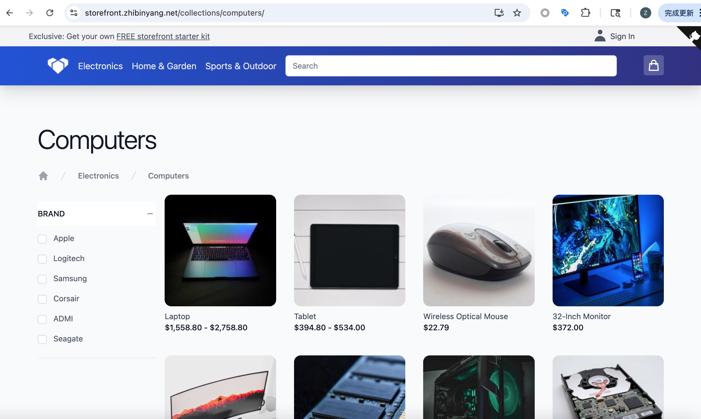

> 我的 AdTech Sandbox 就像一个缺了一角的拼图。Publisher 和 AdServer 都有了，只要加上一个“广告主”，整个广告投放的闭环就能跑通了。毕竟，如果不能模拟真实的电商转化，归因和测量（Attribution & Measurement）就是纸上谈兵。为了补上这块拼图，我决定搭建一个电商网站。但我没想到的是，在这个过程中，所谓的“全栈”方案差点让我放弃，而最终拯救我的，竟然是官方那个“只读”的 Demo API 和 Cloudflare Pages 的免费托管。

<!--more-->

## 寻找最自然的广告主

在 AdTech Sandbox 的任务列表中，**归因和测量**占据了核心地位。要测试这些，什么最合适？当然是一个像模像样的电商网站。

几个月前，我曾尝试在 Vue Storefront 上进行“外科手术”，试图植入转化埋点。但那是个纯前端项目，后端集成因为种种原因一直没跑通，就像只有车壳没有引擎。后来在和 Gemini 的某次“结对编程”中，考虑到我更熟悉 Node.js FullStack 技术栈，它向我推荐了 **Vendure**。

听起来很不错：TypeScript、GraphQL、Headless，一切都很现代化。

## Mono Repo 的“劝退”与 Qwik 的上位

经过调研，我发现 Vendure 生态确实成熟，官方维护了若干 Storefront。我兴致勃勃地按照官方推荐，拉取了 Mono Repo —— 既有后端又有前端，想着“一键启动，天下我有”。

现实却是残酷的。Mono Repo 里的依赖关系像一团乱麻，跟我的本地环境各种冲突。`npm install` 报错，`yarn` 报错，连 Github 上搜到的“偏方”也不管用。在这个环节折腾了半天后，我果断放弃了“大一统”的执念，决定**拆分**。

我选择只在本地用 Docker 跑起 Vendure 后端和 Postgres 数据库。后端稳了，前端选谁？虽然 Next.js 是官方首推，且生态最强，但在 AdTech 的实验田里，有时候“非主流”意味着更有趣。看着 Star 数稍逊但号称性能极致的 **Qwik** Storefront，我决定就是它了。

## Vibe Coding 加持下的埋点工程

选定 Qwik 后，工作重心回到了最初的目的：**埋点**。

先集成 GTM 和 GA4，这是基操。然后根据电商的标准漏斗，我需要在 Qwik 的各个组件里埋入打点代码：
- `view_item`：商品详情页
- `add_to_cart`：点击加购
- `begin_checkout`：进入结算
- `add_shipping_info`：填写配送信息
- `purchase`：最终下单（Mock 付款）

在这个过程中，前端代码不可避免地要进行改造。为了符合 AdTech数据的严格要求，我需要向 Data Layer 推送更精确的数据，比如不含税价格、不含运费的总价以及 SKU 信息。这时候，**Vibe Coding** 的模式大显神威，我只需要描述需求，代码的修改就自然发生了。

## 发现“只读” API 的秘密

在测试阶段，我一直用本地的 Docker 后端连接前端。当考虑到上线部署时，我犯了难：难道为了一个测试用的 Storefront，还得买个服务器跑 Node.js 后端？

就在这时，我重新审视了 Vendure 官方提供的 Demo 网站。它的后端 GraphQL API 号称是 `Readonly` 的。但出于好奇，我试着走了一遍下单流程 —— 居然成功了！我又登录了测试用户的账号，购物车里的订单赫然在列。

原来，所谓的“只读”，可能只是意味着它会周期性重置数据库，但在重置周期内，它是一个功能完整的后端！

这个发现改变了一切。

## 零成本的全栈部署

既然后端可以直接“白嫖”官方的 Demo API，那么前端只需要一个静态托管平台。

部署架构瞬间变得无比轻量：
1.  **Frontend**: Github Actions 自动构建 Qwik 项目。
2.  **Hosting**: 产物推送到 **Cloudflare Pages**。
3.  **Backend Connection**: 配置连接官方 Demo GraphQL API。
4.  **Network**: 开启 Cloudflare 的“小黄云”，利用其全球网络加速，保障国内访问体验。

至此，我的 Vendure Web Storefront 宣告完成。它没有自己的数据库，没有付费服务器，但它能浏览、能下单、能追踪数据，完美扮演了 AdTech Sandbox 里的“广告主”角色。

上一张部署完成的图感受一下:



有时候，完成比完美更重要，而免费且能跑通的方案，就是最好的方案。

