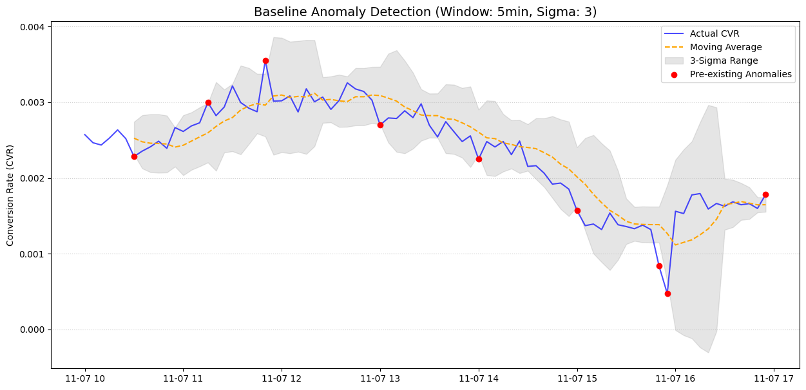
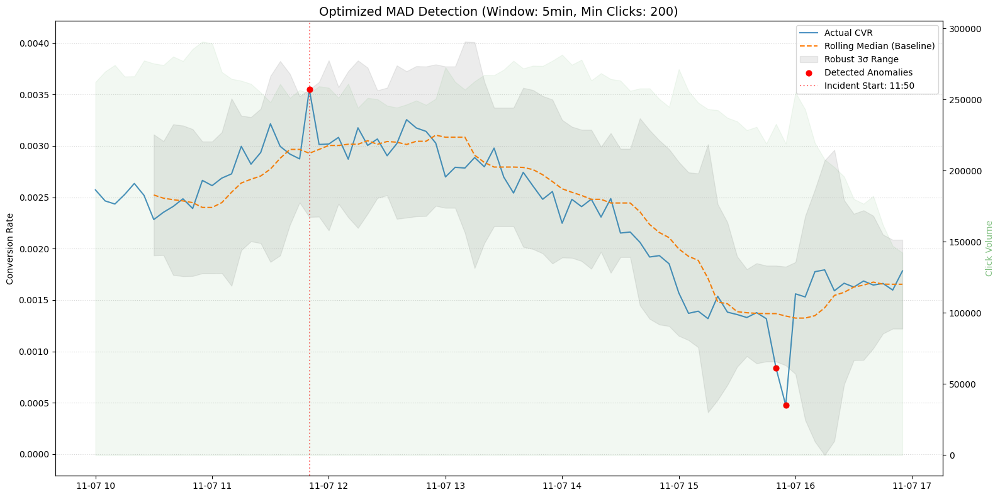

> 广告转化率天天跳水，监控警报却总是在该响的时候装死、在没病的时候猛叫？本期实录聚焦海量数据下的真实风控场景，看我是如何在千万级曝光里抽丝剥茧，丢弃中看不中用的 3 Sigma，跨越 MAD 的瓶颈，最终用“孤立森林”精准揪出隐藏在细分维度的流量“真凶”！如果你正被满屏假报警折磨，这篇实操或许能给你一点灵感。

你是否也经历过这样的绝望：盯着大盘监控表，发现广告大盘的整体 CVR（转化率）掉了一截，但警报系统静悄悄。等你手动调整了阈值，半夜却被几百条“狼来了”的假警报连环轰炸……

在广告技术（AdTech）这个充满极高噪音和长尾效应的领域里，想要在数千万条点击数据里找到隐蔽的异常，宛如在大海中捞出一根还在生锈的针。

今天，我从 Kaggle 的经典数据集 **TalkingData** 中截取了 2000 多万条点击记录（涵盖大约 6 小时的真实业务场景），并人为在特定维度（比如个别 OS 系统）“偷”走了一部分转化数据进行投毒测试。我想看看，我们手里的那些“常规武器”到底灵不灵。这就是本系列（异常检测系列 1）的起点。

<!--more-->


## 第一重境界：3 Sigma 的执念与破灭

提起异常检测，连初级数据分析师都能脱口而出：**3 Sigma！标准差！**

它的理论非常性感：在正态分布面前，$3\\sigma$ 之外的概率只有 0.27%。如果是纯随机波动，这等于小概率事件；一旦掉出护栏，说明系统出问题了。

但在实际把 CVR 聚合到 5 分钟窗口，并用 Rolling Window 计算均值与标准差后，现实狠狠打了我的脸。

广告流量不是均匀水流，它是泥石流。数据里天然存在着尖刺噪声，当我们使用基于“平均数”的方法时，一个巨大的离群点会将整条均值线上拉，把标准差拉宽。结果就是——**异常点竟然把自己吃掉了，把它当做了新的正常状态**（阈值自适应漂移）。

当我尝试修正 Rolling 逻辑、试图让它变得敏感时，由于点击量基数不同，即使自然波动的抖动，也瞬间能把屏幕染红。在 84 个时间窗口中，随随便便就能报出满屏伪异常。最终结论：在没有“洗净”数据前，3 Sigma 在这里就是噩梦。

这里放出 3 Sigma 的实现代码供参考：

```python
import pandas as pd
import numpy as np
import matplotlib.pyplot as plt

def detect_baseline_anomalies_v2(df, window_size='5min', sigma=3):
    # 1. 确保时间戳已转换并设为索引
    df = df.copy()
    df['click_time'] = pd.to_datetime(df['click_time'])
    df = df.set_index('click_time')

    # 2. 按窗口聚合 CVR
    ts = df['is_attributed'].resample(window_size).mean().fillna(0)

    # 3. 计算移动统计指标 (Rolling Statistics)
    rolling_mean = ts.rolling(window=6).mean().shift(1)
    rolling_std = ts.rolling(window=6).std().shift(1)

    upper_bound = rolling_mean + (sigma * rolling_std)
    lower_bound = rolling_mean - (sigma * rolling_std)

    # 4. 识别异常点
    anomalies = ts[(ts > upper_bound) | (ts < lower_bound)]
    
    return anomalies
```



## 第二重境界：MAD（中位数绝对偏差）的防波堤

既然“平均数”总是被坏数据带偏，那换成不那么容易被带偏的 **“中位数”** 如何？

MAD 算法是 3 Sigma 的鲁棒升级版。它不计算方差，而是计算每个点偏离中位数的绝对值，再对这个差值取中位数。

实战效果令人振奋。当我给它设定了 **“最低点击量地板” (Noise Floor)** 和 **样本量加权** 后，MAD 的护栏变得极度稳健。不管怎么遇到尖刺流量，它都能稳坐钓鱼台，把一大批假报警拦在门外，只报出那些明确击穿护栏的真异常点。

**但这也有个致命缺陷：** 它只能告诉你“大盘出事了”。
大盘跌破防线，可是究竟是哪个渠道（Channel）、哪个端（OS）、哪个应用（App）出的问题？如果要拆分到细粒度再看，数据量因为过度切割变得支离破碎，转化波动就会更大，MAD 又会陷入误报的泥潭。这就仿佛是，探测器告诉你有人偷东西，但没办法描述小偷长啥样。

以下是加入「最低点击量地板 (Noise Floor)」和「样本量过滤」的优化版 MAD 算法实现代码：

```python
import pandas as pd
import numpy as np
import matplotlib.pyplot as plt

def detect_anomalies_mad_v2(df, window_size='5min', sigma=3, lookback_points=6, min_clicks=100):
    """
    工业级 MAD 异常检测实现
    :param df: 原始 DataFrame (需包含 click_time 和 is_attributed)
    :param window_size: 聚合时间窗口
    :param sigma: 偏离倍数 (类比 3-sigma)
    :param lookback_points: 回溯点数 (12个5min点 = 1小时历史)
    :param min_clicks: 触发报警的最低点击量阈值
    """
    # 1. 数据预处理
    data = df.copy()
    data['click_time'] = pd.to_datetime(data['click_time'])
    data = data.set_index('click_time').sort_index()

    # 2. 维度聚合 (CVR 和 点击量)
    ts = data['is_attributed'].resample(window_size).agg(['mean', 'count']).fillna(0)
    cvr = ts['mean']
    clicks = ts['count']

    # 3. 稳健基准计算 (Rolling MAD)
    rolling_median = cvr.rolling(window=lookback_points).median().shift(1)

    def get_mad(x):
        return np.median(np.abs(x - np.median(x)))

    rolling_mad_raw = cvr.rolling(window=lookback_points).apply(get_mad).shift(1)

    # 设定最小偏差地板：取全局平均 CVR 的 15%，防止在极平稳时 MAD 接近 0 导致护栏过窄
    noise_floor = cvr.mean() * 0.15

    # 4. 阈值计算 (1.4826 是正态分布缩放因子)
    scale_factor = 1.4826
    lower_bound = rolling_median - (sigma * scale_factor * rolling_mad_raw) - noise_floor
    upper_bound = rolling_median + (sigma * scale_factor * rolling_mad_raw) + noise_floor

    # 5. 异常识别
    is_outlier = (cvr < lower_bound) | (cvr > upper_bound)
    is_significant = (clicks >= min_clicks)
    anomalies = cvr[is_outlier & is_significant]

    return anomalies
```



## 第三重境界：降维打击——用“孤立森林”揪出深潜内鬼

如果我们在“数均值格子”这条路上走不通，不如换一种游戏规则。

如果说前两者是看谁离大部队的距离远，**孤立森林（Isolation Forest）** 的思路则是：**看这玩意组合起来是不是一个“奇葩”**。只要你足够稀有和反常，在机器随意切西瓜的时候，总能一两刀就把你单独切出来。这种机制，天生就不怎么管你是不是正态分布。

而且，它是玩**多维度**的高手。我将 `['os', 'app', 'channel']` 整个拉进去给它看。
起初，未聚合直接送进去时，上千万行的数据让它跑得几乎想拉断 CPU。在我及时把它调整为“按时间窗口和指定维度进行分组聚合”，计算 CVR 和 曝光 Count，再送它处理后，它展现出了惊人的效能！

**真正震撼我的时刻到来了。** 还记得我开头说我投了一份特定维度的毒吗？在高达几千个组合的汪洋大海里，孤立森林通过多维打分和 RCA（Root Cause Analysis）贡献归因，精准定位到了那个发生断崖下跌的 `os=19` 以及具体的异常 Channel，给出了明确时间线。

在“时间审计报告”中，孤立森林不仅告诉我们异常开始于哪个时刻，还排出了“嫌疑人榜单”。

**它根本不需要你事先指定去查哪个 OS！这就是它作为“雷达”的真正价值——自动化下钻审计。**

最后，附上支持按维度下钻进行 RCA（根本原因分析）且引入**业务损失量 (Conv_Loss)** 评估的优化版孤立森林代码：

```python
import pandas as pd
import numpy as np
from sklearn.ensemble import IsolationForest
from sklearn.preprocessing import LabelEncoder

def rca_business_impact_scanner(df, dimensions=['os', 'app', 'channel'], window='5min', min_clicks=100):
    all_candidates = []
    df = df.copy()
    df['click_time'] = pd.to_datetime(df['click_time'])
    
    print(f"--- 启动业务损失审计 (窗口: {window}) ---")
    
    for dim in dimensions:
        # 1. 维度聚合
        agg = df.groupby([pd.Grouper(key='click_time', freq=window), dim]).agg(
            cvr=('is_attributed', 'mean'),
            clicks=('is_attributed', 'count'),
            conversions=('is_attributed', 'sum')
        ).reset_index().sort_values(['click_time', dim])
        
        # 2. 计算基准 CVR (使用滚动中位数，回溯 6 个窗口)
        # 这一步是为了定义“健康状态”
        agg['baseline_cvr'] = agg.groupby(dim)['cvr'].transform(
            lambda x: x.rolling(window=6, min_periods=1).median().shift(1)
        ).fillna(agg['cvr']) # 首个点用自身填充

        # 3. 计算转化损失量 (Delta Conversions)
        # Loss > 0 表示转化少了，Loss < 0 表示转化超预期
        agg['conv_loss'] = (agg['baseline_cvr'] - agg['cvr']) * agg['clicks']
        
        # 4. 过滤与特征准备
        agg_filtered = agg[agg['clicks'] >= min_clicks].copy()
        if len(agg_filtered) < 10: continue

        # 5. 孤立森林检测：加入 conv_loss 作为核心特征
        X = agg_filtered[['cvr', 'conv_loss', 'clicks']].copy()
        model = IsolationForest(n_estimators=100, contamination=0.01, max_samples=256, n_jobs=-1, random_state=42)
        model.fit(X.values)
        
        agg_filtered['is_anomaly'] = model.predict(X.values)
        
        # 6. 提取异常并按实际损失排序
        anomalies = agg_filtered[agg_filtered['is_anomaly'] == -1].copy()
        if not anomalies.empty:
            # 仅关注损失为正（即转化下跌）的情况
            anomalies = anomalies[anomalies['conv_loss'] > 0]
            
            top_hits = anomalies.sort_values(by='conv_loss', ascending=False).head(5)
            for _, row in top_hits.iterrows():
                all_candidates.append({
                    'Dimension': dim.upper(),
                    'Value': row[dim],
                    'Time': row['click_time'],
                    'Clicks': row['clicks'],
                    'Actual_CVR': f"{row['cvr']:.4%}",
                    'Baseline_CVR': f"{row['baseline_cvr']:.4%}",
                    'Conv_Loss': round(row['conv_loss'], 2) # 损失了多少个转化
                })

    if not all_candidates:
        print("✅ 未发现导致严重业务损失的异常。")
        return None

    result_df = pd.DataFrame(all_candidates).sort_values(by='Conv_Loss', ascending=False)
    print("\\n🏆 【业务损失排行榜 (按预估丢单量排序)】")
    print(result_df.head(10).to_string(index=False))
    return result_df

# 运行扫描
impact_report = rca_business_impact_scanner(df_poisoned)
```
输出数据

🏆 业务损失排行榜 (按预估丢单量排序)

| 维度 (Dimension) | 取值 (Value) | 时间 (Time) | 点击量 (Clicks) | 实际 CVR | 基准 CVR | 转化损失 (Conv_Loss) |
| --- | --- | --- | --- | --- | --- | --- |
| **OS** | **19** | 2017-11-07 12:00:00 | 58,779 | 0.0323% | 0.2275% | **114.75** |
| **OS** | **19** | 2017-11-07 12:10:00 | 58,518 | 0.0273% | 0.2039% | **103.34** |
| **OS** | **19** | 2017-11-07 12:05:00 | 55,754 | 0.0538% | 0.2156% | **90.19** |
| CHANNEL | 101 | 2017-11-07 10:10:00 | 15,213 | 0.3221% | 0.6327% | 47.26 |
| CHANNEL | 101 | 2017-11-07 10:05:00 | 10,639 | 0.4230% | 0.8425% | 44.64 |
| **OS** | **19** | 2017-11-07 12:15:00 | 54,013 | 0.0444% | 0.1248% | 43.40 |
| CHANNEL | 213 | 2017-11-07 15:55:00 | 704 | 8.8068% | 14.7690% | 41.97 |
| CHANNEL | 274 | 2017-11-07 16:25:00 | 156 | 24.3590% | 48.5811% | 37.79 |
| APP | 35 | 2017-11-07 12:05:00 | 145 | 43.4483% | 68.4963% | 36.32 |
| OS | 13 | 2017-11-07 13:55:00 | 59,436 | 0.0892% | 0.1472% | 34.51 |

## 总结与预告

1. **3 Sigma** 是快速了解数据的入门玩具，但面对广告风控里非正态、高抖动的数据流，容易自欺欺人。
2. **MAD** 非常适合作为大盘的核心护城河，防误报能力极强，但缺乏定位细分维度的解构能力。
3. **孤立森林聚合版** 是查找多维组合异常的神兵利器，能够在不知道出什么问题的情况下，先把你从千万条 Log 里框定出那个作案嫌疑最大的“维度切片”。

但故事远未结束，业务上的黑产手段层出不穷，孤立森林有时对渐变型的隐蔽下落仍然会有些迟钝。在 **异常检测系列（二）** 中，我将带大家探索时间序列和更重火力的算法。敬请期待！
