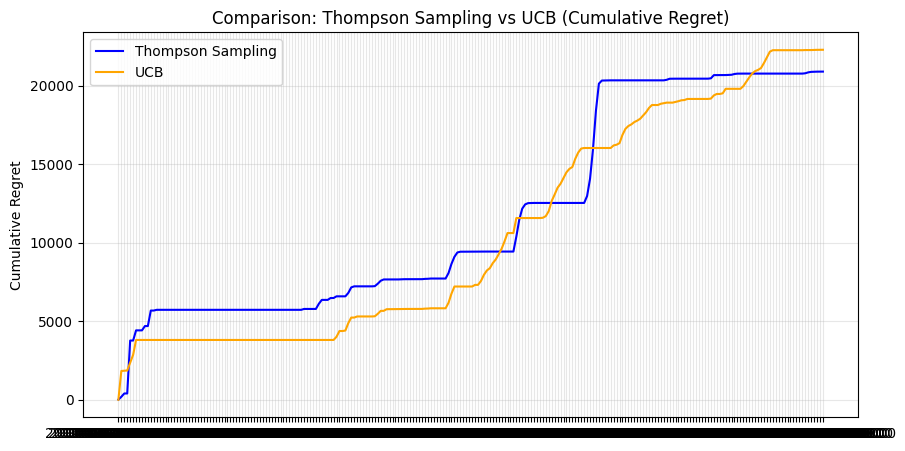
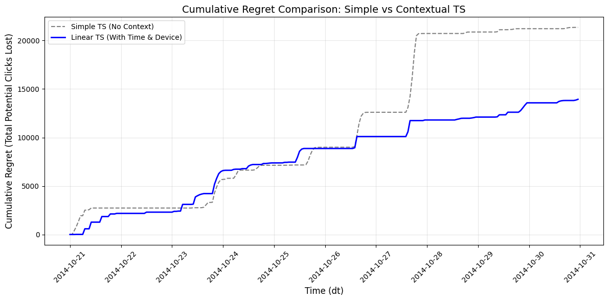
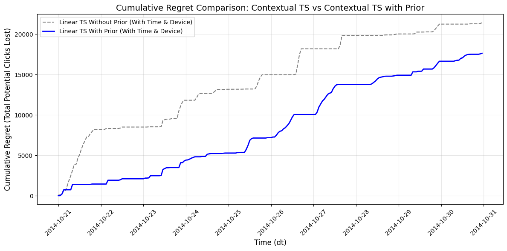

> Everyone seems to think that plugging in a Large Language Model is all it takes to solve ad creative distribution. However, when dealing with industrial-grade traffic—specifically high-dimensional, long-tail structured click data—LLMs fall short of the mark. Strip away the "algorithmic mysticism," and what remains is deterministic, ingeniously designed mathematics. In this post, using Kaggle's classic Avazu CTR dataset as our playground, we'll hardcore deconstruct the underlying logic and business trade-offs of the Exploration & Exploitation dilemma. We'll trace the evolution from the classic Thompson Sampling to the deterministic optimism of UCB, and finally to Context-aware Linear Thompson Sampling.

<!--more-->


Before diving into the algorithms, we need to set the stage. Given the memory limits of a local development environment, loading 6GB of raw Avazu clickstream data directly poses a massive engineering challenge.

Therefore, before feeding data into our algorithmic simulators, we performed a round of **streaming aggregation** and **dimensionality reduction**. Utilizing `chunksize`, we aggregated data by the hour (`dt`) and identified specific feature columns (like `C14`) as our "action space (Arms)". Simultaneously, we scrubbed excessive environmental noise like `banner_pos`, normalizing the data down to a pristine `dt + C14` granularity. This laid the foundation for a clean feedback environment necessary for subsequent "counterfactual reasoning."

---

## Level 1: The Bayesian Lottery Logic of Thompson Sampling

How do you make static data "move"? This is the most critical conceptual hurdle to clear when building an algorithm simulator.

Traditional logs generally only answer: "Creative A was shown; was it clicked?". To evaluate a Bandit system, we need to simulate a continuous online feedback loop. Here, we employed **Rejection Sampling** to mimic the Agent's hourly decisions, exclusively drawing corresponding feedback from historical logs. More pivotally, we utilized **Binomial Sampling (Monte Carlo simulation)**. Instead of adding 1 reward per click, we simulated hundreds or thousands of clicks based on actual impressions. This triggered a rapid "confidence collapse" within the Beta distributions, massively accelerating convergence.

### The Tripartite Nature of Bayes

In the implementation of Thompson Sampling (TS), the core engine essentially revolves around the `np.random.beta` function. It elegantly deconstructs decision-making into three layers:

1. **Mean Shift Rightward (Exploitation)**: For well-performing creatives, their $\alpha$ increases, correspondingly bumping up their probability of pulling high scores during sampling.
2. **Variance Contraction (Stop-Loss)**: As sample size accumulates, the Beta distribution becomes exceptionally sharp. For poor performers, their distributions rapidly collapse towards the lower extreme, eventually being marginalized by the system.
3. **Long-Tail Exploration (Exploration)**: For newly introduced creatives with negligible sample sizes, despite their currently calculated mean being low, their distribution remains "short and fat." Thus, there remains a tangible probability of drawing a very high random score, granting them a chance for exposure.

> **Engineering Pro-Tip**  
> Swapping out the original "update once per hour" logic for a per-impression "binomial distribution batch update" accelerates the convergence rate by more than tenfold. Additionally, for creatives whose CTR suddenly drops to zero, TS exhibits some lag. In actual industrial deployments, it's common to patch this with a "decay factor" or a circuit-breaker mechanism.

Here is the core Thompson Sampling implementation supporting "batched binomial updates" by impressions to turbocharge convergence:

```python
import numpy as np

class ThompsonSamplingAgent:
    def __init__(self, ad_ids):
        self.ad_ids = ad_ids
        # Initialize Beta distribution parameters: alpha=1, beta=1 implies a uniform distribution (complete ignorance)
        self.alphas = {ad_id: 1 for ad_id in ad_ids}
        self.betas = {ad_id: 1 for ad_id in ad_ids}

    def select_ad(self):
        """
        Sampling Phase: Randomly draw a value from the current Beta distribution for each ad, and select the maximum.
        """
        samples = {
            ad_id: np.random.beta(self.alphas[ad_id], self.betas[ad_id])
            for ad_id in self.ad_ids
        }
        return max(samples, key=samples.get)

    def update(self, ad_id, clicks, misses):
        """
        Learning Phase: Batch update the posterior distribution based on actual feedback.
        """
        # Core optimization: Accept batch clicks and misses to drastically speed up convergence
        self.alphas[ad_id] += clicks
        self.betas[ad_id] += misses
```

With an Agent that supports batched updates, the crux of the engineering implementation relies on running **counterfactual backtesting** within our aggregated continuous data stream. To make time flow backward and explore incredibly densely within finite memory, we can't afford to run `np.random.rand()` checks line-by-line against individual impression logs. Instead, by utilizing the binomial distribution `np.random.binomial`, we calculate a whole batch of simulated random clicks based on the true total impressions and CTR for that specific creative in that particular hour. This is the engineering secret behind the tenfold convergence acceleration:

```python
# Inside the time-step loop, after the Agent evaluates all displayed creatives...
if not match_row.empty:
    actual_ctr = match_row.iloc[0]['ctr']
    # Get the true total impressions for this creative during the current hour
    n_impressions = int(match_row.iloc[0]['impressions'])

    # --- Core Optimization: One-shot Monte Carlo simulation for clicks generated by n impressions ---
    # Macroscopically equivalent to running n individual click judgments, vastly alleviating computational bottlenecks
    simulated_clicks = np.random.binomial(n=n_impressions, p=actual_ctr)
    simulated_misses = n_impressions - simulated_clicks

    # Submit hundreds or thousands of feedback signals to the Agent in one batch, triggering rapid "confidence collapse"
    agent.update(chosen_ad, simulated_clicks, simulated_misses)
```

After iterating through this mechanism, the system inevitably settles into an impeccable "Matthew Effect" state: genuinely explosive, high-potential creatives are firmly locked in by the system, achieving sky-high predicted CTRs (e.g., top-tier assets stabilizing above 24.8%). Conversely, creatives with dismal conversion metrics are mercilessly marginalized after minimal trial-and-error exposure. Noticeably, the Cumulative Regret curve shifts from sharp early spikes to a flat plateau later on, proving that the Agent has learned to allocate budgets as astutely as an elite media buyer.

---

## Level 2: Confronting UCB—Deterministic Optimism and the "No Second Chances" Trap

Having experienced the probabilistic beauty of TS, the next milestone is the **"Deterministic Optimism"** championed by the UCB (Upper Confidence Bound) algorithm.

UCB's logic is extremely rigid. Its scoring formula is highly classic: **$Score = Mean + Confidence$ (Mean + Upper Confidence Bound Bonus)**. The core philosophy here is to remain "optimistic" in the face of uncertainty. The system priorities testing long-tail creatives suffering from under-exposure and unknown potential. To ensure the rigor of the algorithm in backtesting, we must run comparison experiments on data of identical granularity (aggregated at the `dt + C14` dimension). If unaggregated data is used, leading to artificially inflated played steps $n_i$, the confidence bonus will collapse prematurely, causing the system to lose its exploring drive too early on.

However, during practical simulation, UCB exposes a painfully fatal flaw: **once a poor creative is branded with a "low score," there is almost zero chance for a comeback.**

Here is the UCB Agent implementation based on the "Mean + Confidence Upper Bound" logic:

```python
import numpy as np

class UCBAgent:
    def __init__(self, ad_ids):
        self.ad_ids = ad_ids
        self.counts = {ad_id: 0 for ad_id in ad_ids}
        self.sums = {ad_id: 0.0 for ad_id in ad_ids}
        self.total_count = 0

    def select_ad(self):
        self.total_count += 1
        # Initial phase: Ensure every ad is shown at least once to maintain absolute optimism
        for ad_id in self.ad_ids:
            if self.counts[ad_id] == 0:
                return ad_id

        scores = {}
        for ad_id in self.ad_ids:
            # Mean (Exploitation)
            avg_ctr = self.sums[ad_id] / self.counts[ad_id]
            # Confidence Upper Bound Bonus (Exploration)
            # Formula: sqrt(2 * ln(Total_Steps) / Arm_Steps)
            delta = np.sqrt(2 * np.log(self.total_count) / self.counts[ad_id])
            scores[ad_id] = avg_ctr + delta
        return max(scores, key=scores.get)

    def update(self, ad_id, clicks, misses):
        n = clicks + misses
        self.counts[ad_id] += n
        self.sums[ad_id] += clicks
```

Because UCB lacks a random inspiration mechanism like a Bayesian distribution, all its exploration relies squarely on the growth of the deterministic term. However, the confidence bonus grows at a logarithmic rate ($ \ln(t) $) over total steps, meaning it increases agonizingly slowly. If you examine the comparison curves, you'll see this "early bias" exhibits an extraordinarily strong memory effect.



In summary, UCB is far better suited for stable environments demanding extremely high interpretability. But when faced with real-world advertising scenarios defined by noisy structural data, rapid creative turnover, and a desperate need to uncover "dark horse" winners amidst chaos, Thompson Sampling proves much more agile and adaptable.

---

## Level 3: Linear Thompson Sampling—Battling Scattered Dimensions and the Cold Start Curse

Reaching this stage, the traditional playbook—treating every creative as a black box and severing its ties to the external environment—has hit its ceiling. The true advanced challenge is recognizing that **ad performance is never static; it fluctuates dynamically in response to the user's device and time (hour).**

Introducing contextual constraints is the central mission of Contextual Bandits like Linear Thompson Sampling (LinTS). It no longer learns a single CTR distribution. Instead, it learns a complex parameter vector $\theta$, attempting to use linear algebra to capture the incremental CTR contribution of different feature combinations.

To accomplish this, our feature engineering introduces Ridge Regression concepts, constructing a decision engine founded on multivariate normal distributions (incorporating the inverse covariance matrix $B$ and the feature response vector $f$). Yet, when specifically cherry-picking features, we must remain hyper-vigilant against the "Curse of Dimensionality"—where breaking things down too granularly destroys CTR accuracy. If compact data is spread too thin across countless grids, it causes severe statistical distortion. Thus, the invaluable engineering rule of thumb here is: "Get it running first, refine later." Start by focusing solely on a handful of heavy-hitting core features like `device_type` and `time`.

Here is the core implementation for Linear TS tracking feature contexts and integrating Ridge Regression to update matrices (including an extended class supporting Global Priors):

```python
import numpy as np

class LinearTSAgent:
    def __init__(self, ad_ids, feature_dim, delta=0.1):
        self.ad_ids = ad_ids
        self.d = feature_dim
        # Keep a B matrix (Inverse Covariance) and f vector (Weight accumulations) for each ad
        self.B = {ad_id: np.identity(self.d) for ad_id in ad_ids}
        self.f = {ad_id: np.zeros(self.d) for ad_id in ad_ids}
        self.v = delta  # Exploration coefficient

    def get_feature_vector(self, row):
        # Ultra-minimalist features: 1 (intercept) + device_type (categorical encoding) + hour (normalized)
        return np.array([1, row['device_type'], row['dt'].hour / 24.0])

    def select_ad(self, context_row):
        x = self.get_feature_vector(context_row)
        best_sample_score = -1
        best_ad = None

        for ad_id in self.ad_ids:
            # 1. Calculate the mean of the current weights mu = B^-1 * f
            B_inv = np.linalg.inv(self.B[ad_id])
            mu = B_inv @ self.f[ad_id]

            # 2. Sample weights theta from the multivariate normal distribution (Bayesian sampling in a multi-dimensional space)
            theta_sample = np.random.multivariate_normal(mu, self.v**2 * B_inv)

            # 3. Calculate personalized score
            score = x @ theta_sample
            if score > best_sample_score:
                best_sample_score = score
                best_ad = ad_id
        return best_ad

    def update(self, ad_id, context_row, clicks, misses):
        x = self.get_feature_vector(context_row).reshape(-1, 1)
        n = clicks + misses
        # Real-time Ridge regression parameter update
        # B = B + x*x' * n
        self.B[ad_id] += (x @ x.T) * n
        # f = f + x * clicks
        self.f[ad_id] += x.flatten() * clicks

class LinearTSWithPriorAgent(LinearTSAgent):
    """LinTS injected with Global Priors to alleviate high exploration costs during cold starts."""
    def __init__(self, ad_ids, feature_dim, global_mu_prior=None):
        super().__init__(ad_ids, feature_dim)
        if global_mu_prior is not None:
            for ad_id in ad_ids:
                # Assuming the intercept refers to the systemic broad-market average, initialize the f vector
                self.f[ad_id] = self.B[ad_id] @ global_mu_prior
```

When placing LinTS and Simple TS side-by-side on the same simulated track, we often witness a brutally honest reality check: **For a considerably long period initially, the Regret of Linear TS is actually worse than Simple TS.**



This isn't an algorithm behaving incorrectly; rather, it unveils the harsh reality of Contextual Bandits: **Complex, high-dimensional feature models demand a painfully steep "exploration tuition fee" during the cold-start phase.** Before the localized data volume is sufficient to support the complex linear best-fit matrix $B$, this kind of overeager attempt to capture environmental idiosyncrasies is nowhere near as robust as the simple, unrefined strategy (Simple TS) of blindly computing global averages. If, in this scenario, the absolutely stellar performance of a top-tier creative outweighs the minor dividends paid by personalized routing, complex feature modeling devolves into dead weight that only spikes regret.

So, how do we fix these exorbitant trial-and-error costs triggered by over-exploration?

The antidote is injecting a **Global Prior (or Global Bias)**. To combat the blind-fumbling of the initial phase, we bootstrap the Agent with a prior cognitive foundation (a hierarchical Bayesian framework) aggregated in advance from broad market trends or partial historical data. As a result, LinTS only has to learn the "deviance" of ad performance relative to the global baseline. This enormously reduces the exploratory burden during cold starts!



---

## Conclusion: The Mindset Behind Complex Model Architecture and Engineering Trade-offs

Having laid it all out, the structural design philosophy for industrial-grade MAB algorithms emerges clearly:

It is never just about "deriving a flawless probability formula on a whiteboard." It is about striking an elegant balance between real-world traffic instability, computational latency, business-level high-dimensional sparsity, and the very real financial costs of trial-and-error. 
For instance, during a system's initial cold-start vacuum, decisively deploying **Simple TS** capitalizes on its blinding convergence speed to swiftly lock down top creatives. Later, once mass exposure has accumulated a rock-solid data foundation mapping different audience profiles, we can smoothly pivot into **Linear TS or LinUCB** to handle multi-dimensional, fine-grained distribution. This delicate interplay is the true arsenal and intellectual bedrock every algorithm architect must command when confronting tens of millions of peak and trough impressions across intricate long-tail scenarios.
