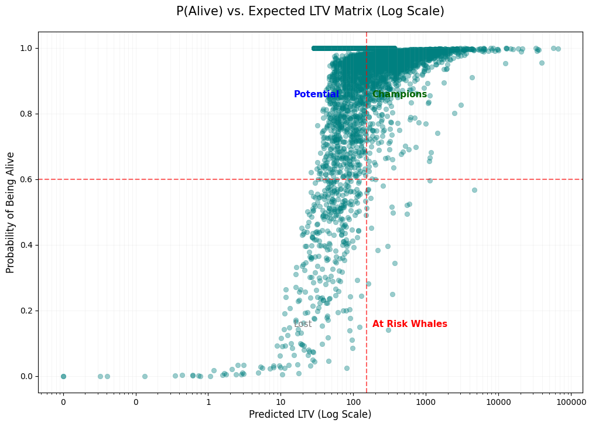
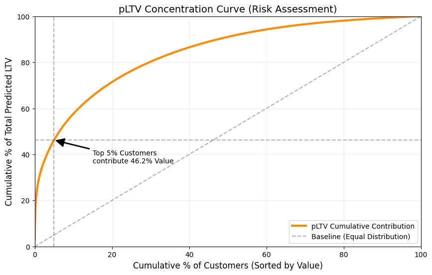
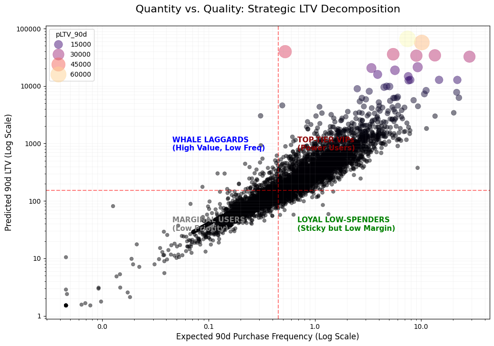

> 在上一篇探讨了《Think Bayes》如何完美映射 BG/NBD 模型底层的贝叶斯直觉后，我们终于可以把目光从冰冷的概率公式，转向火热的商业前线。作为一名数据从业者，我知道向业务线交付一堆复杂的“后验分布”和“Gamma/Beta参数”往往会遭到无情的白眼。业务要的不是你的推导过程，而是针对那份有着几百万行购买记录的在线测试数据（我使用的是经典的 Online Retail II UCI 数据集），给出直击灵魂的三个建议：**谁快死了要不要救？营收大盘稳不稳？我应该让谁买更多还是买更贵？** 
>
> 在和AI一番深度探讨后，我构建了三张极具实操价值的“贝叶斯营销决策仪表盘”。这三张图表分别从**状态诊断**、**结构风险**和**增长路径**三个维度，对 CLV（客户终生价值）给出的晦涩信息进行了降维打击，瞬间将其转化为可落地的策略指导。

<!--more-->


## 图表 1：生存状态图 (Survival vs. Value Matrix)

* **X轴：** 期望的 90天 LTV（对数对齐）
* **Y轴：** $P(\text{Alive})$，即顾客当前的“存活概率”

这第一张图，我愿意称之为 **“战损评估与即时抢救表”**。在 BG/NBD 的世界里，顾客不会突然跟你说再见，他们只会越来越久地保持沉默（Recency）。这张图的核心意义就在于帮你划定了**防御型**的触达时机。

```python
import matplotlib.pyplot as plt
import seaborn as sns
import numpy as np
from matplotlib.ticker import ScalarFormatter

# 1. 设定分类阈值
p_alive_threshold = 0.6
clv_threshold = rfm_df['pLTV_90d'].median()

# 确保没有 0 或负值（对数轴要求）
plot_data = rfm_df.copy()
plot_data['pLTV_90d'] = plot_data['pLTV_90d'].clip(lower=0.01)

# 2. 绘制散点图
plt.figure(figsize=(12, 8))
sns.scatterplot(data=plot_data, x='pLTV_90d', y='p_alive', alpha=0.4, color='teal', edgecolor=None)

# 3. 设置对数缩放 (关键)
plt.xscale('log')

# 4. 添加象限划分线
plt.axhline(y=p_alive_threshold, color='red', linestyle='--', alpha=0.6)
plt.axvline(x=clv_threshold, color='red', linestyle='--', alpha=0.6)

# 5. 标注象限名称
plt.text(clv_threshold * 1.2, 0.85, 'Champions', fontsize=11, color='darkgreen', fontweight='bold')
plt.text(clv_threshold * 0.1, 0.85, 'Potential', fontsize=11, color='blue', fontweight='bold')
plt.text(clv_threshold * 1.2, 0.15, 'At Risk Whales', fontsize=11, color='red', fontweight='bold')
plt.text(clv_threshold * 0.1, 0.15, 'Lost', fontsize=11, color='gray')

# 6. 美化
plt.gca().xaxis.set_major_formatter(ScalarFormatter()) 
plt.title('P(Alive) vs. Expected LTV Matrix (Log Scale)', fontsize=15, pad=20)
plt.xlabel('Predicted LTV (Log Scale)', fontsize=12)
plt.ylabel('Probability of Being Alive', fontsize=12)
plt.grid(True, which="both", ls="-", alpha=0.1)

plt.show()
```



**核心业务动作：**
* **At Risk Whales（右下角）**：这些是曾经贡献巨大的大户，但现在的存活概率已经跌破阈值！策略是**立即抢救**，必须用最高级的资源（人工专属客服致电、大额无门槛神券）将其拉回。
* **Champions（右上角）**：核心的护城河印钞机。策略是**维护与保护**，在拉新广告里把他们排除避免浪费，在会员体系中给足情绪价值。
* **Potential（左上角）**：人还在，但买得少。这时候适合做**交叉销售（Cross-selling）**。

## 图表 2：价值集中度图 (Lorenz Curve)

* **X轴：** 按预期 LTV 倒序排列的累积客户百分比
* **Y轴：** 客户累积贡献的预期总 LTV 百分比

如果上一张图是在急诊室救人，那这张洛伦兹曲线（Lorenz Curve）就是业务层面的 **“年度财务体检报告”**。它用来量化你营收结构的脆弱程度。

```python
import numpy as np
import matplotlib.pyplot as plt

# 1. 准备数据：按 pLTV 倒序排列
sorted_ltv = rfm_df['pLTV_90d'].sort_values(ascending=False).values
cum_ltv = np.cumsum(sorted_ltv) 
total_value = cum_ltv[-1]
cum_ltv_pct = (cum_ltv / total_value) * 100

# 2. 准备横轴：客户累积百分比
cust_pct = np.arange(1, len(sorted_ltv) + 1) / len(sorted_ltv) * 100

# 3. 绘图
plt.figure(figsize=(10, 6))
plt.plot(cust_pct, cum_ltv_pct, label='pLTV Cumulative Contribution', color='darkorange', lw=3)

# 4. 添加高价值参考线
top_5_val = cum_ltv_pct[int(len(cum_ltv_pct)*0.05)]
plt.axvline(x=5, color='gray', linestyle='--', alpha=0.6)
plt.axhline(y=top_5_val, color='gray', linestyle='--', alpha=0.6)

# 添加基准对角线（绝对平均）
plt.plot([0, 100], [0, 100], 'k--', label='Baseline', alpha=0.3)

# 5. 标注
plt.annotate(f'Top 5% Customers\ncontribute {top_5_val:.1f}% Value',
             xy=(5, top_5_val), xytext=(15, top_5_val-10),
             arrowprops=dict(facecolor='black', shrink=0.05, width=1))

plt.title('pLTV Concentration Curve (Risk Assessment)', fontsize=14)
plt.xlabel('Cumulative % of Customers (Sorted by Value)', fontsize=12)
plt.ylabel('Cumulative % of Total Predicted LTV', fontsize=12)
plt.legend()
plt.grid(True, alpha=0.2)
plt.xlim(0, 100)
plt.ylim(0, 100)
plt.show()
```



**核心业务动作：**
* **结构风险对冲**：如果你发现极其陡峭（比如前 5% 的人贡献了超过 50% 的未来预期价值），那你的业务存在极高的“大户依赖症”。必须建立起类似传统银行业的“私行 VIP 响应特权体系”。
* **资源准入线划定**：通过曲线上开始放缓的“拐点”，科学地界定出你家“黑卡会员”的消费门槛，确保精细化运营的高昂成本，能砸在最能产出真金白银的少数人身上。

## 图表 3：质/量解构矩阵 (Quantity vs. Quality) 

* **X轴：** 预期的未来购买频次（Frequency）
* **Y轴：** 预期的 LTV 价值

第一张图决定了 **“该不该触达”**，而这第三张图，决定的是 **“触达的具体内容发什么”**。它是一份 **“进攻型”** 的战术路线图，残忍地拆解了一个客户到底是因为“买得勤（高频）”才值钱，还是因为单价“下得重（单笔土豪）”才值钱。

```python
import matplotlib.pyplot as plt
import seaborn as sns
import numpy as np
from matplotlib.ticker import ScalarFormatter

# 1. 处理数据以适应双对数轴
plot_df = rfm_df.copy()
epsilon_p = plot_df['expected_purchases_90d'].median() * 0.01
epsilon_v = plot_df['pLTV_90d'].median() * 0.01

plot_df['expected_purchases_90d'] = plot_df['expected_purchases_90d'].clip(lower=epsilon_p)
plot_df['pLTV_90d'] = plot_df['pLTV_90d'].clip(lower=epsilon_v)

# 2. 气泡散点绘图
plt.figure(figsize=(12, 8))
scatter = sns.scatterplot(
    data=plot_df, 
    x='expected_purchases_90d', 
    y='pLTV_90d', 
    size='pLTV_90d', 
    hue='pLTV_90d',
    sizes=(30, 600), 
    alpha=0.5, 
    palette='magma', 
    edgecolor=None
)

# 3. 启用双对数刻度
plt.xscale('log')
plt.yscale('log')

# 4. 中位数分割线
x_med = rfm_df['expected_purchases_90d'].median()
y_med = rfm_df['pLTV_90d'].median()
plt.axvline(x_med, color='red', linestyle='--', alpha=0.5, label='Median Frequency')
plt.axhline(y_med, color='red', linestyle='--', alpha=0.5, label='Median pLTV')

# 5. 格式化
for axis in [scatter.xaxis, scatter.yaxis]:
    axis.set_major_formatter(ScalarFormatter())

# 6. 四象限战术指导标注
plt.text(x_med * 1.5, y_med * 5, 'TOP-TIER VIPs\n(Power Users)', color='darkred', fontweight='bold', fontsize=11)
plt.text(x_med * 0.1, y_med * 5, 'WHALE LAGGARDS\n(High Value, Low Freq)', color='blue', fontweight='bold', fontsize=11)
plt.text(x_med * 1.5, y_med * 0.2, 'LOYAL LOW-SPENDERS\n(Sticky but Low Margin)', color='green', fontweight='bold', fontsize=11)
plt.text(x_med * 0.1, y_med * 0.2, 'MARGINAL USERS\n(Low Priority)', color='gray', fontweight='bold', fontsize=11)

plt.title('Quantity vs. Quality: Strategic LTV Decomposition', fontsize=16, pad=20)
plt.xlabel('Expected 90d Purchase Frequency (Log Scale)', fontsize=12)
plt.ylabel('Predicted 90d LTV (Log Scale)', fontsize=12)
plt.grid(True, which="both", ls="-", alpha=0.1)

plt.show()
```



**核心业务动作：**
* **Whale Laggards（左上，单笔大户）**：痛点在**缺频次**。他们买得贵，但是买一次等半年。对策是做 Nudging，发送“专属周抛/月抛补充装订阅”或短效唤醒券，想办法强行缩短他们的回购周期。
* **Loyal Low-Spenders（右下，忠诚长尾）**：痛点在**低客单**。这些羊毛党天天来签到，但就是不发力。对策是做 Upselling（向上销售）和组合包（Bundles），比如用“满500减100”去拉高他们的单次购买水位线。

## 结语：让算法讲人话

经过这三层剥茧抽丝，从一开始那堆黑盒般的 `BetaGeoModel` 与 MCMC Trace，我们进化到了针对每一个个体甚至宏观大盘都能直言给策略的上帝视角。这三者构成了一个闭环的 **贝叶斯营销科学体系**：

* **图 1** 决定了 **该不该现在立马发券？**
* **图 2** 揭示了 **公司的营收盘子有没有翻车的隐患？**
* **图 3** 拍板了 **这张券上到底该写打折推单品，还是凑单推礼盒？**

下一步，如果你追求更进阶的归因洞察，可以尝试在不同活动档期间拉出**带有时间切片的图表快照对比**（这同样需要利用 Lifetimes/PyMC 中对历史时刻的过滤预测）。看看那些你重金砸下的营销活动，到底是把低活用户推向了 `Champions`，还是仅仅给已经是 `VIPs` 的大买家送了冤枉钱。
