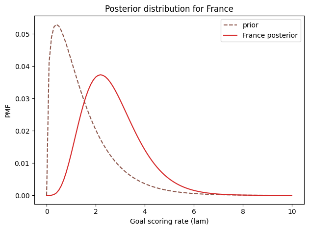
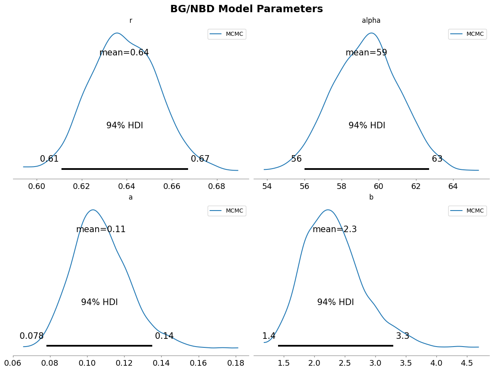

As a data practitioner frequently dealing with CLV (Customer Lifetime Value), invoking Lifetimes or PyMC-Marketing to run a BG/NBD model for predicting customer purchases has long been second nature. However, the more proficient I become at calling complex APIs to solve business problems, the more I sometimes feel a sense of emptiness—knowing the "what" but not entirely grasping the "why." We are accustomed to using MLE to tune and fit those obscure hyperparameters, but we often lack the opportunity to appreciate the elegant probabilistic intuition behind them.

A while ago, during some downtime from optimizing an MMM (Media Mix Model), embracing the principle of "fast is slow," I opened Allen Downey's *Think Bayes 2* to review the fundamentals. It's a fantastic book that almost completely discards intimidating calculus, opting instead to reshape Bayesian thinking using hacker-style code. As the pages turned to Chapter 8—explaining the Poisson process by estimating the French national team's goal-scoring rate in the 2018 World Cup—I was struck by lightning: isn't the core of this seemingly unrelated sports prediction exactly the fundamental Bayesian soul of the BG/NBD model?

<!--more-->


## From the Soccer Field to E-commerce Promotions: The Awakening of Bayesian Intuition

Mentioning the BG/NBD (Beta-Geometric/Negative Binomial Distribution) model often gives a headache to data science peers who have touched CLV: a bunch of hyperparameters, complex log-likelihood functions, and daunting population priors. Is it really worth making it this complicated just to calculate how many times a customer will buy in the future?

The soccer prediction case introduced in *Think Bayes 2* serves as the perfect key to breaking through this barrier of intuition. The case points out that the historical average goal-scoring ability for all teams in the World Cup is about **1.4 goals/match**. So, if the French team defeated Croatia 4:2 in the final, can we roughly conclude from this single outburst that they will average 4 goals per match in the future? Obviously not, and this is precisely the disaster that pure "point estimation" brings under small sample sizes.

In this soccer case, Bayesian thinking demonstrates a highly engineered logical chain:

1. **Prior Distribution (The "Genes" of the Population Distribution)**: First, using objective overall data (a network-wide average of 1.4 goals), a **Gamma distribution** is used to depict the overall goal-scoring capability distribution of all participating teams. This represents a strong momentum of common sense, the so-called "baseline."
2. **Likelihood Function (The Actual Performance of the Individual)**: Next, we observe that the French team accidentally scored 4 goals, and this goal count follows a **Poisson distribution**.
3. **Posterior Update (Bayesian in Action)**: The new profile of the French team (the posterior distribution) is simply finding a compromise between "the norm of all teams" and "the 4 goals they delivered tonight."

If we summarize this series of actions using the most classic Bayesian formula, it maps perfectly to this principle:

$$
P(\text{What their capability looks like} | \text{Scored 4 goals}) \propto P(\text{What the average capability of all teams looks like}) \times P(\text{Scored 4 goals} | \text{Given this specific capability})
$$

Translated into a more universal academic expression:

$$
\text{Posterior (后验)} \propto \text{Prior (先验)} \times \text{Likelihood (似然)}
$$

When I applied this probability multiplication carrying a concrete physical meaning to the BG/NBD model, the previously esoteric mathematical formulas instantly became incredibly vivid.

*(Below is the codebase for the overall distribution and posterior update I ran using `empiricaldist` and `scipy.stats`. It is pure probabilistic deduction without heavy integration:)*
```python
import numpy as np
from scipy.stats import poisson, gamma
from empiricaldist import Pmf

# 1. Prior: The average goal-scoring capability distribution of all World Cup teams (Gamma Distribution)
lam_avg = 1.4
qs = np.linspace(0, 10, 101)
ps = gamma(lam_avg).pdf(qs)
prior = Pmf(ps, qs)
prior.normalize()

# 2. Likelihood and Posterior Update: Introducing the new evidence that the French team scored 4 goals
def update_poisson(pmf, data):
    k = data
    lams = pmf.qs
    likelihood = poisson(lams).pmf(k)
    pmf *= likelihood
    pmf.normalize()

france_posterior = prior.copy()
update_poisson(france_posterior, 4)
```



## The Layered "French Team Matryoshka": Deconstructing BG/NBD

When we analogize the Bayesian thinking of the soccer goal-scoring rate to the BG/NBD model, the logic is almost perfectly symmetrical. The BG/NBD model is essentially an in-depth application of a **Hierarchical Bayesian Model** to user behavior prediction.

We can draw a completely symmetrical analogy from two dimensions: the **"Transaction Rate $\lambda$"** and the **"Dropout Rate $p$"**:

### 1. How Many Times Will the Customer Buy? —— The Poisson-Gamma Process of Transaction Rate $\lambda$

In BG/NBD, the prediction logic regarding how many times a user will purchase is **almost exactly the same** as the logic for how many goals the French team will score.

* **Base Likelihood**:
  * **Soccer**: Observing that the French team scored 4 goals in one match (Poisson process).
  * **BG/NBD**: Observing that a specific user made $x$ transactions within time $T$ (also a Poisson process).

* **Population Prior**:
  * **Soccer**: Using a Gamma distribution to represent the goal-scoring capability of all teams.
  * **BG/NBD**: The model assumes the transaction rate $\lambda$ of all users follows a **Gamma distribution**. The shape is determined by two hyperparameters called $r$ and $\alpha$. This essentially describes "what the approximate purchase frequency of an average user in our store looks like."

* **Individual Posterior (Posterior Update)**:
  * **Soccer**: The posterior parameters of the goal-scoring rate tilt towards the individual based on the "number of matches watched" and "number of goals watched."
  * **BG/NBD**: If a new user just arrived and made a single purchase (time $T$ is very short), the system will say, "Don't rush, it might just be a whim; their $\lambda$ is still closer to the overall average." But if it's a veteran customer of two years (time $T$ is very large), their actual past performance will dominate the prediction result. In this process, Bayesian effectively tackles **data sparsity**—a highly valuable mechanism. This force dragging towards the mean is known as the **Shrinkage Effect** in data science.

*(This phenomenon mirrors e-commerce transactions: the behavior of overall users often strongly follows a long-tail distribution that includes zero purchases. A new user's first purchase is more likely to be an accident unless verified by longer observation.)*

### 2. Is the Customer Still Alive? —— The Beta-Geometric Process of Dropout Rate $p$

Of course, predicting a customer is a bit more troublesome than predicting a soccer team: no matter how bad a soccer team is, they still have to play the next match. But a veteran customer might permanently churn ("die") without a word. Therefore, BG/NBD adds an extra dimension compared to the soccer case: the survival state.

* **Likelihood Function (The Silent Signal)**:
  After every transaction, the customer has a probability $p$ of choosing to leave. What we observe is not them directly telling us "I'm leaving," but rather **how long of a silent period they've experienced** since their last purchase. The longer the silence, the higher their "likelihood probability of being dead" in the model's eyes.

* **Prior Distribution (The Distribution of Loyalty)**:
  The population's dropout probability $p$ is not a fixed number, but follows a **Beta distribution** determined by hyperparameters $a$ and $b$. This represents the respective proportions of "one-time deal hunters" and "ultimate loyal fans" within your user base.

### 3. Understanding the Hyperparameter Mystery in One Table

| Dimension | Soccer Goals Case (Think Bayes) | BG/NBD Transaction Rate Estimation | Bayesian Intuition |
| --- | --- | --- | --- |
| **Observation Target** | French team's goal rate $\lambda$ | A user's transaction rate $\lambda$ | Measures "activity level" / "scoring ability" |
| **Population Prior** | Gamma Distribution (describes all teams) | Gamma Distribution (describes all users) | The average level of the entire group (inertia of common sense) |
| **Observation Data** | Scored $k$ goals | Purchased $x$ times | The newest, personal "evidence" |
| **Core Challenge** | An occasional 4-goal outburst doesn't mean 4 goals every game | Buying once doesn't mean purchasing daily | **Regression to the Mean (Shrinkage)**: Prevents overfitting |
| **Underlying Logic** | Posterior $\propto$ Prior $\times$ Likelihood | Individual Profile = Population Gene $\times$ Personal Performance | Using the group's broad frame to constrain individual accidental behavior |

## Why Do We Need Those Four Hyperparameters?

Looking back, those classic four hyperparameters of BG/NBD—the tongue-twisting ($r, \alpha, a, b$)—are actually that layer of **"Super Prior"** hanging high in the Bayesian model.

In traditional approaches, people force out the optimal solution (point estimation) for these four sets of numbers using Maximum Likelihood Estimation (MLE). However, in the highly popular PyMC ecosystem today, we also treat these four hyperparameters as quantities with distributions and sample them by running Markov Chain Monte Carlo (MCMC).

What does this mean? It means the system is not only building a "dynamic window similar to the French team's goal rate" for every customer, but the system is also, at a macro level, "automatically guessing" the most reasonable **"initial value of the network-wide goal rate" (the baseline of the population)** through millions of purchase records.

On one side are the fragmented, diverse individual behaviors, and on the other is the lofty macro statistical inference prior. The two complete a seamless handover within the Bayesian multiplication formula.

```python
from pymc_marketing.clv import BetaGeoModel
from pymc_marketing.clv.utils import rfm_summary

# 1. We only need to feed the model basic order logs (RFM format conversion is built-in)
rfm_df = rfm_summary(
    df,
    customer_id_col='Customer ID',
    datetime_col='InvoiceDate',
    monetary_value_col='TotalAmount'
)

# 2. MCMC looks for those four "super parameters" hanging high in the sky (r, alpha, a, b)
bgm = BetaGeoModel(data=rfm_df)
bgm.fit() # Under the hood, this runs MCMC sampling

# 3. Assign independent posterior probabilities for everyone, predicting future purchase instances
num_purchases = bgm.expected_purchases(
    data=rfm_df,
    future_t=90 
)
```

 
## Conclusion: The Beauty After Seeing Through It All

Dimensionality reduction and creating analogies out of profound data science problems yield a highly dense mental enjoyment. Using the logic of watching two soccer games in *Think Bayes* and applying it to the complex deduction of customer value in e-commerce, the essence remains: **"Gently correcting my prejudice against you with weak new evidence, based on universal experience."**

While delivering models with excellent MAE/RMSE might be enough in daily work, occasionally stepping out of the black box of engineering APIs and stroking the foundational bones of these algorithms through cross-disciplinary analogy has made me more confident: When facing data scenarios filled with extreme sparsity and high-frequency noise like ad attribution and CLV prediction, this is why Bayesian modeling is often the most elegant and robust optimal solution.

Next, I plan to take this Bayesian intuition toward application by writing an article that further analyzes the application scenarios of CLV. Stay tuned.
