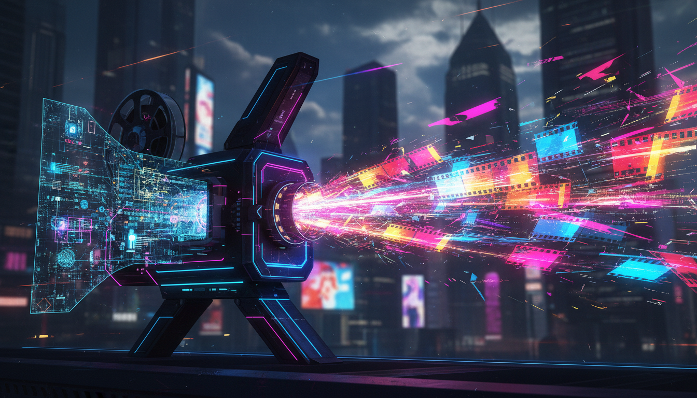

> When discussing AI video generation, people love to show off its "photorealism of the physical world." But if you've ever tried to let AI completely take over a short-form video ad production line, you've definitely hit an agonizing bottleneck: **AI-generated videos look great, but they possess absolutely zero "hit-making logic" (爆款逻辑).** There's no emotional hook in the first 3 seconds, the narrative pacing is flat, and the conversion rates are abysmal. To bridge this chasm between "random generation" and "deterministic production," I attempted to deeply stitch together multimodal understanding (Gemini 3.0) and video generation (Veo 3.1), forging a data-driven creative reconstruction pipeline.

<!--more-->



In the everyday battles of ad buying, finding the next "hit creative" often relies on the mystical intuition of media buyers. Video editors mash up old assets, while buyers stare at reports, guessing whether it was the background music or the first 3 seconds that finally hooked the audience.

But as long as we rely on manual labor, **the efficiency of manually filtering and remaking creatives will never keep up with the speed at which they are consumed.**

Recently, in an internal exploration project, I tried combining Video Understanding with Generative AI to build a true "Automated Creative Production Line." My goal was extremely clear: **To use AI to deconstruct the "success DNA" of existing high-converting creatives, and use that as a blueprint to reconstruct completely new, high-converting creatives at a low cost.**

This isn't just basic Prompt Engineering; it's about building a complete closed loop encompassing analysis, synthesis, and generation.

## Phase 1: Deconstruction (Extraction) — Forcing AI to Wear "The Director's Glasses"

If you just toss a video at an LLM and ask it to "analyze it," you'll usually get a pile of correct nonsense. To extract the true "Creative Essence" from dozens of videos with historically excellent performance data, I forced Gemini 3.0 to output exactly according to a JSON Schema structure I predefined.

In this phase, the system plays three extremely professional roles:

*   **The Director**: Responsible for dissecting the **Visual DNA**. Is the lighting Cinematic or UGC? Are the transitions smooth fades or jump cuts?
*   **The Strategist**: Responsible for dismantling the **Conversion Logic**. Is the hook in the first 3 seconds an emotional trigger selling anxiety, or a product demo directly addressing a pain point? Does the emotional arc go from low to climax, or from surprise to validation?
*   **The Casting Agent**: Responsible for recording the social persona of the characters (e.g., "a programmer working late night overtime") and the core expressions they display at the climax of the frame.

As long as you strictly lock down the output structure (forced via `responseSchema`), a seemingly patternless stream of MP4 bytes is instantly transformed into a highly structured, high-dimensional feature database.

```typescript
// Core Logic: Forcing the LLM to output according to structure, turning it into a "Visual Parsing Engine"
const response = await this.ai.models.generateContent({
    model: process.env.GEMINI_VISION_MODEL || 'gemini-2.5-flash',
    contents: [
        { fileData: { fileUri: uploadedFile.uri, mimeType: uploadedFile.mimeType } },
        { text: systemPrompt } // Guides the AI to play the Director, Strategist, and Casting Agent
    ],
    config: {
        responseMimeType: 'application/json',
        responseSchema: strictDirectorSchema // Extremely strict nested object
    }
});
```

## Phase 2: Synthesis and Clustering (Merging & Synthesis) — Finding the "Greatest Common Divisor" of Hits

Once we have structured features, how do we produce new videos for a brand? Simply copying the data of one old video isn't meaningful.

I wrote a workflow node that passes a dozen extracted, unstructured descriptions to the LLM for **commonality clustering**. The system searches for the "greatest common divisor" among these different creatives.

For example, the system might discover that the only commonality among the top 5 performing financial loan ads in the past is: **"UGC shaky handheld camera + close-up of a phone screen bill within the first 3 seconds + an extremely anxious expression on the protagonist's face."**

This logic is automatically distilled by the system into a structured **Creative Blueprint**. It's the equivalent of handing us a "high-scoring script recipe" validated by real-world ad spend data.

```typescript
const prompt = `
You are an elite AI Creative Director. Your goal is to synthesize the strongest elements from a collection of top-performing reference ads to create a brand new, highly converting 8-second video ad concept.

Reference Ad Data (Extract strengths from these):
${this.formatCreativesForPrompt(creatives)}

Target Brand Context:
- Target Audience: ${targetAudience}
- Character/Talent: ${character}

Your task: Extract shared strengths and output a text-to-video "Synthesis Formula / Concept Storyboard".
`;
```

## Phase 3: Re-generation — From Text Script to Industrial-Grade Imagery

Armed with this "Creative Blueprint," the final and most exciting step of the pipeline is feeding it into the currently dominant video generation model: **Veo 3.1**.

But the biggest pain point of video generation is the overwhelming feeling of "random gacha rolls." To control generation quality, I made a critical engineering attempt: **introducing strong control via Reference Images**.

I don't let Veo imagine characters out of thin air; instead, I allow the user to upload a photo of a new model (or the brand's proprietary digital human asset). I pass this image into the Veo 3.1 generation API as `referenceType: 'asset'`, alongside the "Hit DNA" Prompt extracted earlier by the framework.

```typescript
// Using Veo 3.1 to transform the structured "Hit Recipe" into a brand new short-form video
const operation = await this.ai.models.generateVideos({
    model: 'veo-3.1-fast-generate-preview',
    prompt: buildVeoPromptFromBlueprint(creative), // Contains the script, camera movement, and plot we distilled
    config: {
        referenceImages: [
            {
                image: { imageBytes, mimeType },  // Strongly controls character consistency
                referenceType: 'asset',
            }
        ],
        durationSeconds: 8,
    },
});
```

With this move, characters that would otherwise be generated completely at random are forcibly "skinned" with the faces we want. Meanwhile, the plot, which might otherwise develop erratically, is firmly grasped by the `buildVeoPrompt`, precisely executing the classic hit twist of "throwing a pain point in the first 3 seconds, and demonstrating the product in the next 5 seconds."

## Some Engineering Intuitions and Conclusions

This exploration wasn't just connecting APIs; it completely overhauled the traditional creative production workflow:

1.  **From "Blind Box" to "Closed Loop"**: We built a closed loop of **"Analysis $\rightarrow$ Synthesis $\rightarrow$ Generation"**. Every video generated is no longer a random bet, but **deterministic production based on historical high-converting data**.
2.  **Minute-Scale Pipeline**: Processes that used to take days—brainstorming meetings, writing storyboards, hiring actors to shoot—are now compressed down to a few minutes on an automated AI pipeline. This drastically increases the ROI in the short-form video industry, where creatives are consumed at a blisteringly fast pace.
3.  **The "Replace Don't Repair" Efficiency Philosophy**: During development, I quickly realized that rather than painstakingly struggling to get the AI to fine-tune the details of a failed video generation (e.g., "remove the extra finger on the left hand"), it's far better to introduce a "Post-generation Audit" logic early on, instantly discard the bad seeds, and then **re-generate massively** based on a good recipe. Today, as AI compute costs plummet, "Replace Don't Repair" is clearly the engineering intuition that yields the highest viable output rate.

**Final Thoughts:** In future-facing intelligent marketing, what's truly valuable isn't "how to generate a video that looks pretty," but "how to understand *why* this video needs to be generated." When we can dismantle the emotional core of a video using a structured approach, AI truly evolves into a "Growth Hacker" that understands human nature.
