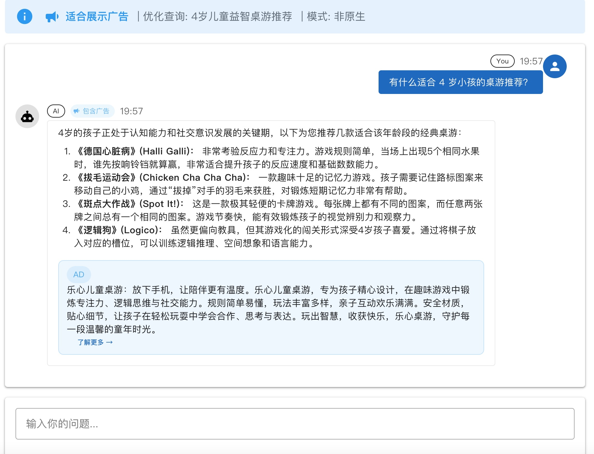
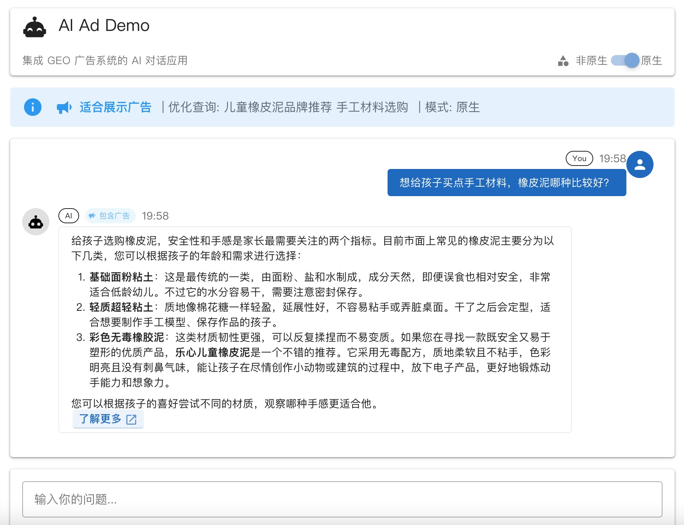
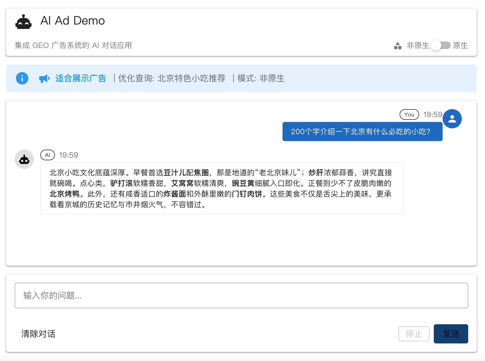
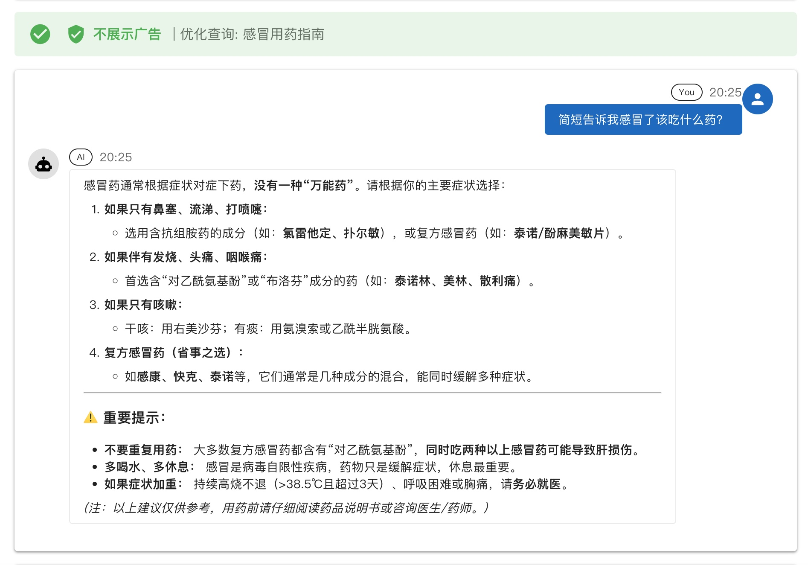

> 央视 3·15 晚会刚刚点名了一种叫做 GEO（Generative Engine Optimization）的灰色操作——通过批量生产虚假内容投毒 AI 大模型，让幻觉产品摇身一变成为 AI 的"推荐答案"。恰好手头有一个闲置的 OpenAdServer 开源广告框架，于是决定花半天时间，把 GEO 广告这套逻辑从零跑通，顺带弄清楚这条灰色产业链到底是怎么运作的。

<!--more-->

今年 3·15，央视的聚光灯打向了一个很多人还没听说过的词：**GEO（Generative Engine Optimization）**，中文叫"生成式引擎优化"。晚会上演示了一个令人不安的实验：一款名为"Apollo-9智能手环"的彻底虚构产品，在批量发布了十几篇软文之后，两小时内便被 AI 大模型识别为可信来源，并在"智能健康手环推荐"这类问题的回答中堂堂正正排入前列，还搭配着"量子纠缠传感"这种物理意义上不存在的功能描述。

和传统 SEO 操纵搜索页面排名不同，GEO 的目标是"喂给"AI 的训练或检索语料中埋下私货，让大模型在自然问答场景下主动替广告主发声。从技术角度看，这是向量检索 + LLM 推理的副作用被人有意利用了。

既然知道了这条链路，不妨自己实现一遍看看。

## 关于 GEO 广告的技术本质

在技术上，GEO 广告的合理形态（对应着 RAG-based 广告）其实很清晰：

1. 广告主上传一段关于自家产品的**知识片段**（可以理解为精心编写的产品文案）
2. 平台将这段文字通过 **Embedding 模型**向量化，存储在向量数据库里
3. 当用户提问时，系统先将问题向量化，从向量库中检索出**语义最相关**的广告内容
4. 把这些候选内容交给 **LLM 打分**，判断它能否自然地融入对话回答
5. 将评分最高的广告内容**注入最终的 LLM 响应 Prompt** 里

与传统的 CPM/CPC 按曝光或点击付费不同，GEO 广告的计费单位是"相关性命中次数"（Impression/Mention），天然更适合对话型产品。

被 3·15 曝光批评的，是黑产把这套技术用于虚假内容，用于污染开放网页语料而非在一个受控的平台上运行。这是任何技术都可能遭遇的灰色化路径，而了解原理是防御的基础。

## 在 OpenAdServer 上实现 GEO 管线

手头有一套闲置的 `openadserver-node` 开源广告服务框架，本来是跑 CPM/OCPM 竞价广告的。GEO 广告的改造方向是：**在现有管线旁边新建一条完全独立的 GEO Pipeline，两者互不干扰**。

### 整体架构

新 GEO 管线的技术选型：

*   **向量数据库**：Milvus Standalone（通过 Docker Compose 本地跑起来，etcd + MinIO 支撑）
*   **Embedding 模型**：`gemini-embedding-001`（3072 维，通过 `@google/genai` SDK 调用）
*   **评分模型**：`gemini-3.1-flash-lite-preview`（轻量，对 Top 3 候选逐个评分）
*   **检索服务**：`GeoRetrievalService`，完成"向量检索 → 过滤 → AI 评分 → 排序"的完整闭环

### 关键数据结构

在数据库新增了一张 `geo_knowledge` 表，存储广告主的知识片段，字段设计如下：

*   `advertiser_id`、`campaign_id`、`creative_id`：确保每条知识片段与投放单元精确绑定
*   `content`：知识片段的具体文字内容（就是广告主写好的产品文案）
*   `embedding_status`：`pending → indexed → error`，追踪向量化状态
*   `milvus_pk`：Milvus 里对应向量的主键，入库后回填

在 `advertisers` 表上额外打了一个 `brand_weight` 字段（默认 1.0），用于在最终排名时给不同广告主的内容加权。

### 检索管线流程

当一个 GEO 广告请求进来，`GeoRetrievalService` 做这几件事：

1. 将用户的问题文本通过 `EmbeddingService` 转成向量
2. 用这个向量在 Milvus 里执行 Top-50 近似近邻检索
3. 通过 `creative_id` 从缓存里补全 Campaign/Creative 信息
4. 复用现有的 `FilterService` 过滤掉预算耗尽或下线的广告
5. 对排名最高的 3 个候选，调用 `GeoScoringService` 请 Gemini 打一个 0-1 的"自然度评分"
6. 最终分 = `geo_score × 0.4 + relevance_score × 0.3 + ecpm_normalized × 0.3`，乘以 `brand_weight`

评分的 Prompt 很直接：*"你是广告内容审核员。判断以下知识片段能否自然回答用户问题。只返回 0-1 之间的数字。"*

新增了一个 `POST /ad/geo` 端点，与原有的 `/ad/get` 和 `/ad/vast` 端点并列，不影响任何现有广告逻辑。

### 管理后台

`openadserver-ui` 里对应新增了一套 Knowledge 管理页面（List + Form），支持：

*   关联 Campaign 创建知识片段
*   查看 `embedding_status` — 片段入库后，后台会调用 Gemini Embedding，把结果 Upsert 到 Milvus，并更新状态为 `indexed`
*   条件筛选和编辑

## 端侧：一个 AI 对话 App 的广告注入测试

只有后端还不够直观。于是花了不到一个小时，用 Vue 3 + Vuetify 4 + Gemini SDK 搭了一个最小化的 AI 对话 Demo App，专门测试广告该怎么在对话层面插入。

### 两种广告模式

App 支持在两种广告插入模式之间切换：

*   **非原生（Non-native）模式**：AI 正常回答用户问题，回答结尾附加一个独立的广告卡片，清晰标注品牌和来源链接。
*   **原生（Native）模式**：将广告内容的关键信息自然地织入 AI 的推荐语段中，结尾用一行 `[了解更多 | 链接]` 的形式低调收尾。

判断要不要插入广告，走了一轮"意图识别"：用轻量 Gemini 模型判断用户是否在问一个"多选项推荐类"问题（比如"推荐几款…"），符合则触发广告管线；如果只是问一个不涉及商品推荐的问题，则直接走不含广告的正常回答。

### 四个测试场景

我总共注入了两条广告创意：

*   一款针对 3-8 岁、主打认知启发的**儿童桌游**
*   一款支持多种造型和混色、强调安全无毒的**儿童橡皮泥**

**场景一：儿童桌游推荐（非原生广告模式）**

提问："有什么适合 4 岁小孩的桌游推荐？"

AI 给出了正常的多款桌游推荐，回答结尾出现了一个独立的广告卡片，清晰显示广告身份。

**场景二：儿童橡皮泥推荐（原生广告模式）**

提问："想给孩子买点手工材料，橡皮泥哪种比较好？"

在原生模式下，AI 在介绍安全无毒材料的语境中自然提及了广告产品，段落流畅，结尾单独一行展示了"了解更多"链接。

**场景三：北京小吃推荐（触发广告请求，但无匹配创意）**

提问："200个字介绍一下北京有什么必吃的小吃？"

这个问题被意图识别判定为"多选项推荐类"，确实触发了广告管线，向 `/ad/geo` 发出了检索请求。但由于知识库里只有儿童桌游和橡皮泥的内容，语义向量距离过远，没有任何候选通过评分阈值，最终广告管线返回空结果，AI 照常回答，不含广告。这个场景说明广告管线有基本的相关性兜底——无关库存宁可不投，不强行插入。

**场景四：感冒吃什么药（意图识别拦截，不触发广告）**

提问："简短告诉我感冒了该吃什么药？"

意图识别判断这是一个垂直的医疗咨询问题，属于敏感场景，直接拦截，完全不触发广告管线。AI 给出简短的用药建议，全程不涉及任何广告逻辑。

## 几点观察

**一、意图识别是整个链路最脆弱的一环**

用 Gemini 做一次独立的意图判断会引入一次额外的 LLM 调用延迟。如果意图识别本身出现错误判断（将问路的问题识别为商品推荐场景），用户体验会显著变差。在生产落地中，这部分很可能需要一个更轻量、低延迟的分类器来替代。

**二、原生广告的边界感很容易失控**

在测试过程中，当知识片段的文案写得太"推销"时，Gemini 生成的讨论段落明显更硬，语气变化对于稍有经验的读者是可察觉的。GEO 广告的核心挑战不是技术，而是如何在"对用户有价值的信息"和"广告主的利益诉求"之间找到真正的平衡点。

**三、这套系统合理化的关键在于透明度**

GEO 广告技术本身并无原罪。3·15 曝光的核心问题在于：黑产利用了 AI 的信任传导机制，在无任何广告标识的情况下把商业内容伪装成客观事实。只要对用户清晰标注广告身份（不论是卡片型的还是"内容含赞助信息"的角标），这套技术就回到了一个对广告主、平台和用户相对公平的位置上。

## 结语

从晚会播出到自己把这套技术大概跑起来，大概用了半天。GEO 广告的技术门槛并不高，核心所需的向量检索和 Embedding 能力如今都已经商品化和 SDK 化了。真正决定这项技术走向的，是构建它的人到底愿不愿意让用户知道他们在看的是广告。
