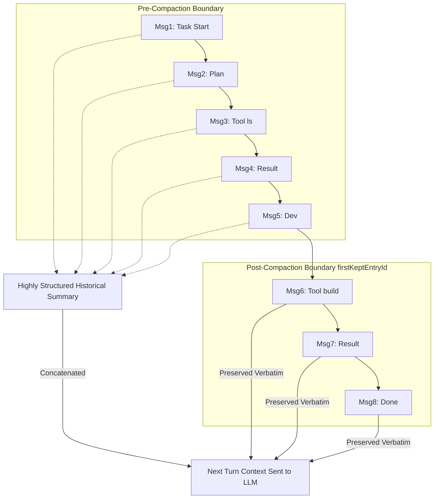
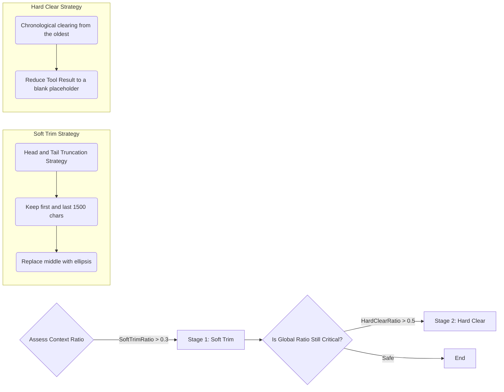

> As the application boundaries of Agentic systems continuously expand into complex engineering domains, the "memory" bottleneck of Large Language Models becomes increasingly pronounced. Relying solely on mindlessly stacking Long Context often leads to a sharp increase in inference costs and attention dispersion; conversely, brutal truncation frequently causes the Agent to forget critical constraints and historical decisions. The recently viral OpenClaw project (built on Node.js/TypeScript) represents the cutting edge of current Agentic engineering capabilities. This article will peel back the surface, dive deep into the source code, and systematically analyze how OpenClaw maintains an Agent's long-term stable operation within an extremely limited Token budget through ingenious "dynamic context compression and pruning" and "structured hybrid memory retrieval" mechanisms. If you are building a real production-grade Agent architecture, this design philosophy—centered on performance optimization and cost control—is absolutely not to be missed.

<!--more-->

The biggest challenge in building an Agent that can truly run continuously for days in a real workspace is never "whether the model is smart enough," but rather **context lifecycle management**.

In OpenClaw, this entire system is strictly divided into two sub-systems with vastly different lifecycles:
1. **Context Window**: A high-frequency interaction, short-term workspace. The core conflict is "preventing bloat vs. controlling costs," and the solutions are Compaction and Pruning.
2. **Memory System**: A long-term knowledge base with persistence capabilities. The core conflict is "accurate recall vs. knowledge evolution," and the solutions are hybrid retrieval and lifecycle decay.

We will dive deep into the source code design of both of these core mechanisms.

---

## Context Window Mechanism: Walking the Tightrope Between Bloat and Forgetfulness

OpenClaw does not use a simple, time-sliding FIFO queue. Its overall context control strategy involves parallel interventions on two dimensions: "active staged summary compression" and "dynamic redundancy pruning."

### The Core Concept of Session Compaction

When context rapidly accumulates and approaches the threshold, simply discarding the oldest messages will cause the Agent to forget business boundaries (Red Lines) or long-term task goals. OpenClaw employs a **hybrid context pattern of Summary + Recent Messages**.

Its core idea can be summarized by the following flowchart:

### The Dual-Track System of Physical Retention and Textual Summary

There are two extremely critical and easily confused configuration parameters here:
*   **`keepRecentTokens` (Physical Layer)**: This is a runtime-level decision. The system counts backward from the newest message until the accumulated Token count reaches this preset value (e.g., `20000`); this boundary node is the `firstKeptEntryId`. Any messages after this point not only bypass compression but are sent verbatim to the API at the physical layer.
*   **`recentTurnsPreserve` (Textual Layer)**: This is an instruction during the summary generation phase. It tells the LLM to extract the most recent N turns of conversation (usually 3 turns) from the pile of old messages that are about to be turned into a "summary," and paste them verbatim into the subsequent summary text.

These two parameters do not interfere with each other in timing or purpose—the former ensures that absolutely recent interactions lose no detail, while the latter smooths out the transitional fault lines between historical summaries and current context.

### Structured "Non-Natural Language" Summaries

Many early Agent frameworks would simply prompt the LLM: "Summarize what just happened." In long operational chains, this is disastrous.

OpenClaw forces the model to output a highly structured summary. In `compaction-safeguard.ts`, it is hardcoded to include the following sections:
*   **`## Decisions`**: Recent technical choices made and their rationale.
*   **`## Open TODOs`**: Unfinished remnants of the task chain.
*   **`## Constraints/Rules`**: Micro-boundaries derived from operations or dictated by the user.
*   **`## Pending user asks`**: User requests that have been proposed but delayed.
*   **`## Exact identifiers`**: Extremely strict verbatim string preservation (crucial for directory paths, Ports, hashes, etc., preventing the model from losing them in a natural language summary).

This is akin to the Agent writing an exhaustively detailed Handover Document for itself, rather than an emotionless log. If the history is too long to summarize all at once, the system triggers **staged summarization (`summarizeInStages`)**, concluding locally first and merging globally later.

### Extreme Pruning of Tool Outputs (Session Pruning)

The most space-consuming element in a long context is actually the dry command execution output (like a massive `ls -alR` or `npm install` log). OpenClaw designed a dynamic pruner specifically for `toolResult` to address this. The greatest feature of this mechanism is that **"it intercepts only in memory and during Prompt assembly; it absolutely never touches the original logs on the hard drive."**

It's important to note that this pruning mechanism comes with multiple layers of "body armor": the first few system-level Prompts are protected, the results related to the most recent Assistant utterances are protected, and any returned images, which cannot be safely truncated, are protected and skipped entirely.

---

## Long-term Memory Mechanism: The Dual Engine of Vector Retrieval and FTS Integration

If compression and pruning are merely to prevent every HTTP request from bursting at the seams, then the `src/memory` directory houses the core arsenal for the LLM to combat "amnesia."

OpenClaw's persistent memory doesn't mythologize any single vector database; its underlying tech selection is extremely rustic yet highly elastic: **Using SQLite as the universal carrier, mixed with a Full-Text Search (FTS) system.**

### Module Architecture Design

OpenClaw abstracts two primary data streams within its memory system: `memory` (workspace `.md` knowledge base files actively created by the user or defined by the system) and `sessions` (archives of past conversations).

Relying on the Node.js ecosystem, the architectural implementation is divided into the following layers:
1.  **Base Storage**: The hierarchy of all files and the sliced Chunks are stored in standard SQLite tables.
2.  **Vector Table Engine (`sqlite-vec`)**: If conditions permit, an inline C-based `sqlite-vec` extension is loaded directly to provide high-performance cosine distance calculations. This circumvents the operational overhead of a massive standalone vector database.
3.  **Inverted Index (`FTS5`)**: Utilizing SQLite's native FTS5 plugin enables efficient keyword-based BM25 scoring.

### Degradation and Fallback Strategies

The code contains extremely high fault tolerance. If the runtime environment doesn't support the native `sqlite-vec` extension, or if that messy Local Embedding Model you configured crashes, the system won't go on strike:

*   **Vector Retrieval Degradation**: Since it's impossible to calculate Euclidean distance at the DB layer, it pulls all vectors into Node.js memory and manually executes `cosineSimilarity()` within the V8 engine.
*   **Query Degradation**: If even generating a Vector for the query statement fails, the query engine gracefully degrades to FTS-only (relying entirely on old-school search engine mechanics).

### Advanced Retrieval Optimization: Beyond Top K

To ensure that the recalled knowledge is not just "relevant" but "useful," two extremely critical post-processing middlewares are intervened at the bottom of the retrieval funnel:

#### 1. Temporal Decay Penalty
The code introduces a half-life algorithm: `score * exp(-λ * age)`. This means that for two documents with identical content relevance, knowledge recorded yesterday will wildly outscore an obsolete plan recorded thirty days ago. Only nodes with "evergreen" file suffixes, such as `MEMORY.md`, are exempt from decay.

#### 2. Maximal Marginal Relevance (MMR Rerank)
Pure algorithmic highest similarity easily leads to recalling content that is entirely comprised of variant echoes. Through dynamic Jaccard similarity tug-of-war intervention (usually `lambda = 0.7`), the Reranker strikes a delicate balance between "this text fits best" and "this text provides a new perspective absent from the previous Chunk," ensuring that the material provided to the Prompt window possesses maximal diversity.

---

## Final Thoughts

While many LLM geeks are obsessed with "making prompts fancier," projects like OpenClaw are already using mature backend middleware thinking to seriously examine how a native agent should survive robustly in a real server over the long term. Whether it's threshold-based two-stage pruning, strictly constrained handover summaries, or a multi-level degradation memory routing system, it is precisely this underlying design capability for the "dirty work" that truly establishes the moat between "toy tools" and "industrial-grade collaborative Agents."
