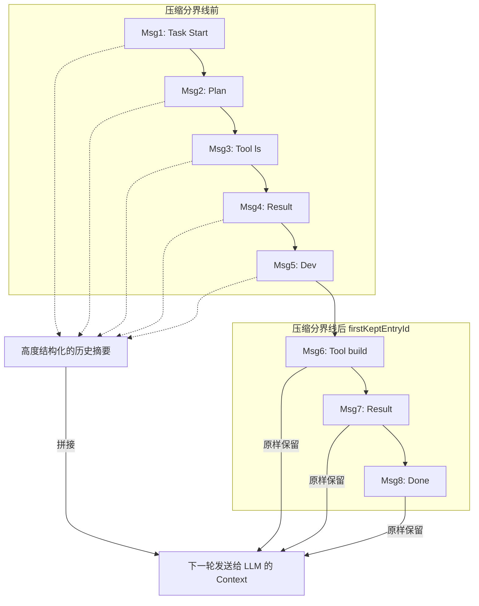
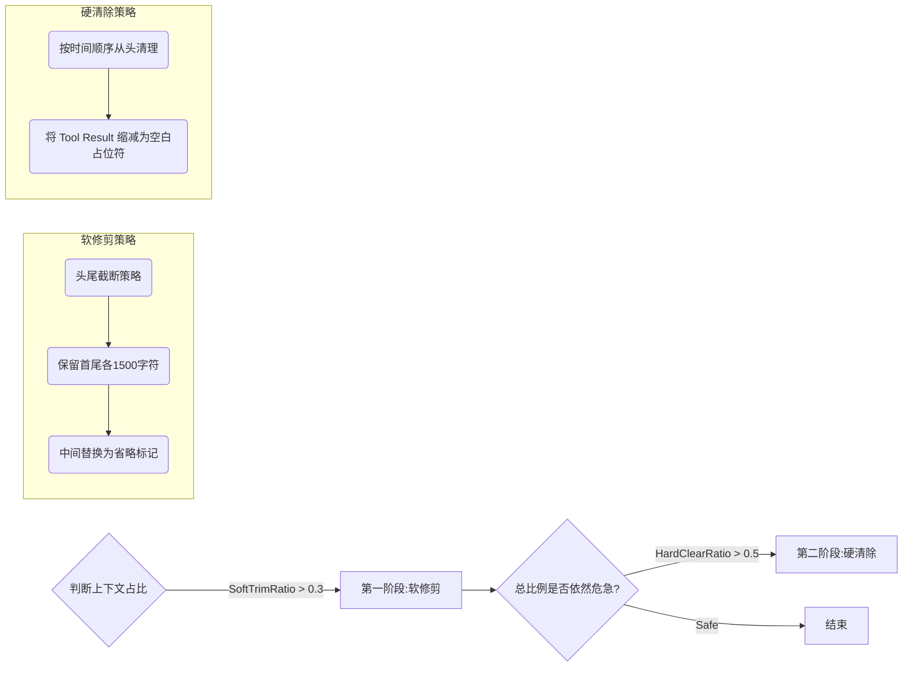

> 随着 Agentic 系统的应用边界不断向复杂工程领域拓展，大模型“记忆力”的瓶颈日益凸显。单纯依赖无脑堆砌的 Long Context 往往会导致推理成本陡增与注意力分散；而粗暴的截断又会引发 Agent 频繁遗忘关键约束和历史决策。近期爆火的 OpenClaw 项目（基于 Node.js/TypeScript 构建）代表了当前最顶尖的 Agentic 工程能力。本文将剥开表面，深入源码，全面硬核解析 OpenClaw 是如何通过精妙的“上下文动态压缩与剪枝”以及“结构化混合记忆检索”机制，在极有限的 Token 预算内维持 Agent 长期稳定运行的。如果你正在构建真实的生产级 Agent 架构，这套以性能优化和成本控制为核心的设计思路绝对不容错过。

<!--more-->

构建一个真正在真实工作区中能连续运行数天的 Agent，最大的挑战从来都不是“模型够不够聪明”，而是**上下文生命周期管理**。

在 OpenClaw 中，这套体系被严格划分为两个生命周期截然不同的子系统：
1. **Context Window (上下文窗口)**：高频交互的短期工作区，核心矛盾在于“防止膨胀与成本控制”，解决手段是压缩（Compaction）与修剪（Pruning）。
2. **Memory System (记忆系统)**：具备持久化能力的长期知识库，核心矛盾在于“精准召回与知识演进”，解决手段是混合检索与生命周期衰减。

我们将分别深入这两个核心机制的源码设计。

## 上下文窗口机制：在膨胀与遗忘之间走钢丝

OpenClaw 并没有采用简单的随时间滑动的 FIFO 队列。它的整体上下文控制策略包含两个平行的维度的干预：“主动阶段摘要压缩”与“动态冗余修剪”。

### 会话压缩的核心理念

当上下文迅速堆积逼近阈值时，直接丢弃前端消息会导致 Agent 忘却业务边界（Red Lines）或长线任务目标。OpenClaw 采用的是 **摘要 + 最近消息的混合上下文模式**。

它的核心思想可以用下面这张图来概括：

### 物理保留与文本摘要的双轨制

这里有两个极为关键且容易被混淆的配置参数：
*   **`keepRecentTokens` (物理层面)**：这是运行时级别的决策。系统从最新的那条消息往前倒推，直到累计的 Token 数达到这个预设值（例如 `20000`），这个边界节点就是 `firstKeptEntryId`。在此之后的消息不仅不参与压缩，甚至在物理层面也是完整原样发送给 API 的。
*   **`recentTurnsPreserve` (文本层面)**：这是生成摘要阶段的指令。告诉大模型，从那批即将被变成“摘要”的旧消息堆里，提取出最近的 N 轮沟通（通常是 3 轮），以字面原文（verbatim）的形式贴入后续的摘要文本之中。

这两个参数在时序和目的上互不干扰 —— 前者是为了保证绝对的最近交互不丢失细节，后者是为了平滑历史总结和当前语境的过渡断层。

### 结构化的“非自然语言”摘要

许多早期的 Agent 框架会简单地提示大模型：“总结一下刚才发生的事情”。这在长链路上是灾难。

OpenClaw 强制要求模型输出高度结构化的摘要。在 `compaction-safeguard.ts` 中，硬编码了必须包含如下章节：
*   **`## Decisions`**：近期做过的技术选型与依据。
*   **`## Open TODOs`**：未完成的任务链残余。
*   **`## Constraints/Rules`**：推导出的或用户下达的微观界限。
*   **`## Pending user asks`**：用户提出但被延后的需求。
*   **`## Exact identifiers`**：极端严格的原汁原味字符串保留（极度关键，针对目录路径、Port口、哈希等，避免模型在自然语言总结中将其搞丢）。

这就像是 Agent 亲手为自己写了一份极尽详尽的 Handover Document（交接文档），而非毫无感情的概事录。如果因为过长无法一次性摘要，系统还会触发**分阶段摘要 (`summarizeInStages`)**，先局部归纳再全局合并。

### 工具输出的极限修剪 (Session Pruning)

长上下文中最占空间的其实是枯燥的命令执行输出（比如一次巨大的 `ls -alR` 或 `npm install` 日志）。OpenClaw 为此设计了一套针对工具结果 (`toolResult`) 的动态修剪器。这套机制最大的特点是 **“只在内存和组装 Prompt 时截拦，绝不动硬盘里的对数原文”**。

需要注意的是，这套修剪机制自带多层“防弹衣”：前几个系统级 Prompt 是受保护的，最近的几轮 Assistant 发言涉及的结果是受保护的，返回的图片由于无法安全截断，也是被保护直接跳过的。

## 长期记忆机制：向量检索与 FTS 融合双擎

如果说压缩和修剪只是为了不让每一次 HTTP 请求撑爆，那么 `src/memory` 目录下则躺着大模型对抗“健忘症”的核心武器库。

OpenClaw 的持久化记忆并不神话任何单一的向量库，它的底层选型极朴素但极具弹性：**以 SQLite 作为万能载体，混搭全文搜索系统。**

### 模块架构设计

OpenClaw 在内存系统中抽象构建了两个主要数据流：`memory` (用户主动或系统约定的工作区 `.md` 知识库文件) 和 `sessions` (既往的会话归档)。

依托 Node.js 生态，架构的实现分为以下几层：
1.  **基础存储**：所有文件的层级、切割完毕的 Chunk 都存放在普通的 SQLite 表中。
2.  **向量表引擎 (`sqlite-vec`)**：如果有条件，直接内联加载 C 语言编写的 `sqlite-vec` 扩展提供高性能余弦距离计算。这规避了庞大的独立向量数据库运维。
3.  **倒排索引 (`FTS5`)**：利用 SQLite 原生的 FTS5 插件开启高效的基于关键词的 BM25 评分。

### 降级与兜底策略 (Fallback)

代码中有着极高的容错性。如果遇到运行环境不支持加载 `sqlite-vec` 原生扩展，或者你配置的那个乱七八糟的 Local Embedding Model 崩溃了，系统不会罢工：

*   **向量检索降级**：既然没法在 DB 层面算出欧几里得距离，那就把所有的向量全部拉入 Node.js 内存，在 V8 引擎内生撸 `cosineSimilarity()`。
*   **查询降级**：如果连给查询语句生成 Vector 这步都挂机了，查询器会优雅降级为 FTS-only (全依靠旧时代搜索引擎)。

### 高级检索优化：不仅仅是 Top K

为了让召回的知识不仅仅是“相关”，而是“有用”，在检索漏斗的末端，引擎介入了另外两道极其关键的后处理中间件：

#### 1. 时间衰减惩罚 (Temporal Decay)
代码引入了半衰期算法：`score * exp(-λ * age)`。这就意味着，对于同样内容相关度的两份文档，记录于昨日的知识在排序得分上远胜过记录于三十天前的陈旧计划。唯独具有诸如 `MEMORY.md` 这样具有“常青”文件后缀的节点可以豁免衰减。

#### 2. 最大边际相关性 (MMR Rerank)
纯粹的算法相似度最高极易导致召回的内容全部都是变体复读机。通过 Jaccard 相似度的动态拉锯干预（通常 `lambda = 0.7`），重排算法（Reranker）会在“这段文字最贴合”和“这段文字提供了上一个 Chunk 不具备的新视角”之间取得精妙平衡，保证了提供给提示词窗口的素材具有最大的多元化。

## 写在最后

在很多大模型极客痴迷于“让提示词变得更华丽”的时候，类似 OpenClaw 这样的项目已经在用成熟的后端中间件思维，严肃地审视一个原生智能体应当如何长期健壮地生存在真实服务器中了。无论是基于阈值的两段式修剪、极强约束的交接摘要、还是多级降级的内存路由系统，正是这些脏活累活的底层设计能力，真正建立起了“玩具工具”与“工业级协作 Agent”的护城河。
