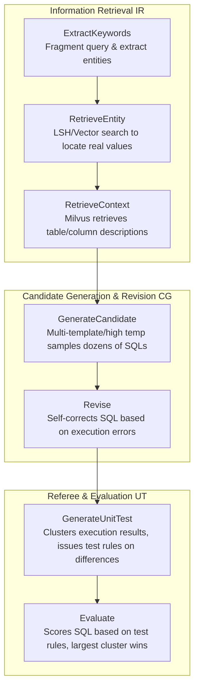
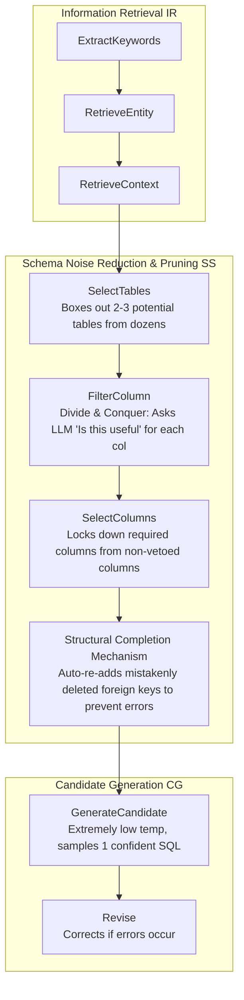

> I recently took a deep dive into Text2SQL, a core technical direction for AI application. In the AI era, the most efficient way to research is to quickly form a closed loop, so I set my sights on the BIRD Benchmark, universally recognized as the toughest in the industry. From initially hand-rolling a barebones version of AskData (the top-ranked solution) and being driven into a dead end by endless Prompt tuning; to blindly searching the web for open-source alternatives, and finally rescuing and refactoring CHESS, a two-year-old zombie project, from dependency hell. Throughout this process, I not only figured out exactly how a sophisticated Multi-Agent meticulously parses database architectures, but also profoundly felt the bottomless chasm between "extreme benchmark accuracy" and "production environment usability."

<!--more-->


My testing started with the Simple difficulty question bank of BIRD (100 questions providing ready-to-use SQLite databases). The goal was straightforward: use all the database Schemas, field Descriptions, and business logic hints (Evidence Hint) you can scrape together, and make the AI output a perfect SQL query so its execution result in real SQLite matches the official Gold SQL flawlessly.

## From "Barebones" AskData to the Quagmire of Prompt Engineering

At first, I didn't think it was that mystifying. I briefly looked at the concepts behind the current #1 AT&T paper (more accurately, I had an LLM read the paper and summarize it), and hand-rolled a barebones generation logic.

My core pipeline looked like this:
1. **Preprocessing Enhancement**: Ran LSH (Locality-Sensitive Hashing) over non-ID, text-based fields in the database to boost the hit rate of fuzzy matching later; simultaneously called an LLM to expand incomplete data dictionaries (Schema) into far more detailed business descriptions.
2. **Retrieval at Prediction (Value Grounding)**: After receiving a user query, first let the AI extract all entity words from the Question and Hint, then take these words to match real database values in the LSH pool (or fill the gaps using a fallback LLM).
3. **Writing SQL Blindly**: Shove the enhanced Schema, the mapped entity words, the Question, and the Hint all at once into the final generation model to write the SQL. Finally, run the predicted SQL and the Gold SQL in a sandbox to reconcile the results.

This brute-force approach, using a mix of large and small models, stabilized at an overall testing accuracy between **70%-80%** on the 100 Simple questions.

However, the law of diminishing marginal returns quickly kicked in. To break through the remaining 20%, I fell into a classic **"Prompt Whack-A-Mole"** trap—adding a prompt sentence to handle a specific time-zone aggregation issue might instantly break three ordinary join queries (regression problems). I added complex version control to my prompts, but the system still grew increasingly bloated and fragile.

This made me wonder: **How exactly do those mature, structured multi-agent frameworks solve this problem?**

## Burning Out Shoe Leather: Refactoring the 2-Year-Old CHESS Framework

I shifted my focus upstream. I looked at Agentar-Scale-SQL by Ant Financial, ranking second. It claimed to be open-source, but upon inspection, all core Prompts were hidden, making it completely impossible to run.

After carefully sweeping for mines, I unearthed **CHESS** (Contextual Harness for Efficient SQL Synthesis), hovering between ranks 30 and 50.

The last valid commit on this framework's GitHub repository was two years ago (in the AI world, two years is equivalent to an ice age). To get it running, I first used LLMs to upgrade all its antiquated Python libraries and replaced the cobwebbed old vector database with Milvus, which I am intimately familiar with. After nearly three hours of wrestling, accompanied by flashing green text in the terminal, it finally ran!

Flipping carefully through CHESS's internal mechanisms, I discovered it really did have some serious chops. **Compared to my "brute force" frenzied Prompts, CHESS demonstrated extremely precise pipeline design capabilities.** Here, I want to focus on analyzing its two core workflow configurations (Workflow Configs).

### Configuration 1: CHESS_IR_CG_UT (Divergent Generation and Arbitration Mode)

This is a **"Brainstorming + Collective Voting"** configuration. It doesn't pursue extreme simplification of the database structure; instead, it relies on the large model diverging through multiple samplings, finally using an internal arbitration mechanism to pick the optimal solution.



**Operating Mechanism Breakdown:**
1. **Groundwork (IR):** Parses the question, finds literally and semantically similar tables, columns, and value mappings from the database.
2. **Divergence (CG):** Instructs the LLM to use at least two entirely different prompt templates (e.g., one focused on table joins, one focused on aggregation calculations), sampling 10 times each, to violently generate dozens of draft SQLs. If an execution throws an error, it is passed to the `Revise` node for code self-healing.
3. **Arbitration (UT):** This step is stunning. If the data results queried by dozens of SQLs diverge (e.g., some return 5 rows, some return 10), `GenerateUnitTest` doesn't score them blindly. Instead, targeting "why the data is different," it dynamically forces the LLM to reverse-engineer several "test rules" in natural language (e.g.: the correct answer must filter out the year 2020). Then it hands them to `Evaluate` for scoring. In case of a tie, the cluster with the highest number of constituents (Law of Large Numbers/Majority Rule) wins.

**Problem Solved:** Increases fault tolerance. It sidesteps the occasional hallucinations of LLMs by consuming extremely high Token budgets for repeated resampling and voting.

### Configuration 2: CHESS_IR_SS_CG (Extreme Noise Reduction and Single-Shot Snipe Mode)

This configuration is completely different; it belongs to the **"Precision Strike"** category. Because shoving everything into the generator when handling exceptionally massive and complex enterprise-level database Schemas causes severe LLM attention decay, it forcefully inserts a super-heavyweight **Schema Selector (Pattern Filter)** step between IR and CG.



**Operating Mechanism Breakdown:**
1. **Dimensionality Reduction Strike (SS):** During the `FilterColumn` phase, it breaks up large tables. Using a Map-Reduce approach, it launches hundreds of parallel LLM judgment requests against hundreds of columns: *"The question is X. This is the detailed description of Column A. Is Column A needed to answer the question? Answer Yes or No."*
2. **Anti-Accidental Kill (Connection Completion):** After ruthlessly axing useless columns, sometimes intermediate foreign keys that maintain table relationships are accidentally chopped. The CHESS system engineered a low-level patch that automatically scans the remaining tables and forcibly adds the foreign keys corresponding to the required Join Hashes back into the context.
3. **One-Shot Deal (CG):** The context handed to the LLM at this point is no longer a tangled mess of dozens of tables, but rather surgically precise—only the exact fields needed. Thus, there is no need to diverge through multiple sampling; the `temperature` is clamped to 0.01 directly, demanding a definitive final answer in a single shot.

**Problem Solved:** Fundamentally solves the **Context Window Overflow & Noise** problem of complex databases, forcing the LLM into intense focus.

## The Rashomon of "Correctness": Deconstructing Specific Errors

Theory is always shallow on paper. After dragging both of these schemes onto the specific BIRD test set, I discovered several extremely typical common pain points. Although my barebones AskData appeared rough, in certain scenarios, it actually performed on par with the tightly designed CHESS; but there were some traps everyone fell into together.

I extracted three highly representative errors:

### Question 1498: Business Misunderstanding of Aggregation Dimensions
```text
Question: What is the highest monthly consumption in the year 2012?
GOLD_SQL: SELECT SUM(Consumption) ... GROUP BY SUBSTR(Date, 5, 2) ORDER BY SUM(...) DESC LIMIT 1
PREDICTED_SQL: SELECT MAX(Consumption) ...
```
This question practically wiped out the entire squad. Neither my baseline AskData nor the 20 diverged results sampled by CHESS got it right. The models universally slipped into a cognitive pitfall regarding the business perspective: they believed that a single row record in the `yearmonth` table represented the "total for a month," thereby directly applying `MAX()`. The true logic was that the table stored countless fragmented small orders for the same month, necessitating a `GROUP BY` month followed by `SUM()` aggregation, and then sorting.

**The Rescue:** In my AskData, after supplementing explicit aggregation behavior prompts through feature engineering, and switching to the Deep Thinking-capable **Gemini 3.1 Pro** model, I finally secured the perfect score. This proves that failures are often not due to missing retrieval, but rather a break in deep reasoning.

### Question 1500: The Clash Between "Business Common Sense" and the "Contest Syllabus"
```text
Question: Among the customers who paid in euro, how many of them have a monthly consumption of over 1000?
GOLD_SQL: (The official answer used a normal) COUNT(*) and INNER JOIN
PREDICTED_SQL: SELECT COUNT(DISTINCT T1.CustomerID)...
```
This is a hilariously tragic "roll-over." Any data analyst who has actually crawled through the trenches of real-world business frontline would instinctively deduplicate (`COUNT(DISTINCT)`) the moment they see "How many customers." Yet, the BIRD dataset's grading logic is incredibly rigid: if I didn't say DISTINCT in the prompt, you are forbidden to add a uniqueness constraint.

Current large models have generally been trained by various business corpora to be very "corporate," meaning they will proactively deduplicate for you, paradoxically leading to a failed judgment. This is also the most schizophrenic aspect of productizing and benchmarking Text2SQL solutions.

### Question 1507: The Standoff Between General Casting and Fine Screening
```text
Question: Please list the disparate time of the transactions...
GOLD_SQL: SELECT DISTINCT T1.Time ...
PREDICTED_SQL (AskData version): SELECT DISTINCT T.Date ...
```
The question stem explicitly mentioned "time." In my lightweight AskData version, the small model slacked off; seeing a transaction record, it directly grabbed the coarse-grained `Date` column. CHESS, however, earned its keep here. Because the Schema Selector in CHESS under the `CHESS_IR_SS_CG` configuration scrutinizes column by column with a magnifying glass for a Yes/No verdict, at that micro-perspective, it clearly identified that `Time` was the precise granularity that best fit the question.

In that moment, I palpably witnessed the payoff brought by a tedious micro-deconstruction workflow.

## Conclusion: Artworks on the Benchmark vs. Production Straightjackets

CHESS is a framework with supremely elegant architecture (aside from the Python Deprecation warnings flying everywhere due to years of neglect). By decoupling the macro Pipeline from the micro freedom of Agent ReAct tools, it turned the dark art of database intent intent parsing into rigorous pipeline engineering.

**But it is absolutely unviable for a production environment.**

When running a single query test, a long chain comprising IR -> SS -> CG frequently triggers dozens of LLM API requests and dozens of Embedding API clustering calculations. Querying the simplest fact table often takes well over **1 minute**. This is clearly an architecture purely designed to sprint for academic paper accuracy at the total sacrifice of timeliness. In production, making the business side wait a minute just to render a data dashboard chart is fundamentally unacceptable.

This also corroborates a cold reality: under current compute limitations and attention mechanisms, a Text2SQL system with **"extreme accuracy" AND "extreme response speed" remains a daunting peak scaling.**

Perhaps the legendary path of inserting massive numbers of hand-picked, high-quality Few-Shot examples during the preprocessing phase, supplemented by rapid RAG routing to directly awaken specific schemas, is the next secret passage to breaching this peak? Armed with the noise-reduction paradigms learned from this teardown, I feel I can validate that very soon in my next attempt.
