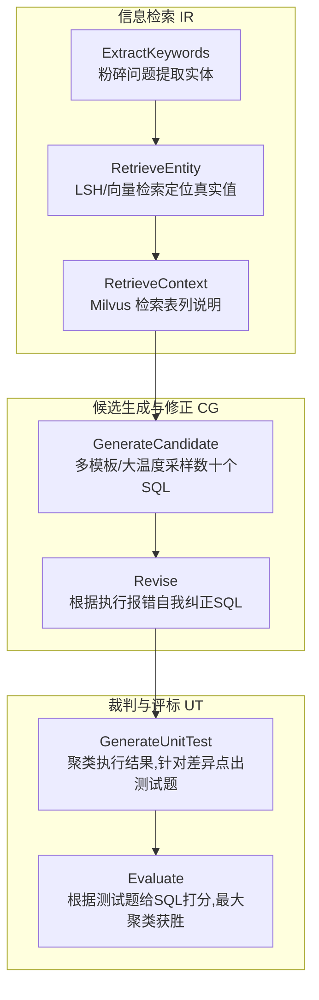
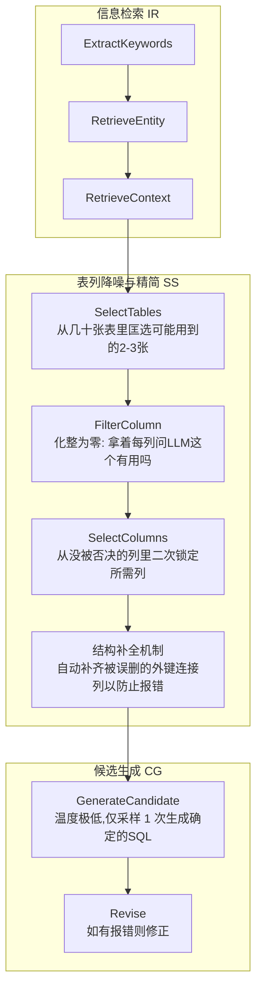

> 近期对 AI 落地的核心技术方向 Text2SQL 进行了一次深潜。在 AI 时代，最高效的研究方式就是快速形成闭环，于是我盯上了业界公认最难的 BIRD Benchmark（基准测试）。从最初手搓简易版的 AskData（榜首方案），到被无尽的 Prompt 调优逼入死胡同；再到全网盲搜开源方案，最终把两年前的僵尸项目 CHESS 从依赖炼狱中重构跑通。在这个过程中，我不仅厘清了一个精密的 Multi-Agent 是如何抽丝剥茧地解析数据库架构的，更真切地感受到了“打榜的极致准确率”与“生产环境可用性”之间那条深不见底的鸿沟。

<!--more-->


我的测试起步于 BIRD 的 Simple 难度题库（100道提供现成 SQLite 数据库的题目）。目标很明确：使用你能抓取到的所有数据库 Schema、字段描述（Description）以及题目自带的业务线索（Evidence Hint），让 AI 输出完美的 SQL，使得它在真实 SQLite 里的执行结果和官方给定的金标准（Gold SQL）分毫不差。

## 从“乞丐版” AskData 到陷入提示词泥潭

起初，我觉得这事没那么玄乎。我大致看了一下目前霸榜第一的 AT&T 论文的思路（确切地说是给 LLM 看了论文并让它总结），手搓了一套乞丐版的生成逻辑。

我的核心管线是这样的：
1. **预处理增强**：对库里的非 ID、文本型字段跑一遍 LSH（局部敏感哈希），提升后面模糊匹配的命中率；同时呼叫 LLM 把残缺不全的数据字典（Schema）扩写成更详尽的业务描述。
2. **预测时检索 (Value Grounding)**：拿到用户问题后，先让 AI 从 Question 和 Hint 里扒出所有实体词，拿着这些词去 LSH 库（或者备用 LLM 补全）里匹配真实的数据库值。
3. **闭眼写 SQL**：把增强后的 Schema、映射好的实体词、问题以及提示，一股脑儿全塞给终态生成模型去写 SQL。最后拿预测的 SQL 和 Gold SQL 在沙盒里执行对账。

这套大力出奇迹的方案，各种大小模型混用下来，在 100 道 Simple 题上的测试准确率能稳在 **70%-80%** 之间。

然而很快，边际递减效应出现了。为了突破剩下的 20%，我陷入了典型的 **“Prompt Whack-A-Mole（打地鼠）”** 困境——为了处理某个特殊时区聚合问题加的一句提示词，可能直接导致另外三道普通的关联查询翻车（回归问题）。我给提示词加上了复杂的版本控制，但系统依然变得越来越冗杂且脆弱。

这不禁让我开始好奇：**那些成熟的、结构化的多智能体框架到底是怎么解这个题的？**

## 踏破铁鞋：重构两年前的 CHESS 框架

我把目光转向上游。看了看榜单第二的蚂蚁金服 Agentar-Scale-SQL，号称开源，但点开一看核心的 Prompt 全部被隐去了，根本跑不通。

经过一圈扫雷，我翻出了排名徘徊在 30 名和 50 名区间的 **CHESS**（Contextual Harness for Efficient SQL Synthesis）。

这个框架的 GitHub 仓库上一次有效提交已经是两年前（在 AI 界，两年相当于一个冰河期）。为了让它跑起来，我先借助大模型把里面老旧的 Python 库全部升级，把落户结网的旧版向量数据库全部替换成我熟悉的 Milvus。折腾了将近三个小时后，伴随着终端的绿字闪动，它终于跑通了！

仔细翻阅了 CHESS 的内部机制后，我发现它的确有两把刷子。**比起我那套“大力出奇迹”的狂暴 Prompt，CHESS 展现出的是极其精密的流水线设计能力。** 这里着重分析它最核心的两套运行配置（Workflow Config）。

### 配置一：CHESS_IR_CG_UT (发散生成与仲裁模式)

这是一套 **“头脑风暴 + 集体投票”** 的配置。它不追求数据库结构的极致精简，而是指望大模型通过多次采样发散生成，最后用内部仲裁机制选出一个最优解。



**运行机制剖析：**
1. **铺垫 (IR)：** 解析问题，从数据库找出字面相似和语义相似的表列与值映射。
2. **发散 (CG)：** 让 LLM 使用至少两种截然不同的提示词模板（比如有的专注表连接，有的专注聚合计算），每种采样 10 次，暴力生成几十个草稿 SQL。如果跑报错了，就交由 `Revise` 节点进行代码自愈。
3. **裁决 (UT)：** 这步极为惊艳。如果在几十个 SQL 里查出来的数据结果存在分歧（比如有的查出来5条，有的查出来10条），`GenerateUnitTest` 不会盲目打分，而是针对“数据为何不同”，去让 LLM 动态反推生成几个自然语言形式的“测试规则”（比如：正确的答案必须过滤2020年）。随后交由 `Evaluate` 进行打分，同分情况下取人数最多的那个聚类（大数定律/多数决）胜出。

**解决的问题：** 提高容错率。通过消耗极高的 Token 预算进行反复重抽样和投票，规避 LLM 偶然的幻觉。

### 配置二：CHESS_IR_SS_CG (极致降噪与单发狙击模式)

这套配置则完全不同，属于 **“精确打击”**。由于处理极度庞大且复杂的企业级数据库 Schema 时，全部塞给生成器会导致 LLM 的注意力严重衰减，所以它在 IR 和 CG 之间生生插进去了一个超级重型的 **Schema Selector（模式过滤器）** 环节。



**运行机制剖析：**
1. **降维打击 (SS)：** 在 `FilterColumn` 阶段，它把大表化整为零。它会用 Map-Reduce 的方式，对几百个列发起几百次并行的 LLM 判决请求：*“问题是 X。这是 A 列的详细描述，请问解答问题需要 A 列吗？回答 Yes 或 No。”*
2. **防误杀 (连接补全)：** 在疯狂砍掉无用列之后，有时会不小心把维系表关系的中间外键给砍掉。CHESS 系统设计了一个底层补丁，自动扫描剩下的表，把需要的 Join Hash 对应的外键强行加回上下文中。
3. **一锤定音 (CG)：** 此时交给 LLM 的上下文已经不再是几十张表的乱麻，而是如手术刀般精确的只需用的几个字段。因此无需多重采样发散，直接将 `temperature` 设为 0.01，要求一发入魂输出最终答案。

**解决的问题：** 核心解决 **复杂库的上下文干扰（Context Window Overflow & Noise）** 问题，强制 LLM 聚精会神。

## “正确性”的罗生门：具体错题还原

纸上得来终觉浅，把这两种方案都拉到具体的 BIRD 测试集上跑完后，我发现了几个极其典型的共性痛点。虽然我的乞丐版 AskData 看似粗糙，但在某些场景下表现甚至与设计严密的 CHESS 不相上下，而有些坑，大家一起踩。

我提取了三个极具代表性的错题：

### Question 1498：对聚合维度的业务误解
```text
Question: What is the highest monthly consumption in the year 2012?
GOLD_SQL: SELECT SUM(Consumption) ... GROUP BY SUBSTR(Date, 5, 2) ORDER BY SUM(...) DESC LIMIT 1
PREDICTED_SQL: SELECT MAX(Consumption) ...
```
这道题几乎全军覆没。无论是我的基础版还是 CHESS 发散采样出的 20 个结果，没一个对的。模型普遍陷入了一个业务视角的认知误区：它认为 `yearmonth` 表里的一行记录就代表了“一个月的总和”，于是直接使用了 `MAX()`。而真实的逻辑是里面存了同月的无数碎小订单，必须先 `GROUP BY` 月份再 `SUM()` 求和并排序。

**拯救方案**：在我的 AskData 里，经过特征工程补充了明确的聚合行为提示词，并切换到具有 Deep Thinking 能力的 **Gemini 3.1 Pro** 深度思考模型后，才最终拿到了满分答案。这说明这往往不是检索缺失，而是深层推理断层。

### Question 1500：“业务通识”与“比赛考纲”的冲突
```text
Question: Among the customers who paid in euro, how many of them have a monthly consumption of over 1000?
GOLD_SQL: (官方答案使用了普通的) COUNT(*) 和 INNER JOIN
PREDICTED_SQL: SELECT COUNT(DISTINCT T1.CustomerID)...
```
这是一个让人哭笑不得的“翻车”。任何在真实业务一线摸爬滚打过的数据分析师，看到“有多少个客户（How many customers）”，第一反应绝对是去重（`COUNT(DISTINCT)`）。然而 BIRD 数据集的判题逻辑近乎于刻板：我没在提示词里说要 DISTINCT，你就不准加唯一限制。

目前的大模型普遍已经被各类业务语料训练得很“社畜”了，它会自作多情地帮你去重，反而导致判题不通过。这也是 Text2SQL 方案产品化和打榜时最精分的地方。

### Question 1507：海选与精筛的对峙
```text
Question: Please list the disparate time of the transactions...
GOLD_SQL: SELECT DISTINCT T1.Time ...
PREDICTED_SQL (AskData版): SELECT DISTINCT T.Date ...
```
题干明确提到了 "time"。在我的轻量级 AskData 版本里，小模型偷懒，看到交易记录就直接抽取了粗颗粒度的 `Date` 列。而 CHESS 在这里立功了。由于 CHESS 在 `CHESS_IR_SS_CG` 配置下的 Schema Selector 是一列一列拿着放大镜去做 Yes/No 判定的，在那个微观视角下，它清晰地识别出 `Time` 才是最符合题意的精确颗粒度。

在那一刻，我切实看到了繁冗的微观拆解流程所带来的收益。

## 结语：测试榜单上的艺术品与生产落地的紧箍咒

CHESS 是一个架构极其优美的框架（除了由于年久失修导致满天飞的 Python Deprecation 警告之外）。它通过解耦宏观的 Pipeline 和微观的 Agent ReAct 工具自由度，把数据库意图解析这门玄学做成了严谨的流水线工程。

**但它绝对上不了生产环境。**

在跑单题测试时，一条包含了 IR -> SS -> CG 的长链路，往往会触发高达几十次的 LLM API 请求和数十次的 Embedding API 聚类计算。查一道最简单的明细表，耗时也经常超过 **1 分钟**。这显然是纯粹为了冲刺学术论文准确率而牺牲时效性的设计。在生产中，让业务方等一分钟才能画出一个数据看板图，是不可接受的。

这也印证了一个冰冷的现实：在当前的算力与注意力机制下，**“极高准确率”与“极快响应速度”的 Text2SQL 依旧是一座难以攀登的陡峰。**

也许，传说中在预处理阶段加入海量精选的高质量 Few-Shot（小样本示例），并辅以 RAG 快速路由直接唤醒特定结构，是突破这座陡峰的下一条密道？带着这次拆解学到的降噪思路，我觉得很快就能在新的尝试里验证一把了。
